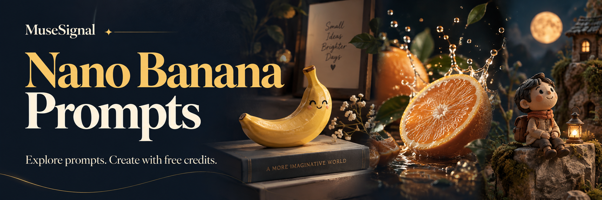

[](https://musesignal.com/?utm_source=github&utm_medium=repository&utm_campaign=awesome-nano-banana-prompts&utm_content=banner)

# Awesome Nano Banana Prompts

**by [MuseSignal](https://musesignal.com/?utm_source=github&utm_medium=repository&utm_campaign=awesome-nano-banana-prompts&utm_content=brand)**

[English](README.md) · [简体中文](README.zh-CN.md)

Complete prompts, real example images, original creators and sources. Curated by MuseSignal for product photography, portraits, posters and more.

**Nano Banana · Nano Banana 2 · Nano Banana Pro**

> **Try leading AI image models — no top-up required to get started.**
>
> Sign up and claim free credits on MuseSignal. Generation uses credits; usage varies by model and settings.

**[Start creating with free credits](<https://musesignal.com/?utm_source=github&utm_medium=repository&utm_campaign=awesome-nano-banana-prompts&utm_content=hero>) · [Explore selected prompts ↓](<#selected-prompts>)**

| Public prompts in this repository | Complete examples on this page | Dataset updated |
| ---: | ---: | --- |
| **174** | **60** | 2026-09-24 |

This repository shares a selection from MuseSignal. The counts distinguish JSON records from examples on this page, not the full website library. Model collections are subsets of the catalog.

## Browse by use case

Open a filtered MuseSignal gallery. Counts refer to this repository's JSON; model collections offer separate version filters.

| Browse by use case | In JSON | MuseSignal |
| --- | ---: | --- |
| Portrait | 83 | [Nano Banana](<https://musesignal.com/?category=portrait&model=nano-banana&utm_source=github&utm_medium=repository&utm_campaign=awesome-nano-banana-prompts&utm_content=category_portrait>) · [Nano Banana 2](<https://musesignal.com/?category=portrait&model=nano-banana-2&utm_source=github&utm_medium=repository&utm_campaign=awesome-nano-banana-prompts&utm_content=category_portrait>) · [Nano Banana Pro](<https://musesignal.com/?category=portrait&model=nano-banana-pro&utm_source=github&utm_medium=repository&utm_campaign=awesome-nano-banana-prompts&utm_content=category_portrait>) |
| Commercial &amp; Product | 32 | [Nano Banana](<https://musesignal.com/?category=commercial-product&model=nano-banana&utm_source=github&utm_medium=repository&utm_campaign=awesome-nano-banana-prompts&utm_content=category_commercial-product>) · [Nano Banana 2](<https://musesignal.com/?category=commercial-product&model=nano-banana-2&utm_source=github&utm_medium=repository&utm_campaign=awesome-nano-banana-prompts&utm_content=category_commercial-product>) · [Nano Banana Pro](<https://musesignal.com/?category=commercial-product&model=nano-banana-pro&utm_source=github&utm_medium=repository&utm_campaign=awesome-nano-banana-prompts&utm_content=category_commercial-product>) |
| Poster &amp; Graphic | 16 | [Nano Banana](<https://musesignal.com/?category=poster-graphic&model=nano-banana&utm_source=github&utm_medium=repository&utm_campaign=awesome-nano-banana-prompts&utm_content=category_poster-graphic>) · [Nano Banana 2](<https://musesignal.com/?category=poster-graphic&model=nano-banana-2&utm_source=github&utm_medium=repository&utm_campaign=awesome-nano-banana-prompts&utm_content=category_poster-graphic>) · [Nano Banana Pro](<https://musesignal.com/?category=poster-graphic&model=nano-banana-pro&utm_source=github&utm_medium=repository&utm_campaign=awesome-nano-banana-prompts&utm_content=category_poster-graphic>) |
| Food &amp; Drink | 10 | [Nano Banana](<https://musesignal.com/?category=food-drink&model=nano-banana&utm_source=github&utm_medium=repository&utm_campaign=awesome-nano-banana-prompts&utm_content=category_food-drink>) · [Nano Banana 2](<https://musesignal.com/?category=food-drink&model=nano-banana-2&utm_source=github&utm_medium=repository&utm_campaign=awesome-nano-banana-prompts&utm_content=category_food-drink>) · [Nano Banana Pro](<https://musesignal.com/?category=food-drink&model=nano-banana-pro&utm_source=github&utm_medium=repository&utm_campaign=awesome-nano-banana-prompts&utm_content=category_food-drink>) |
| Character &amp; Art | 22 | [Nano Banana](<https://musesignal.com/?category=character-art&model=nano-banana&utm_source=github&utm_medium=repository&utm_campaign=awesome-nano-banana-prompts&utm_content=category_character-art>) · [Nano Banana 2](<https://musesignal.com/?category=character-art&model=nano-banana-2&utm_source=github&utm_medium=repository&utm_campaign=awesome-nano-banana-prompts&utm_content=category_character-art>) · [Nano Banana Pro](<https://musesignal.com/?category=character-art&model=nano-banana-pro&utm_source=github&utm_medium=repository&utm_campaign=awesome-nano-banana-prompts&utm_content=category_character-art>) |
| Scene &amp; Space | 11 | [Nano Banana](<https://musesignal.com/?category=scene-space&model=nano-banana&utm_source=github&utm_medium=repository&utm_campaign=awesome-nano-banana-prompts&utm_content=category_scene-space>) · [Nano Banana 2](<https://musesignal.com/?category=scene-space&model=nano-banana-2&utm_source=github&utm_medium=repository&utm_campaign=awesome-nano-banana-prompts&utm_content=category_scene-space>) · [Nano Banana Pro](<https://musesignal.com/?category=scene-space&model=nano-banana-pro&utm_source=github&utm_medium=repository&utm_campaign=awesome-nano-banana-prompts&utm_content=category_scene-space>) |

<a id="selected-prompts"></a>

## Selected prompts: examples & complete text

[Portrait](<#selected-portrait>) · [Commercial &amp; Product](<#selected-commercial-product>) · [Poster &amp; Graphic](<#selected-poster-graphic>) · [Food &amp; Drink](<#selected-food-drink>) · [Character &amp; Art](<#selected-character-art>) · [Scene &amp; Space](<#selected-scene-space>)

Expand Full prompt to copy the original text. Try on MuseSignal opens the case; use its prompt action to open the creation workspace. Images are the original creators’ examples, and model versions retain their source attribution.

<a id="selected-portrait"></a>

### Portrait · 10

[Nano Banana](<https://musesignal.com/?category=portrait&model=nano-banana&utm_source=github&utm_medium=repository&utm_campaign=awesome-nano-banana-prompts&utm_content=category_portrait>) · [Nano Banana 2](<https://musesignal.com/?category=portrait&model=nano-banana-2&utm_source=github&utm_medium=repository&utm_campaign=awesome-nano-banana-prompts&utm_content=category_portrait>) · [Nano Banana Pro](<https://musesignal.com/?category=portrait&model=nano-banana-pro&utm_source=github&utm_medium=repository&utm_campaign=awesome-nano-banana-prompts&utm_content=category_portrait>)

<a id="prompt-3336e049-b5ee-454c-9e52-15918181db5b"></a>

#### Sadie Sink with Disco Ball in Pink

<a href="https://musesignal.com/prompt/3336e049-b5ee-454c-9e52-15918181db5b?utm_source=github&amp;utm_medium=repository&amp;utm_campaign=awesome-nano-banana-prompts&amp;utm_content=case_image"></a>

**Nano Banana Pro** · Creator: manolya

Use case: Portrait

<details>
<summary>Full prompt</summary>

```text
Disco Ball and Sadie Sink
Pink Aesthetic Nano Banana Pro:
{
"style_summary": "Retro-modern disco-pop aesthetic with high-saturation monochromatic tones.",
"pose": {
"orientation": "Over-the-shoulder look",
"description": "The subject is positioned with her back to the camera, twisting her torso to look back. She is holding a large silver disco ball at chest height, creating a focal point in the upper half of the frame.",
"stance": "High-cut silhouette emphasizing the hips and back."
},
"colors": {
"primary_palette": ["Bubblegum Pink", "Fuchsia", "Hot Pink"],
"accent_colors": ["Metallic Silver", "White"],
"skin_tones": "Warm, natural tan with highlights",
"vibe": "Monochromatic and high-energy."
},
"composition": {
"framing": "Vertical, medium-full shot",
"subject_placement": "Centered silhouette",
"background": "Minimalist, solid-colored flat wall",
"depth": "Shallow, with a sharp drop-off shadow on the background to create a 3D pop effect."
},
"outfits_and_props": {
"clothing": "High-leg pink spandex bodysuit with white piping/trim",
"accessories": "Rose-tinted transparent aviator-style sunglasses",
"key_prop": "A large, multi-faceted metallic silver disco ball",
"hair": "High ponytail, sleek and brunette."
},
"lighting": {
"type": "Hard studio lighting",
"direction": "Side-lit from the left",
"shadows": "Sharp, defined shadows on the wall and body contours",
"highlights": "Specular highlights on the bodysuit and disco ball facets",
"special_lighting": "Caustic light reflections (small squares of light) projected onto the subject's skin from the disco ball."
},
"effects_and_texture": {
"finish": "Glossy and high-contrast",
"texture": "Reflective surfaces (disco ball), matte background, and smooth spandex sheen",
"saturation": "High",
"grain": "Clean, digital finish with minimal noise."
```

</details>

**[Try on MuseSignal →](<https://musesignal.com/prompt/3336e049-b5ee-454c-9e52-15918181db5b?utm_source=github&utm_medium=repository&utm_campaign=awesome-nano-banana-prompts&utm_content=readme_case_cta>)** · [Original post](<https://x.com/manolyaai/status/2020561374217126145>)

---

<a id="prompt-e9496853-ff93-4817-a020-032fe8285cb3"></a>

#### Sweet Costume, Powerful Aura

<a href="https://musesignal.com/prompt/e9496853-ff93-4817-a020-032fe8285cb3?utm_source=github&amp;utm_medium=repository&amp;utm_campaign=awesome-nano-banana-prompts&amp;utm_content=case_image"></a>

**Nano Banana Pro** · Creator: manolya

Use case: Portrait

<details>
<summary>Full prompt</summary>

```text
{
"visual_style": {
"pose": {
"action": "Relaxed reclining on a textured surface",
"leg_position": "One leg gently raised and extended, the other comfortably bent",
"interaction": "Hands resting naturally on clothing or adjusting fabric casually",
"expression": "Soft, calm expression looking downward or sideways"
},
"colors": {
"palette": "Monochromatic Pink and White",
"primary": "#E18982 (Dusty Rose background)",
"secondary": "#F4A7B9 (Pastel Pink faux fur)",
"accents": [
"#FFFFFF (White clothing and accessories)",
"#F2DADA (Neutral skin tone balance)"
]
},
"composition": {
"framing": "Wide shot with significant negative space at the top",
"subject_placement": "Centered horizontally, weighted in the lower half of the frame",
"depth": "Layered textures with foreground and midground dominated by soft fur texture",
"angle": "Eye-level to slightly high-angle"
},
"outfits": {
"clothing": "White fashion bodysuit or fitted studio outfit (non-lingerie)",
"legwear": "Opaque or semi-opaque white tights or stockings",
"accessories": "Plush white bunny ear headband (playful fashion styling)",
"makeup": "Soft monochromatic pink tones on eyes and cheeks"
},
"lighting": {
"type": "High-key studio lighting",
"quality": "Soft and diffused with minimal harsh shadows",
"effect": "Even illumination emphasizing texture and color harmony"
},
"mood_and_style": {
"theme": "Playful Editorial, Whimsical Fashion",
"vibe": "Dreamy, lighthearted, soft, magazine-style",
"textures": "Contrast between smooth fabric and soft faux fur"
},
"environment": {
"setting": "Minimalist studio",
"props": "Large oversized pink faux-fur sofa or seating surface",
"background": "Solid seamless paper backdrop"
```

</details>

**[Try on MuseSignal →](<https://musesignal.com/prompt/e9496853-ff93-4817-a020-032fe8285cb3?utm_source=github&utm_medium=repository&utm_campaign=awesome-nano-banana-prompts&utm_content=readme_case_cta>)** · [Original post](<https://x.com/manolyaai/status/2021333957594243367>)

---

<a id="prompt-cf27f8fd-9c22-4325-9185-6283d1bc76ea"></a>

#### Seated Portrait with Foreground Emphasis

<a href="https://musesignal.com/prompt/cf27f8fd-9c22-4325-9185-6283d1bc76ea?utm_source=github&amp;utm_medium=repository&amp;utm_campaign=awesome-nano-banana-prompts&amp;utm_content=case_image"></a>

**Nano Banana 2** · Creator: sammy

Use case: Portrait

<details>
<summary>Full prompt</summary>

```text
{
"image_metadata": {
"style": "hyper-realistic smartphone photography",
"aspect_ratio": "4:5 vertical",
"resolution": "high resolution with subtle smartphone compression",
"camera": {
"device": "modern smartphone",
"lens": "wide-angle (~24mm equivalent)",
"angle": "slightly low, close perspective",
"framing": "full body seated portrait with strong foreground emphasis on legs and feet",
"focus": "sharp on face and foreground feet, mild background softness"
}
},
"subject": {
"use_reference_image": true,
"override": false,
"pose": {
"position": "seated deep into a cushioned armchair",
"torso": "slightly reclined into the backrest",
"legs": "both legs lifted and bent upward toward camera, creating strong foreshortening",
"arms": "wrapped casually around shins, holding legs in place",
"hips_and_glutes": {
"visibility": "partially visible",
"description": "subtle outline visible due to seated compression against chair cushion; fabric slightly stretched and creased around hip area",
"interaction_with_chair": "pressed into seat, creating natural flattening and fabric tension"
},
"feet": {
"position": "dominant foreground element, closest to lens",
"orientation": "soles facing camera at slight angles",
"detail": "natural skin texture, visible creases, relaxed toes"
}
},
"face": {
"expression": "neutral, slightly serious/pensive",
"gaze": "direct eye contact with camera"
}
},
"clothing": {
"type": "casual loungewear set",
"top": {
"item": "sweatshirt",
"color": "light grey",
"fit": "loose, slightly oversized",
"fabric_behavior": "soft folds around torso and arms"
},
"bottom": {
"item": "jogger sweatpants",
"color": "light grey",
"fit": "relaxed but slightly fitted around hips and thighs",
"details": "elastic ankle cuffs, visible creases from bent legs and seated compression"
}
},
"environment": {
"setting": "indoor, calm living space",
"chair": {
"type": "armchair",
"material": "brown leather",
"texture": "soft, slightly worn with natural creases",
"design": "rounded backrest with stitched geometric/sunburst pattern"
},
"background": {
"curtains": {
"color": "beige",
"material": "heavy fabric",
"style": "full-length, softly draped"
},
"floor": {
"type": "light patterned rug",
"visibility": "partially visible at bottom edge"
}
}
},
"lighting": {
"type": "natural daylight",
"source": "window from side/front",
"quality": "soft and diffused",
"shadow_behavior": "gentle shadows, no harsh contrast",
"tone": "warm-neutral"
},
"composition": {
"perspective": "strong foreshortening due to legs extending toward camera",
"focus_hierarchy": [
"feet in foreground",
"face and expression",
"body posture including seated compression"
],
"framing": "subject centered within chair",
"mood": "intimate, relaxed, candid"
},
"color_palette": {
"dominant": ["light grey", "warm brown", "beige"],
"secondary": ["neutral tones"],
"style": "muted, soft, warm"
},
"post_processing": {
"editing": "minimal, natural",
"contrast": "low to medium",
"saturation": "slightly muted",
"skin_retention": "realistic texture preserved"
```

</details>

**[Try on MuseSignal →](<https://musesignal.com/prompt/cf27f8fd-9c22-4325-9185-6283d1bc76ea?utm_source=github&utm_medium=repository&utm_campaign=awesome-nano-banana-prompts&utm_content=readme_case_cta>)** · [Original post](<https://x.com/sumiturkude007/status/2045917845842776100>)

---

<a id="prompt-f5935f6b-d62f-4cb5-a133-8cc9087a1c24"></a>

#### Sabrina Carpenter in a Stunning Portrait

<a href="https://musesignal.com/prompt/f5935f6b-d62f-4cb5-a133-8cc9087a1c24?utm_source=github&amp;utm_medium=repository&amp;utm_campaign=awesome-nano-banana-prompts&amp;utm_content=case_image"></a>

**Nano Banana 2** · Creator: Pinodi

Use case: Portrait

<details>
<summary>Full prompt</summary>

```text
An eye-level, medium-shot lifestyle portrait of [NAME] with an athletic hourglass physique, standing confidently and relaxed in a casual, sporty mood. She is facing the camera but slightly angled to the side, with her right hand resting on her hip and her left hand lightly holding the edge of her tied shirt. Her hair is styled in a high, wavy ponytail with loose strands framing her face, and she looks directly into the lens with a subtle, soft smile.
She wears a 2026 Portugal national football team short-sleeve jersey, with the front tied in a central knot to create a cropped look above her waist, paired with tight, maroon athletic spandex shorts and small gold hoop earrings. Her makeup is natural, featuring defined eyebrows, soft eyeshadow, and nude lipstick.
The setting is an off-white bedroom; a bed with a textured white quilt is visible to the right, next to a dark headboard with warm, built-in accent lighting glowing behind it.
The scene is captured with high-key flat beauty lighting, creating a bright, airy atmosphere with even illumination on her face and extremely soft, low-contrast shadows. Photographed with an 85mm f/1.4 lens, the image features tack-sharp focus on her eyes and a shallow depth of field that elegantly blurs the background into a soft bokeh. The photo maintains real skin texture with visible pores and no artificial smoothing, ensuring high sharpness in the fabric and hair textures, accurate white balance, and a professional high-resolution quality. Aspect Ratio 9:16.
```

</details>

**[Try on MuseSignal →](<https://musesignal.com/prompt/f5935f6b-d62f-4cb5-a133-8cc9087a1c24?utm_source=github&utm_medium=repository&utm_campaign=awesome-nano-banana-prompts&utm_content=readme_case_cta>)** · [Original post](<https://x.com/PinodiArt/status/2067587675360506344>)

---

<a id="prompt-b0203a6a-e6b1-4a0e-881a-354a1cdf4ff6"></a>

#### Sabrina Carpenter in Radiant Portrait

<a href="https://musesignal.com/prompt/b0203a6a-e6b1-4a0e-881a-354a1cdf4ff6?utm_source=github&amp;utm_medium=repository&amp;utm_campaign=awesome-nano-banana-prompts&amp;utm_content=case_image"></a>

**Nano Banana Pro** · Creator: Sadia

Use case: Portrait

<details>
<summary>Full prompt</summary>

```text
{
"nano_banana_pro_system_v6.0": {
"global_master_rendering_specifications": {
"resolution": "8K Ultra-HD / 7680x4320 native upscale",
"lighting_engine": "Unreal Engine 5.4 Lumen + Nanite, Path Traced global illumination",
"post_processing": "Subsurface scattering (SSS), chromatic aberration (0.02), film grain (0.1), ACES color grading",
"branding_overlay": "Digital watermark text '@emer_web3' in bottom right corner, 20% opacity"
},
"asset_profile_01_sabrina_yellow": {
"subject": "Sabrina Carpenter",
"physique_metadata": {
"hair": "Voluminous long blonde wavy hair, warm honey highlights, soft curtain bangs",
"complexion": "Radiant, sun-kissed skin texture with natural specular highlights"
},
"wardrobe_specifications": {
"material": "High-elasticity performance spandex, matte lemon yellow finish",
"top": "Cropped tank with intricate multi-strap criss-cross back design",
"bottom": "High-waisted matching leggings, ruched seam 'scrunch' detail on posterior"
},
"scene_coordinates": [
"Pose: Prone on mat, knees bent at 90 degrees, feet raised, looking over shoulder with soft smile",
"Pose: Kneeling lunge, hands clasped above head, torso twisted toward lens",
"Pose: Kneeling, rear-facing torso twist, hands resting on thighs",
"Environment: Seamless white photography cyclorama with a single black rectangular rubber yoga mat"
]
},
"asset_profile_02_sadie_sink_multiverse": {
"subject": "Sadie Sink",
"hair": "Vibrant wavy copper-red hair, textured finish",
"variant_01_lounge": {
"outfit": "Blue 'HAWAIIAN Tropic' strapless tube top with yellow floral logo, matching blue high-waisted shorts",
"environment": "Modern grey-walled interior, KAWS Companion pop-art red canvas, warm wall sconce lighting",
"jewelry": "Gold circular pendant, silver navel piercing"
},
"variant_02_cosplay": {
"outfit": "Red wide-brimmed cowboy hat, tricolor (blue/gold/white) strapless top with silver ring connector, denim shorts, white chaps",
"accessories": "Brown leather belt with gold buckle, yellow armbands with red ribbon ties",
"prop": "Elegant wine glass with dark red liquid"
},
"variant_03_fitness": {
"outfit": "Black 'HAWKINS ATHLETICS' spaghetti strap top, deep cobalt blue high-waisted compression leggings, white crew socks",
"environment": "Gym locker room, full-length mirror reflection, industrial lighting, visible fitness equipment in background"
}
},
"asset_profile_03_sweeney_blue": {
"subject": "Sydney Sweeney",
"outfit_specs": "Premium cobalt blue performance activewear set, high-neck racerback top, high-rise leggings",
"yoga_sequence": [
"Tabletop pose (all-fours) on black mat, focused neutral expression, concrete wall background",
"Seated resting pose, torso leaning back, weight supported by straight arms behind back",
"Prone sphinx variation, chest lifted by forearms, lower legs elevated vertically",
"Vertical leg extension stretch, grasping ankles, intense focus"
]
},
"asset_profile_04_editorial_red": {
"wardrobe": "Vibrant crimson red high-performance gym wear, multi-lattice strap bra, matching leggings",
"visual_highlights": [
"Back view showing intricate lattice strap pattern and tied bow detail",
"Prone pose on black mat against high-key white background, accentuating fabric tension",
"Kneeling pose showing rear scrunch-seam detail and bare feet on mat"
```

</details>

**[Try on MuseSignal →](<https://musesignal.com/prompt/b0203a6a-e6b1-4a0e-881a-354a1cdf4ff6?utm_source=github&utm_medium=repository&utm_campaign=awesome-nano-banana-prompts&utm_content=readme_case_cta>)** · [Original post](<https://x.com/SadiaMalik182/status/2060595724510015717>)

---

<a id="prompt-5c204dcc-3207-4e00-a096-79921469bbdb"></a>

#### Sydney Sweeney in Ethereal Cupid Pose

<a href="https://musesignal.com/prompt/5c204dcc-3207-4e00-a096-79921469bbdb?utm_source=github&amp;utm_medium=repository&amp;utm_campaign=awesome-nano-banana-prompts&amp;utm_content=case_image"></a>

**Nano Banana Pro** · Creator: manolya

Use case: Portrait

<details>
<summary>Full prompt</summary>

```text
{
"visual_style": {
"aesthetic_theme": "Modern Ethereal Cupid / Coquette Core",
"composition": {
"shot_type": "Full-body studio portrait",
"pose": "Crouched/squatting position, dynamic three-quarter view with head tilted",
"framing": "Centered subject, vertical orientation",
"background": "Minimalist, seamless off-white/light grey studio backdrop"
},
"color_palette": {
"primary": ["#FDFDFD (Clean White)", "#F4D0D9 (Soft Petal Pink)"],
"secondary": ["#F5F5DC (Cream/Ivory)"],
"accents": ["#D4AF37 (Glittering Gold)", "#FF4D4D (Soft Red heart)"],
"tonality": "High-key, pastel-saturated, and bright"
},
"outfit_and_styling": {
"clothing": "White satin mini slip dress with delicate lace scalloped trim",
"accessories": ["Large pale pink feathered wings", "Textured gold glitter bow", "Red heart-tipped arrow"],
"footwear": "Soft pink patent Mary Jane heels paired with white crew socks",
"hair_style": "Messy ash-blonde updo with soft, face-framing wispy curls",
"makeup": "Igari-style (hangover) heavy pink blush across cheeks and nose, dewy skin, and doll-like wispy lashes"
},
"lighting": {
"source": "Large, soft light source (likely a softbox)",
"quality": "Diffused, high-key, and even",
"shadows": "Extremely soft and minimal, creating a 'glowy' skin effect"
},
"effects_and_atmosphere": {
"textures": "Contrast between smooth satin, organic feathers, and gritty gold glitter",
"vibe": "Romantic, whimsical, dreamy, and youthful",
"finish": "Sharp focus on facial features with a slight soft-focus blooming effect on the highlights"
```

</details>

**[Try on MuseSignal →](<https://musesignal.com/prompt/5c204dcc-3207-4e00-a096-79921469bbdb?utm_source=github&utm_medium=repository&utm_campaign=awesome-nano-banana-prompts&utm_content=readme_case_cta>)** · [Original post](<https://x.com/manolyaai/status/2020872345393447326>)

---

<a id="prompt-9f07ae34-5326-49c6-82ef-8e268a5f4407"></a>

#### Candid Gaze of Rosé in Soft Light

<a href="https://musesignal.com/prompt/9f07ae34-5326-49c6-82ef-8e268a5f4407?utm_source=github&amp;utm_medium=repository&amp;utm_campaign=awesome-nano-banana-prompts&amp;utm_content=case_image"></a>

**Nano Banana 2** · Creator: Alice

Use case: Portrait

<details>
<summary>Full prompt</summary>

```text
{
"type": "image_prompt",
"meta": {
"aspect_ratio": "9:16",
"style": "casual lifestyle photography",
"quality": "ultra photorealistic, highly detailed, 8k resolution",
"focus": "sharp focus on subject, realistic skin texture and fabric draping"
},
"subject": {
"identity": "Rosé (Park Chaeyoung) from BLACKPINK",
"appearance": {
"hair": "messy long blonde hair",
"expression": "head watching the camera in three-quarter front view, gaze directed at the camera, mouth slightly open in a candid relaxed expression with natural lip color"
},
"body_type": "slim athletic build with visible collarbones and natural arm definition"
},
"clothing": {
"type": "bright yellow sleeveless tank top",
"details": "loose-fitting with thin straps and a deep side cutout prominently visible on her left side revealing skin, paired with light-colored bottoms partially visible"
},
"pose": {
"description": "exact amateur smartphone selfie mirror shot from a precise side angle",
"body_position": "body turned slightly to the side, left arm raised with hand behind her head tousling her messy blonde hair",
"arms": "left arm raised with hand behind her head, right hand holding a gray iPhone with triple camera array extended forward for the selfie",
"head": "turned toward the phone in three-quarter profile view"
},
"environment": {
"location": "bright bedroom with pink walls and unmade bed",
"details": "graffiti written 'youngcatwoman' on walls in the background, white dresser, messy white bedding"
},
"props": [
"gray iPhone with triple camera array"
],
"lighting": {
"type": "natural",
"quality": "bright natural daylight from a window on the left creating soft directional shadows along her side profile and even illumination with accurate auto white balance around 5500K",
"effects": "soft directional shadows, realistic smartphone lighting"
},
"mood": "candid relaxed",
"color_palette": [
"Bright red tank top",
"Pink walls",
"Messy blonde hair",
"White bedding"
],
"camera": {
"framing": "medium shot from waist up",
"perspective": "exact amateur smartphone selfie mirror shot from a precise side angle with mild wide-angle lens distortion",
"lens_suggestion": "smartphone lens with slight natural distortion (approximately 24mm equivalent focal length)"
},
"additional_details": [
"Photorealistic recreation preserving the exact original flat casual lighting, cluttered bedroom background, precise first-person selfie perspective with visible extended arm holding the device from the side angle, natural front-camera lens distortion on the face in profile, and authentic unfiltered amateur smartphone photography feel with high detail in hair strands, skin texture, and clothing fabric.",
"Kim Jisoo from BLACKPINK with the same outfit style as the main subject but wearing a bright orange sleeveless tank top and denim shorts is standing just behind Rosé, hugging her lovingly from the back with her arms wrapped gently and affectionately around her waist. Jisoo has long wavy dark hair, a warm friendly smile with her characteristic lip shape, and is embracing Rosé protectively while Rosé takes the selfie."
```

</details>

**[Try on MuseSignal →](<https://musesignal.com/prompt/9f07ae34-5326-49c6-82ef-8e268a5f4407?utm_source=github&utm_medium=repository&utm_campaign=awesome-nano-banana-prompts&utm_content=readme_case_cta>)** · [Original post](<https://x.com/youngcatwoman/status/2048338798137004056>)

---

<a id="prompt-2e4b2e9c-bcbb-4938-8ac7-6f20cd8ccfeb"></a>

#### Deep Squat Pose in High Heels

<a href="https://musesignal.com/prompt/2e4b2e9c-bcbb-4938-8ac7-6f20cd8ccfeb?utm_source=github&amp;utm_medium=repository&amp;utm_campaign=awesome-nano-banana-prompts&amp;utm_content=case_image"></a>

**Nano Banana 2** · Creator: sammy

Use case: Portrait

<details>
<summary>Full prompt</summary>

```text
{
"image_description": {
"subject": {
"use_reference_image": true,
"override": false,
"physique": "slim, toned"
},
"pose_and_composition": {
"body_position": "tight deep squat",
"lower_body": {
"stance": "knees fully bent and drawn close to chest",
"feet": {
"position": "close together, pointed forward",
"heels": "elevated due to high heels",
"weight_distribution": "balanced on balls of feet"
}
},
"upper_body": {
"posture": "leaning forward over knees",
"arms": {
"one_arm": "forearm resting across knees",
"other_arm": "elbow resting on knee with hand supporting head"
}
},
"head": {
"tilt": "slight tilt to side",
"direction": "angled upward",
"gaze": "direct eye contact with camera above",
"facial_features": "fully derived from reference image",
"expression": "fully derived from reference image"
},
"camera_angle": {
"position": "well above subject’s head",
"angle": "top-down high angle (approximately 30–45 degrees downward)",
"lens": "slight wide-angle smartphone perspective",
"distance": "close framing, compact composition",
"effect": "knees and feet appear slightly larger due to perspective"
},
"aspect_ratio": "4:5 vertical"
},
"attire": {
"outfit": {
"type": "long-sleeve fitted mini dress",
"color": "black",
"fabric": "velvet or soft matte",
"fit": "tight, body-contouring",
"neckline": "deep V-neck"
},
"footwear": {
"type": "high heels",
"color": "black patent",
"details": "pointed toe with ankle embellishments"
},
"accessories": {
"bag": "small metallic/rhinestone handbag held loosely",
"necklace": "thin silver necklace"
}
},
"environment_and_lighting": {
"setting": "modern indoor space (elevator or hallway)",
"background": "metallic wall panels",
"floor": "light gray tile floor",
"lighting": {
"type": "overhead indoor lighting",
"quality": "soft but directional from above",
"effect": "subtle highlights on face and reflective surfaces"
}
},
"technical_details": {
"style": "fashion/editorial photography",
"resolution": "high definition",
"depth_of_field": "moderate, subject sharp"
},
"rendering_notes": {
"identity_consistency": "all facial features must match reference image exactly",
"camera_priority": "strong top-down perspective must be preserved",
"pose_accuracy": "tight squat with forward lean",
"perspective_accuracy": "slight wide lens distortion (foreground emphasis)",
"anatomy": "natural proportions, no distortion artifacts",
"consistency": "alignment between camera height, gaze direction, and pose"
```

</details>

**[Try on MuseSignal →](<https://musesignal.com/prompt/2e4b2e9c-bcbb-4938-8ac7-6f20cd8ccfeb?utm_source=github&utm_medium=repository&utm_campaign=awesome-nano-banana-prompts&utm_content=readme_case_cta>)** · [Original post](<https://x.com/sumiturkude007/status/2048469660010783160>)

---

<a id="prompt-1b7cb5cf-ce49-4c2f-9de2-9533424ddc89"></a>

#### Luxury Ballroom Fashion Editorial Portrait

<a href="https://musesignal.com/prompt/1b7cb5cf-ce49-4c2f-9de2-9533424ddc89?utm_source=github&amp;utm_medium=repository&amp;utm_campaign=awesome-nano-banana-prompts&amp;utm_content=case_image"></a>

**Nano Banana Pro** · Creator: Miz

Use case: Portrait

<details>
<summary>Full prompt</summary>

```text
{
  "prompt": "Ultra-realistic luxury ballroom fashion editorial portrait of a glamorous young woman with voluminous copper-red hair styled in an elegant textured updo with soft romantic tendrils framing the face. Warm ivory skin with visible pores, realistic skin texture, natural freckles, subtle peach blush, luminous satin complexion, champagne highlighter, feathered brows, warm bronze eyeshadow, delicate fox-eye eyeliner, wispy lashes, and glossy nude-peach lips with realistic lip texture. Wearing a fitted champagne-gold halter mini dress completely covered in shimmering sequins, body-hugging silhouette, open shoulders, and luxurious reflective fabric. Large polished gold hoop earrings, delicate gold rings, and refined minimalist jewelry. Holding an elegant crystal champagne flute filled with sparkling champagne while one hand rests naturally in her hair, eyes softly closed with a serene, sophisticated expression. Standing inside a grand European-style ballroom featuring magnificent crystal chandeliers, polished hardwood floors, ornate architecture, warm golden ambient lighting, luxurious bokeh, and timeless elegance. Warm chandelier lighting creates cinematic highlights across the sequins, realistic skin reflections, soft shadows, and glowing golden atmosphere. Vogue luxury fashion campaign, old-money aesthetic, premium editorial photography, Kodak Portra-inspired skin tones, realistic skin rendering, DSLR-quality sharpness, RAW photo, ultra photorealistic, 8K.",
  
  "negative_prompt": "cartoon, anime, CGI, painting, beauty filter, plastic skin, wax skin, excessive skin smoothing, fake pores, blurry face, blurry eyes, low resolution, noise, grain, watermark, text, logo, distorted anatomy, extra limbs, extra fingers, malformed hands, unrealistic body proportions, duplicate chandeliers, oversaturated colors, clipped highlights, low-detail hair",
  
  "style": "photorealistic",
  
  "camera": {
    "type": "Sony A7R V",
    "lens": "85mm f/1.4 GM",
    "aperture": "f/1.8",
    "iso": 320,
    "angle": "eye-level luxury editorial portrait",
    "depth_of_field": "shallow"
  },
  
  "lighting": {
    "type": "warm crystal chandelier lighting",
    "direction": "soft ambient illumination",
    "mood": "luxury, elegant, cinematic"
  },
  
  "composition": {
    "framing": "vertical fashion portrait",
    "subject_position": "centered",
    "background": "grand ballroom with crystal chandeliers, polished wood floors, warm golden bokeh, and elegant architecture"
  },
  
  "quality": {
    "resolution": "8k",
    "detail": "ultra high",
    "sharpness": "DSLR-quality",
    "skin_detail": "visible pores, realistic texture, natural freckles",
    "realism": "maximum"
  }
}
```

</details>

**[Try on MuseSignal →](<https://musesignal.com/prompt/1b7cb5cf-ce49-4c2f-9de2-9533424ddc89?utm_source=github&utm_medium=repository&utm_campaign=awesome-nano-banana-prompts&utm_content=readme_case_cta>)** · [Original post](<https://x.com/mizq06/status/2077373186610806868>)

---

<a id="prompt-c303c6b7-29d4-4aa9-99cc-08dff0f6fec1"></a>

#### Elizabeth Olsen Kitchen Countertop Lifestyle Portrait

<a href="https://musesignal.com/prompt/c303c6b7-29d4-4aa9-99cc-08dff0f6fec1?utm_source=github&amp;utm_medium=repository&amp;utm_campaign=awesome-nano-banana-prompts&amp;utm_content=case_image"></a>

**Nano Banana 2** · Creator: Pinodi

Use case: Portrait

<details>
<summary>Full prompt</summary>

```text
{
"subject": {
"identity": {
"biometric_reference": "Elizabeth Olsen",
"facial_matrix": {
"morphology": "Natural gentle soft-square facial architecture, welcoming cheekbone definition, warm symmetric skeletal balance.",
"ocular_biometrics": {
"iris_color": "#768A72",
"iris_pattern": "Luminous green-hazel iris layout, expressive natural sclera contrast, warm intelligent gaze directed slightly upward and away from the camera lens axis with a dreamy, soft smile.",
"superciliary_arch": "Softly tailored, elegantly defined natural light brown eyebrows."
},
"maxillofacial_data": {
"vermilion_border": {
"hex_code": "#DDA29A",
"anatomy": "Naturally structured full lips, gentle natural Cupid's bow perimeter, mouth slightly upturned at the corners forming a pleasant, relaxed expression."
}
}
},
"body": {
"stature": "Standard elegant height proportions, natural lean athletic skeleton frame, precisely capturing the fluid body lines.",
"kinesiology_pose": "Casual seated posture on a kitchen countertop. The model is sitting perched on the polished edge of the dark counter surface next to the stove area, her back leaning subtly back against the tiled wall backdrop. Her legs are bare and crossed elegantly at the thighs, dangling freely down past the drawer units towards the floor plane, emphasizing the length of the legs and completely bare feet. Her left hand rests casually over her lap layer, while her right arm is bent gracefully at the elbow, elevating her hand near chest level as she holds a single small red cherry between her fingers. Her head is tilted slightly with a pensive, cheerful look.",
"epidermal_physics": {
"base_tone": "#FDF6EE",
"surface_properties": "Fair alabaster porcelain skin tone, soft natural specular highlight mapping along the exposed shoulders, collarbones, and the full bare surface of her extended legs and feet, isotropic sub-surface scattering, fine micro-pore distribution mapping."
},
"integumentary_profile": {
"hair_matrix": {
"color_coordinates": "#A07855",
"geometry": "Natural warm light brown to golden bronde hair styled long and straight, left down to tumble naturally past her shoulders and back, framing her face softly, replacing the hair style."
}
},
"accessories": {
"neckwear": "A subtle, thin artistic beaded necklace featuring small multi-colored accent beads resting loosely around her neck base, adding a delicate lifestyle detail.",
"jewelry": "A minimal delicate band ring on her right hand digit."
}
}
},
"wardrobe": {
"full_layer": {
"item": "Light summer slip sundress",
"color_profile": "Crisp solid white",
"material_physics": "Lightweight, semi-sheer soft cotton or linen fabrication. The top features delicate thin tie-up spaghetti shoulder straps, a soft sweetheart bustline embellished with fine white lace trimmings, and a small keyhole drawstring tie at the center chest. The fluid dress skirt gathers softly at her hips, pooling gently around her on the countertop surface and uncovering her legs cleanly.",
"design_elements": "Relaxed bohemian styling, form-fitting bodice with a light flowing airy drape."
},
"footwear": {
"item": "None",
"color_profile": "Not applicable",
"material_physics": "Completely bare feet, clean soles and detailed toes extended elegantly in mid-air, with no shoes, slippers, or socks."
}
}
},
"scene": {
"configuration": "Bright rustic rustic-modern home kitchen interior setting during midday.",
"background_architecture": {
"cabinetry": "Classic warm honey-oak wooden under-counter kitchen cabinets featuring a row of vertical drawers equipped with decorative blue-and-white patterned ceramic pull knobs.",
"countertop_and_appliances": "Polished dark reddish-brown granite or stone countertop surface supporting a modern built-in glass cooktop stove with a metallic tea kettle resting over the burner grates. Below the cooktop is an integrated stainless steel oven unit with black glass window panels.",
"wall_and_fixtures": "The backsplash wall is surfaced in glossy square off-white ceramic kitchen tiles divided by a singular horizontal blue trim tile lane running across the center. Above the cooking area sits a large minimalist white pyramidal ventilation range hood fixture. Faint decorative items like small glass spice jars sit atop the ledge.",
"sink_area": "To the left side frame, a white drop-in basin kitchen sink area is visible, holding a yellow mesh grocery bag filled with fresh fruits like pears and citrus fruits arranged nearby."
},
"aesthetic_profile": "High-resolution clean daytime lifestyle editorial photography, bright home interior aesthetic, natural organic composition, completely text-free.",
"text_and_logos": {
"constraints": "Completely clean kitchen workspace layout; zero commercial brand logos on appliances, zero typographic labels on food packaging materials, and zero digital watermarks."
}
},
"lighting": {
"source_profile": "Diffuse omnidirectional daytime window illumination flooding the room evenly.",
"ray_tracing_properties": "High-key, bright and soft light distribution minimizing harsh highlights, creating clean clarity across the white walls, tile surfaces, and skin tones while casting soft, faint gradient drop shadows beneath the counter lip, legs, and cabinet molding panels.",
"visibility_constraints": "No visible studio light fixtures, no direct harsh flash artifacts, and no electronic hardware in the composition frame."
},
"camera": {
"projection_type": "Straight-on eye-level medium-full vertical portrait shot, framing the entire lower cabinet layout up to the white ceiling plane to emphasize the vertical lines and scale of the posture.",
"optical_profile": "35mm standard lens simulation, aperture setting at f/2.8 to maintain high edge-to-edge structural sharpness across the model and kitchen elements while keeping a natural depth of field.",
"aspect_ratio": "9:16"
},
"negative_constraints": {
"prohibited_elements": [
"shoes", "sandals", "slippers", "socks", "hosiery", "stockings", "dark-hair", "black-hair",
"text-elements", "typographic-characters", "brand-insignias", "trademark-logos",
"watermark-overlays", "polydactyly-digits", "anatomical-fusions", "asymmetrical-limbs",
"low-frequency-blurring", "digital-artifacting", "pixelation", "non-biometric-smoothing",
"extra limbs", "no logos", "no text", "harsh-shadows"
]
}
}
```

</details>

**[Try on MuseSignal →](<https://musesignal.com/prompt/c303c6b7-29d4-4aa9-99cc-08dff0f6fec1?utm_source=github&utm_medium=repository&utm_campaign=awesome-nano-banana-prompts&utm_content=readme_case_cta>)** · [Original post](<https://x.com/PinodiArt/status/2069020183935512744>)

---

<a id="selected-commercial-product"></a>

### Commercial &amp; Product · 16

[Nano Banana](<https://musesignal.com/?category=commercial-product&model=nano-banana&utm_source=github&utm_medium=repository&utm_campaign=awesome-nano-banana-prompts&utm_content=category_commercial-product>) · [Nano Banana 2](<https://musesignal.com/?category=commercial-product&model=nano-banana-2&utm_source=github&utm_medium=repository&utm_campaign=awesome-nano-banana-prompts&utm_content=category_commercial-product>) · [Nano Banana Pro](<https://musesignal.com/?category=commercial-product&model=nano-banana-pro&utm_source=github&utm_medium=repository&utm_campaign=awesome-nano-banana-prompts&utm_content=category_commercial-product>)

<a id="prompt-c6beb52d-34fd-45cb-9e49-229af4ce108c"></a>

#### Nano Banana 2 Enamel Pin on Desk

<a href="https://musesignal.com/prompt/c6beb52d-34fd-45cb-9e49-229af4ce108c?utm_source=github&amp;utm_medium=repository&amp;utm_campaign=awesome-nano-banana-prompts&amp;utm_content=case_image"></a>

**Nano Banana 2** · Creator: Nano Banana 2

Use case: Commercial &amp; Product

<details>
<summary>Full prompt</summary>

```text
You can use Nano Banana 2 to turn anything into an enamel pin. In @GeminiApp you can select the "Enamel pin" style, or you can use a prompt like this:
Turn just the subject into a gold enamel pin. It's a minimal photo of the pin on a desk, no other items.
```

</details>

**[Try on MuseSignal →](<https://musesignal.com/prompt/c6beb52d-34fd-45cb-9e49-229af4ce108c?utm_source=github&utm_medium=repository&utm_campaign=awesome-nano-banana-prompts&utm_content=readme_case_cta>)** · [Original post](<https://x.com/NanoBanana/status/2027716950705521054>)

---

<a id="prompt-14d82000-1fd7-46ba-8140-79e10b46e271"></a>

#### Late-Night Selfie with Nano Banana Pro

<a href="https://musesignal.com/prompt/14d82000-1fd7-46ba-8140-79e10b46e271?utm_source=github&amp;utm_medium=repository&amp;utm_campaign=awesome-nano-banana-prompts&amp;utm_content=case_image"></a>

**Nano Banana Pro** · Creator: Aria

Use case: Commercial &amp; Product

<details>
<summary>Full prompt</summary>

```text
Ultra-realistic indoor selfie portrait of a breathtakingly beautiful young woman sitting casually on a bed in a minimalist modern bedroom, captured with an iPhone-style front camera angle. Soft direct flash photography creates luminous glowing skin, realistic highlights, and subtle shadows, giving the image a candid late-night selfie atmosphere. Clean neutral-toned background, cozy modern bedroom aesthetic, natural composition, effortless feminine beauty with subtle IG baddie influence.
Face & Expression:
Soft oval face shape with delicate feminine features, large almond-shaped eyes, naturally flushed cheeks, small defined nose, and glossy pink lips slightly parted. Joyful and playful expression with a soft smile, sparkling eyes, and carefree feminine energy. Dreamy yet fun vibe, realistic skin texture with visible pores and natural glow.
Makeup — Soft IG Baddie Meets Clean Girl: Flawless hydrated glass skin with a soft matte balance and luminous highlights on the cheeks and nose. Soft pink blush concentrated across the cheeks and nose bridge for youthful warmth. Defined fluffy brows with clean shaping. Eyes enhanced with soft brown-pink eyeshadow, subtle eyeliner, wispy doll-like lashes, and bright under-eye highlights creating large innocent eyes. Lips are naturally overlined with a glossy pink tint. Makeup feels feminine, modern, effortless, photogenic, and subtly glamorous.
Hair: Long voluminous chestnut-brown layered blowout hairstyle with soft feathered curtain bangs framing the face naturally. Smooth silky texture with luxurious shine, large rounded bouncy curls at the ends, face-framing layers, airy movement, and salon-quality 90s supermodel blowout styling. Hair appears thick, healthy, soft, and dimensional with subtle warm brunette highlights. Elegant fluffy volume around the crown and sides, softly curled inward and outward layers creating glamorous movement. Slightly messy effortless styling with a few loose strands framing the cheeks naturally. One hand gently touching and adjusting the messy hair, enhancing the candid playful selfie vibe.
Outfit & Styling: Tight fitted white baby tee with soft fabric contours, casual feminine styling, minimalist jewelry, oversized round eyeglasses with subtle flash reflection on the lenses adding realism and cozy aesthetic charm.
Lighting & Atmosphere: Direct camera flash mixed with soft ambient room lighting, creating glossy skin reflections, natural facial depth, and realistic bedroom selfie vibes. Soft warm neutral color grading, intimate candid mood, cozy clean-girl aesthetic with luxury influencer photography feel.
Camera & Composition: Close-up to medium framing, slight low-angle selfie perspective with extended arm visible, shallow depth of field, ultra-realistic DSLR/iPhone hybrid quality, cinematic skin rendering, natural imperfections preserved, cozy candid framing, 8k ultra-detailed realism.
```

</details>

**[Try on MuseSignal →](<https://musesignal.com/prompt/14d82000-1fd7-46ba-8140-79e10b46e271?utm_source=github&utm_medium=repository&utm_campaign=awesome-nano-banana-prompts&utm_content=readme_case_cta>)** · [Original post](<https://x.com/ariaxawan/status/2061324766901088571>)

---

<a id="prompt-d1680c98-65ff-49df-84a9-10db1abf1568"></a>

#### Futuristic Sneakers Stepping Into Tomorrow

<a href="https://musesignal.com/prompt/d1680c98-65ff-49df-84a9-10db1abf1568?utm_source=github&amp;utm_medium=repository&amp;utm_campaign=awesome-nano-banana-prompts&amp;utm_content=case_image"></a>

**Nano Banana 2** · Creator: Gem Alpha

Use case: Commercial &amp; Product

<details>
<summary>Full prompt</summary>

```text
Futuristic Sneakers
Step into tomorrow. 👟⚡
Innovation begins with every stride.
Created with Nano Banana 2 on @Lart_AI
Check the Stey bye step Tutorial here 👇🏻
```

</details>

**[Try on MuseSignal →](<https://musesignal.com/prompt/d1680c98-65ff-49df-84a9-10db1abf1568?utm_source=github&utm_medium=repository&utm_campaign=awesome-nano-banana-prompts&utm_content=readme_case_cta>)** · [Original post](<https://x.com/Gemalpha_88/status/2073221972432199693>)

---

<a id="prompt-e1e22381-87bd-4252-85f4-b17970f0a1f0"></a>

#### Dynamic 3D Product Ad with Dramatic Lighting

<a href="https://musesignal.com/prompt/e1e22381-87bd-4252-85f4-b17970f0a1f0?utm_source=github&amp;utm_medium=repository&amp;utm_campaign=awesome-nano-banana-prompts&amp;utm_content=case_image"></a>

**Nano Banana Pro** · Creator: Amira Zairi

Use case: Commercial &amp; Product

<details>
<summary>Full prompt</summary>

```text
Cinematic 3D action-packed advertisement for [INSERT PRODUCT/BRAND HERE], captured in an intense mid-motion moment with dramatic studio lighting, dynamic particle effects, and high-impact slow-motion energy. Ultra-hyperrealistic rendering, razor-sharp details, glossy commercial finish, atmospheric depth, and powerful contrast. Viral-ready composition with the brand logo seamlessly integrated into the scene and a sleek, modern slogan positioned cleanly beneath. High-end blockbuster commercial aesthetic
```

</details>

**[Try on MuseSignal →](<https://musesignal.com/prompt/e1e22381-87bd-4252-85f4-b17970f0a1f0?utm_source=github&utm_medium=repository&utm_campaign=awesome-nano-banana-prompts&utm_content=readme_case_cta>)** · [Original post](<https://x.com/azed_ai/status/2069781855772233854>)

---

<a id="prompt-fe49ff6c-3605-4f38-8055-3503200b0a15"></a>

#### Specialty Coffee Packaging Design Concept

<a href="https://musesignal.com/prompt/fe49ff6c-3605-4f38-8055-3503200b0a15?utm_source=github&amp;utm_medium=repository&amp;utm_campaign=awesome-nano-banana-prompts&amp;utm_content=case_image"></a>

**Nano Banana** · Creator: Daria\_Surkova

Use case: Commercial &amp; Product

<details>
<summary>Full prompt</summary>

```text
Design Concept of the Day
Specialty Coffee Packaging Design
Midjourney + NanoBanana + Ps
```

</details>

**[Try on MuseSignal →](<https://musesignal.com/prompt/fe49ff6c-3605-4f38-8055-3503200b0a15?utm_source=github&utm_medium=repository&utm_campaign=awesome-nano-banana-prompts&utm_content=readme_case_cta>)** · [Original post](<https://x.com/Dari_Designs/status/2043685636922806566>)

---

<a id="prompt-0376ed86-67b2-4d11-ae83-72cf61e30c20"></a>

#### Avant-Garde Typographic Portrait with Nano Banana Pro

<a href="https://musesignal.com/prompt/0376ed86-67b2-4d11-ae83-72cf61e30c20?utm_source=github&amp;utm_medium=repository&amp;utm_campaign=awesome-nano-banana-prompts&amp;utm_content=case_image"></a>

**Nano Banana Pro** · Creator: ΛRMIN \| AI

Use case: Commercial &amp; Product

<details>
<summary>Full prompt</summary>

```text
A premium editorial mixed-media avant-garde magazine poster.
SUBJECT & COMPOSITION: A central, shoulder-up portrait of [INSERT CHARACTER NAME], featuring a [INSERT FACIAL EXPRESSION / EMOTION, e.g., stern, intense, or smiling] serious facial expression, with [INSERT HAIR / FACIAL HAIR DESCRIPTION], staring directly into the lens. He/She is wearing a sleek, [INSERT BLACK CLOTHING DESCRIPTION, e.g., solid black t-shirt or turtleneck] that extends to the absolute bottom edge of the frame. The art style is a high-contrast figurative digital illustration with realistic ink shading, intricate manual cross-hatching, and crisp linework mixed with retro stippling.
TRANSLUCENT GRAPHIC HIGHLIGHT: A raw, slightly tilted diagonal vibrant [INSERT HIGHLIGHT COLOR] graphic bar is slashed strictly across the eyes. Crucially, this color block is a highly translucent, sheer vellum-like overlay with a multiply-blend effect; every single detail underneath—including the fine lines of the eyes, the facial features, the texture of the hair, and the background text—remains perfectly visible and crisp through the [INSERT SAME COLOR] tint. The highlight features an authentic vintage halftone dot screen-print texture with subtle, raw ink-bleeds along its imperfect edges.
DESIGNER TEXT BACKGROUND: The background is an off-white newsprint paper texture layout, structured into clean justified columns with distinct gutters, completely filled with dense, tiny black Lorem Ipsum text. Crucially, a sharp, empty negative space buffer closely contours his/her hair and face; this buffer matches the exact off-white canvas color, ensuring a seamless break in the text grid without any sticker outline. Faint, technical printer registration marks and tiny color-bar test strips are subtly visible on the extreme bottom edges, while a minimalist horizontal barcode and a technical serial number are placed on the extreme top edges.
TYPOGRAPHY: At the absolute bottom, overlaid on his/her black garment, the title "[INSERT CHARACTER NAME IN CAPS]" is typeset in an ultra-bold, heavy geometric sans-serif font (like Neue Haas Grotesk Display or Futura Bold) in crisp solid white. Underneath, a smaller, widely-spaced white subtitle reads "[INSERT CUSTOM SUBTITLE / EPITHET]" with generous letter-spacing.
MATERIAL & VINTAGE PRINTING: The overall poster exhibits tangible paper grain, a slightly weathered archive condition, minor corner ink-wear, and organic, gentle paper creases across the entire canvas.
```

</details>

**[Try on MuseSignal →](<https://musesignal.com/prompt/0376ed86-67b2-4d11-ae83-72cf61e30c20?utm_source=github&utm_medium=repository&utm_campaign=awesome-nano-banana-prompts&utm_content=readme_case_cta>)** · [Original post](<https://x.com/Arminn_Ai/status/2064039812861186497>)

---

<a id="prompt-295774ea-0236-40a3-9947-fe74a4710a2d"></a>

#### Luxury FIFA Trophy Built from Brand Products

<a href="https://musesignal.com/prompt/295774ea-0236-40a3-9947-fe74a4710a2d?utm_source=github&amp;utm_medium=repository&amp;utm_campaign=awesome-nano-banana-prompts&amp;utm_content=case_image"></a>

**Nano Banana Pro** · Creator: Saul Goodman

Use case: Commercial &amp; Product

<details>
<summary>Full prompt</summary>

```text
Brand_Name: {Type brand name}
Create a clean premium poster in 4:5 vertical format. Place the brand logo at the top center. In the middle, build a FIFA World Cup trophy shape using only the brand’s products and packaging, arranged to match the exact iconic trophy silhouette as closely as possible. Keep the trophy centered, tall, elegant, and instantly recognizable, with realistic 3D product rendering, crisp details, and soft studio shadows. Use a flat solid background in the brand’s signature color. Add floating golden confetti, ribbon curls, and subtle spark bursts around the trophy. At the bottom, add a short bold all-caps slogan in modern heavy typography. Keep the design minimal, highly polished, and identical in composition style to a luxury brand campaign poster.
```

</details>

**[Try on MuseSignal →](<https://musesignal.com/prompt/295774ea-0236-40a3-9947-fe74a4710a2d?utm_source=github&utm_medium=repository&utm_campaign=awesome-nano-banana-prompts&utm_content=readme_case_cta>)** · [Original post](<https://x.com/Goodmanprotocol/status/2069647345374077253>)

---

<a id="prompt-20aceaa8-1624-4bd7-b7c7-5a463da7512e"></a>

#### Minimalist Fashion Campaign with Maroon Knit Top

<a href="https://musesignal.com/prompt/20aceaa8-1624-4bd7-b7c7-5a463da7512e?utm_source=github&amp;utm_medium=repository&amp;utm_campaign=awesome-nano-banana-prompts&amp;utm_content=case_image"></a>

**Nano Banana Pro** · Creator: Calira

Use case: Commercial &amp; Product

<details>
<summary>Full prompt</summary>

```text
A high-end UGC fashion campaign featuring a young East Asian woman with long, sleek straight black hair, showcasing a product. She is wearing a deep maroon knit cowl-neck short-sleeve top with elegant draped pleats on the shoulder and ruching on the sides, paired with white drawstring cargo shorts.
A multi-angle cinematic sequence style, showcasing both full-body lifestyle shots and close-up fabric textures. The setting is a minimalist, modern aesthetic apartment with a cream-colored curved sofa, a large gold-rimmed standing mirror, and bright windows. Soft, diffused natural morning sunlight illuminating the scene, casting gentle shadows.
Photorealistic, high-end commercial quality, shot on an 85mm lens, f/1.8 aperture, sharp focus on the fine texture of the burgundy fabric, clean color grading, 8K resolution.
```

</details>

**[Try on MuseSignal →](<https://musesignal.com/prompt/20aceaa8-1624-4bd7-b7c7-5a463da7512e?utm_source=github&utm_medium=repository&utm_campaign=awesome-nano-banana-prompts&utm_content=readme_case_cta>)** · [Original post](<https://x.com/CaliraVal/status/2062391667567767855>)

---

<a id="prompt-e431e1f3-272e-4598-83ed-2cdb642a665b"></a>

#### Soccer Ball Leather Gaming Console Product Render

<a href="https://musesignal.com/prompt/e431e1f3-272e-4598-83ed-2cdb642a665b?utm_source=github&amp;utm_medium=repository&amp;utm_campaign=awesome-nano-banana-prompts&amp;utm_content=case_image"></a>

**Nano Banana 2** · Creator: Shams

Use case: Commercial &amp; Product

<details>
<summary>Full prompt</summary>

```text
Ultra-realistic vertical product render of a [CONSOLE NAME] console sculpted entirely from a premium black-and-white soccer ball, 9:16 aspect ratio. The body features classic pentagonal and hexagonal panels with deep leather texture, visible raised stitching, subtle wear, and glossy highlights exactly like a professional match soccer ball. Signature accents integrated into the panel design. Matching controller (also soccer-ball textured with stitches) leaning against the base. Solid [BACKGROUND COLOR] background. Small clean monochrome console logo in the top-left corner. A tiny detailed [CONSOLE NAME] keychain replica hanging from the top-right corner by a metal ring and chain. Cinematic studio lighting, sharp focus, photorealistic materials, 4k detail, ultra realistic textures and stitches --ar 9:16 --stylize 250
```

</details>

**[Try on MuseSignal →](<https://musesignal.com/prompt/e431e1f3-272e-4598-83ed-2cdb642a665b?utm_source=github&utm_medium=repository&utm_campaign=awesome-nano-banana-prompts&utm_content=readme_case_cta>)** · [Original post](<https://x.com/ShamsAmin56/status/2069467450991890504>)

---

<a id="prompt-21837dc1-2c06-4c26-8dea-a0a20e70fef2"></a>

#### Nano Banana Pro Mysterious Cinematic Reveal

<a href="https://musesignal.com/prompt/21837dc1-2c06-4c26-8dea-a0a20e70fef2?utm_source=github&amp;utm_medium=repository&amp;utm_campaign=awesome-nano-banana-prompts&amp;utm_content=case_image"></a>

**Nano Banana Pro** · Creator: Max

Use case: Commercial &amp; Product

<details>
<summary>Full prompt</summary>

```text
Start with Nano Banana Pro || 8K Ultra-Realistic Promotional
A mysterious cinematic product reveal. A closed vintage Briefsuitcase rests motionless on a premium desk surface. Subtle vibrations begin, metal latches gently rattle
```

</details>

**[Try on MuseSignal →](<https://musesignal.com/prompt/21837dc1-2c06-4c26-8dea-a0a20e70fef2?utm_source=github&utm_medium=repository&utm_campaign=awesome-nano-banana-prompts&utm_content=readme_case_cta>)** · [Original post](<https://x.com/Max__Build/status/2024279891915788402>)

---

<a id="prompt-9862a193-702b-4066-8017-0f0c2df4a27b"></a>

#### Lovart Soda Can Ultra-Realistic Render

<a href="https://musesignal.com/prompt/9862a193-702b-4066-8017-0f0c2df4a27b?utm_source=github&amp;utm_medium=repository&amp;utm_campaign=awesome-nano-banana-prompts&amp;utm_content=case_image"></a>

**Nano Banana Pro** · Creator: Max

Use case: Commercial &amp; Product

<details>
<summary>Full prompt</summary>

```text
Nano Banana Pro || 4k
Ultra-Realistic Promotional
Create an ultra-premium, high-energy soda can product render that feels like a global beverage brand, featuring a tall slim aluminum can with rich metallic depth, a vibrant orange soda base color with dynamic gradients, bold flowing liquid waves, fizz-inspired curves, abstract citrus-energy patterns wrapping around the can, and embedded carbonation bubbles with subtle motion streaks; center the main brand text “Lovart” in bold high-contrast typography, place “Lovart Soda” directly below it, followed by the refined tagline: “Creativity, Carbonated.” with perfect alignment and zero distortion, use the primary Lovart logo centered and a secondary circular Lovart icon subtly repeated as micro-graphics or accents, ensure photoreal aluminum texture with varied condensation droplets and soft reflections that follow the graphic flow, light the scene with professional studio lighting, strong rim highlights, a soft glow halo behind the can, a clean background with a gentle gradient, and a soft natural shadow beneath, styled as high-end commercial soda advertising that feels energetic, refreshing, premium, billboard-ready, and supermarket-ready, rendered in 8K ultra-detailed photorealism using an 85mm lens, f/8, ISO 100, physically based rendering, in a 4:5 aspect ratio.
```

</details>

**[Try on MuseSignal →](<https://musesignal.com/prompt/9862a193-702b-4066-8017-0f0c2df4a27b?utm_source=github&utm_medium=repository&utm_campaign=awesome-nano-banana-prompts&utm_content=readme_case_cta>)** · [Original post](<https://x.com/Max__Build/status/2022552052761608653>)

---

<a id="prompt-cebd0e42-6637-40e8-9791-fcc40797f8e4"></a>

#### Giant Banana Mascot in Glasses-Free 3D

<a href="https://musesignal.com/prompt/cebd0e42-6637-40e8-9791-fcc40797f8e4?utm_source=github&amp;utm_medium=repository&amp;utm_campaign=awesome-nano-banana-prompts&amp;utm_content=case_image"></a>

**Nano Banana Pro** · Creator: Max

Use case: Commercial &amp; Product

<details>
<summary>Full prompt</summary>

```text
Nano Banana Pro || 8k
Ultra-Realistic Promotional
An enormous L shaped glasses free 3D LED screen situated prominently at a bustling urban intersection, designed in an iconic architectural style reminiscent of Shinjuku in Tokyo or Taikoo Li in Chengdu. The screen displays a captivating glasses free 3D animation featuring a giant hyper realistic banana mascot wearing stylish sunglasses and streetwear, playfully peeling itself open while smaller glowing bananas float outward toward the viewer. The characters and objects possess striking depth and appear to break through the screen’s boundaries, extending outward or floating vividly in mid air. Under realistic daylight conditions, these elements cast lifelike shadows onto the screen’s surface and surrounding buildings. Rich in intricate detail and vibrant colors, the animation seamlessly integrates with the urban setting and the bright sky overhead. Ultra realistic CGI, cinematic perspective, high dynamic range, sharp reflections, global illumination, volumetric lighting, extreme detail, Nano Banana Pro render quality, true 4K resolution, photorealistic, depth illusion, anamorphic perspective, HDR, professional CGI advertisement style, image size 4 5 .
```

</details>

**[Try on MuseSignal →](<https://musesignal.com/prompt/cebd0e42-6637-40e8-9791-fcc40797f8e4?utm_source=github&utm_medium=repository&utm_campaign=awesome-nano-banana-prompts&utm_content=readme_case_cta>)** · [Original post](<https://x.com/Max__Build/status/2023241640849371231>)

---

<a id="prompt-bd6ce446-9dfc-4266-b051-f42c75af307d"></a>

#### Gym Selfie with Adidas Sports Bra

<a href="https://musesignal.com/prompt/bd6ce446-9dfc-4266-b051-f42c75af307d?utm_source=github&amp;utm_medium=repository&amp;utm_campaign=awesome-nano-banana-prompts&amp;utm_content=case_image"></a>

**Nano Banana Pro** · Creator: Lore

Use case: Commercial &amp; Product

<details>
<summary>Full prompt</summary>

```text
{
"prompt": "A highly detailed, realistic photograph of a beautiful young woman in her early 20s taking a gym selfie. She has fair skin with a light sweat sheen, striking blue-green eyes, subtle natural makeup, and light brown hair with darker roots tied in a messy high ponytail with loose strands framing her face. She is wearing a vibrant royal blue ribbed Adidas triangle sports bra with the black Adidas logo visible on the left side, and black leggings. She has a delicate pearl choker necklace and small gold hoop earrings. She is holding a smartphone with a black-and-white speckled/dalmatian-style case in her right hand, capturing her reflection. Confident slight smile, head slightly tilted, looking at the phone camera. Toned athletic physique with visible collarbones and abs. Gym setting with green artificial turf floor, treadmills, exercise balls, and large windows showing a city night view with lights in the background. Soft indoor lighting mixed with cool fluorescent gym lights, cinematic composition, sharp focus, photorealistic, 8k detail, natural skin texture, sweaty glow.",
"negative_prompt": "blurry, deformed, ugly, extra limbs, bad anatomy, watermark, text, overexposed, underexposed, cartoon, painting, illustration, low quality",
"aspect_ratio": "9:16",
"style": "photorealistic",
"quality": "high"
```

</details>

**[Try on MuseSignal →](<https://musesignal.com/prompt/bd6ce446-9dfc-4266-b051-f42c75af307d?utm_source=github&utm_medium=repository&utm_campaign=awesome-nano-banana-prompts&utm_content=readme_case_cta>)** · [Original post](<https://x.com/l_w_lorenzen/status/2063872806111318170>)

---

<a id="prompt-cdbcdf29-df81-47b5-8d13-ad9c869a3416"></a>

#### Casual Tech and Style Portrait

<a href="https://musesignal.com/prompt/cdbcdf29-df81-47b5-8d13-ad9c869a3416?utm_source=github&amp;utm_medium=repository&amp;utm_campaign=awesome-nano-banana-prompts&amp;utm_content=case_image"></a>

**Nano Banana Pro** · Creator: Picts by AI

Use case: Commercial &amp; Product

<details>
<summary>Full prompt</summary>

```text
Prompt 👇
A young adult male with short textured hair and a neatly trimmed short beard stands facing the camera, dressed in a black t-shirt and beige striped shorts, his eyes entirely concealed by dark sunglasses. He holds a serious, deliberately posed expression with a closed, neutral mouth and relaxed shoulders, leaning back comfortably against a dark wooden structure. His relaxed left hand rests casually on the edge of the wooden bar, displaying a sleek silver watch on his wrist, while his right hand gently grasps a black smartphone resting near his waist against the bar. He interacts seamlessly with the foreground of an outdoor beach club, supported by a deeply textured dark espresso brown slatted wooden bar that features a satin finish, patchy color variations, dust, scuffs, and slight weathered edge wear, rooted on a solid dark gray concrete floor. The deep spatial depth transitions into a beautifully blurred midground showcasing a thriving dominant palm tree with vibrant green fronds on the left, accompanied by worn, closed beige canvas patio umbrellas flanking both sides, subtle lounge beds, and DJ equipment boxes, before giving way to a tranquil background horizon where a calm ocean meets the sky. The relaxed dusk atmosphere is bathed in warm, golden twilight lighting softly diffused from multiple sources above, establishing a calm, low-contrast mood. Short, gray-toned shadows with delicately soft, gradual edges pool naturally under his chin and behind him on the bar, while subtle specular highlights catch gracefully on his forehead, skin, and the metallic face of his watch. The complementary color palette anchors the stark black of his primary attire and warm beige accents against a sweeping dusky peach and muted blue-gray background sky, maintaining moderate saturation and medium contrast. Captured with a straight-on perspective as a tack-sharp, realistic digital photograph using a 50mm lens at f/2.8, 1/100s, and ISO 400, the composition embraces a clean lifestyle social media aesthetic with medium depth of field and authentic digital noise grain, finalized with warm shadow tinting, reduced highlight clipping, and a slight contrast boost, all elegantly framed in a 3:4 aspect ratio.
```

</details>

**[Try on MuseSignal →](<https://musesignal.com/prompt/cdbcdf29-df81-47b5-8d13-ad9c869a3416?utm_source=github&utm_medium=repository&utm_campaign=awesome-nano-banana-prompts&utm_content=readme_case_cta>)** · [Original post](<https://x.com/pictsbyai/status/2067517575810945483>)

---

<a id="prompt-50cfae5e-08ff-426e-bcff-d94ce85b4b68"></a>

#### Torn Paper Poster for Nano Banana Pro

<a href="https://musesignal.com/prompt/50cfae5e-08ff-426e-bcff-d94ce85b4b68?utm_source=github&amp;utm_medium=repository&amp;utm_campaign=awesome-nano-banana-prompts&amp;utm_content=case_image"></a>

**Nano Banana Pro** · Creator: ΛRMIN \| AI

Use case: Commercial &amp; Product

<details>
<summary>Full prompt</summary>

```text
An advanced, multi-layered premium [sports / music / pop-culture] graphic design poster. The main canvas background consists of a continuous sheet of heavy, industrial white paper. HIGH-END STUDIO PAPER PATTERN: The white paper surface is stylized with a premium, abstract graphic design texture, featuring very faint, subtle geometric light-gray horizontal ridges integrated with a gritty, mixed-medium concrete stippling. This gives the white canvas a tangible, high-end editorial material feel. A tiny, crisp 4x4 dotted matrix pattern printed in solid vibrant [Color]. A few very small, fine graphic plus-signs (+) and minimalist crosshair marks, also printed in solid vibrant [Color], are subtly placed in the empty white spaces to anchor the design. THE TORN RECTANGULAR WINDOW: A massive rectangular window is torn open on the right half of the poster, exposing a solid, [Color] background canvas underneath. Framing: The [Background Color] window is positioned very tightly toward the borders, leaving only a slim, narrow white paper framing margin along the far-right and top edges. Jagged Borders: The top and right borders of this window are highly textured, rough, and jagged torn edges showing realistic paper fibers.
THE 3D TRIANGULAR FOLDED FLAP (Strict Jagged Torn Edges):
The left edge of this opening is peeled back and folded flat over to the right, creating a prominent triangular paper flap. Realism: Crucially, the moving outer diagonal edge of this folded triangular flap must be a rough, highly textured, jagged, and shredded torn edge with visible white paper thickness and loose paper fiber fringes, perfectly matching and mirroring the torn texture of the window it was ripped from. Depth: The flap casts a realistic dark drop shadow onto the [Color] background for a strong 3D effect. A piece of translucent gray scotch tape holds the flap on the left. STRICT UNIFIED TEXT DIRECTION: All typography inside this white triangle must form a perfectly unified, neatly stacked text block. Every single line of text must be strictly oriented in the exact same direction, slanting upwards and running perfectly parallel to the diagonal slope of the fold (from bottom-left to top-right).
The text block reads: "[Line 1: Full Name of Character]" "[Line 2: Main Slogan or Title]" (printed in solid vibrant [Main Theme Color]) "[Line 3:]" "[Line 4:]"
POWERFUL 3D CHARACTER BREAKOUT EFFECT (Strict Top Overlap): Inside the [Background Color] window, there is a large, assignment-focused upper-body action portrait of [Character Name]. [description of pose, clothing, and interaction]. Overlapping Execution: The portrait must forcefully break the frame. The very top of [his / her] head must clearly cross over the top edge of the [ Background Color] cutout, layered directly on top of the main white background paper.
Interaction Action: [His / Her] [specific hand, arm, or prop] must also smash and break past the right side boundary, projecting outward and overlapping onto the white paper margin for an aggressive, multi-layered 3D breakout effect.
MASSIVE TALL "[Main Vertical Word]" TYPOGRAPHY (Vertical Elongation): is printed vertically ([Hyphenated Word Breakdown - e.g., N-I-K-E) down the left side of the white paper canvas. Typography Scale: The letters are rendered in a solid black, ultra-heavy, blocky, and extremely tall and elongated condensed sans-serif font. Placement Constraint: The vertical text block is massive, stretching almost the entire full height of the poster from top to bottom. It fills the vertical space completely, leaving only a very tight, minimal, and identical amount of equal negative white space on its top, left, and bottom margins to look intentionally integrated. Overall Style: Editorial magazine cover, gritty paper textures, high-contrast, professional graphic design.
```

</details>

**[Try on MuseSignal →](<https://musesignal.com/prompt/50cfae5e-08ff-426e-bcff-d94ce85b4b68?utm_source=github&utm_medium=repository&utm_campaign=awesome-nano-banana-prompts&utm_content=readme_case_cta>)** · [Original post](<https://x.com/Arminn_Ai/status/2062980594758275343>)

---

<a id="prompt-07665afa-c1e5-4585-8dd6-00b1f66ac11a"></a>

#### Cherry Blossom Skincare Elegance

<a href="https://musesignal.com/prompt/07665afa-c1e5-4585-8dd6-00b1f66ac11a?utm_source=github&amp;utm_medium=repository&amp;utm_campaign=awesome-nano-banana-prompts&amp;utm_content=case_image"></a>

**Nano Banana 2** · Creator: 𝐌

Use case: Commercial &amp; Product

<details>
<summary>Full prompt</summary>

```text
Cherry Blossom Beauty 🌸
Made with Nano Banana 2 & Gemini 3.5 flash
Prompt - Elegant blush pink bottle surrounded by cherry blossom petals floating in air, soap bubbles reflecting soft pink light, glossy podium, premium Japanese beauty advertisement style, dreamy cinematic atmosphere, ultra realistic, luxury skincare campaign.
```

</details>

**[Try on MuseSignal →](<https://musesignal.com/prompt/07665afa-c1e5-4585-8dd6-00b1f66ac11a?utm_source=github&utm_medium=repository&utm_campaign=awesome-nano-banana-prompts&utm_content=readme_case_cta>)** · [Original post](<https://x.com/Strength04_X/status/2068353624800178493>)

---

<a id="selected-poster-graphic"></a>

### Poster &amp; Graphic · 9

[Nano Banana](<https://musesignal.com/?category=poster-graphic&model=nano-banana&utm_source=github&utm_medium=repository&utm_campaign=awesome-nano-banana-prompts&utm_content=category_poster-graphic>) · [Nano Banana 2](<https://musesignal.com/?category=poster-graphic&model=nano-banana-2&utm_source=github&utm_medium=repository&utm_campaign=awesome-nano-banana-prompts&utm_content=category_poster-graphic>) · [Nano Banana Pro](<https://musesignal.com/?category=poster-graphic&model=nano-banana-pro&utm_source=github&utm_medium=repository&utm_campaign=awesome-nano-banana-prompts&utm_content=category_poster-graphic>)

<a id="prompt-e10af005-1a73-44b7-9430-a53c29d07d47"></a>

#### Duotone Typographic Portrait Poster

<a href="https://musesignal.com/prompt/e10af005-1a73-44b7-9430-a53c29d07d47?utm_source=github&amp;utm_medium=repository&amp;utm_campaign=awesome-nano-banana-prompts&amp;utm_content=case_image"></a>

**Nano Banana Pro** · Creator: ΛRMIN \| AI

Use case: Poster &amp; Graphic

<details>
<summary>Full prompt</summary>

```text
A professional duotone graphic design poster of [Subject], rendered from the neck up in a detailed three-quarter profile view looking slightly right. [description of facial expression and gaze].
Composition & Typography Integration: The visual style is a seamless double-exposure blend of typography and portraiture, exactly as if the text is carving out the face. The bold, heavy, solid sans-serif word "[Word]" is positioned vertically on the left. Crucially, the typography is not a flat layer on top of or behind the face; instead, the left side of Subject's face—including the left eye, eyebrow, temple, and cheek—is visibly contained and fully detailed inside the body of the letters themselves. The facial features and shading transition smoothly into the text without any sharp dividing lines, gaps, or cuts, allowing the complete structure of the face to remain recognizable through the typography.
Texture & Halftone Technique: The entire face and the vertical text are rendered in a uniform, deep [Dark Color Name] color. The details and gradients of the portrait are created using a fine, sharp screen-print halftone stippling dot pattern.
Background & Framing (Strict Rule): The background is a flat, solid [Light Color Name] color, overlaid completely with a subtle, tactile organic paper fiber texture. The colored background matrix must absolutely fill the 100% full frame from edge to edge. Do not include any white borders, paper margins, external frames, mockups, vignettes, or realistic backgrounds. The canvas itself is the textured colored paper.
Signature: At the bottom center, a minimalist, elegant cursive signature of [Subject's Name] is cleanly drawn in the matching [Dark Color Name] color. High contrast, clean vector-like execution with fine stipple textures.
```

</details>

**[Try on MuseSignal →](<https://musesignal.com/prompt/e10af005-1a73-44b7-9430-a53c29d07d47?utm_source=github&utm_medium=repository&utm_campaign=awesome-nano-banana-prompts&utm_content=readme_case_cta>)** · [Original post](<https://x.com/Arminn_Ai/status/2062579500727288202>)

---

<a id="prompt-d093b499-4d07-4f73-8b73-fa7e1c9c096c"></a>

#### 400 Advanced Prompts for Business Automation

<a href="https://musesignal.com/prompt/d093b499-4d07-4f73-8b73-fa7e1c9c096c?utm_source=github&amp;utm_medium=repository&amp;utm_campaign=awesome-nano-banana-prompts&amp;utm_content=case_image"></a>

**Nano Banana** · Creator: Santi Torres

Use case: Poster &amp; Graphic

<details>
<summary>Full prompt</summary>

```text
El resultado: Una biblioteca en Notion con los 400 mejores prompts avanzados para clonar tu cerebro y automatizar tu negocio.
Te ahorra semanas de trabajo en:
• Creación de contenido masivo
• Automatización de sistemas
• Copywriting que vende solo
... Y mucho más en 20 categorías.
GRATIS solo hoy.
Like + RT
Sígueme (para abrir DM)
Comenta "400"
```

</details>

**[Try on MuseSignal →](<https://musesignal.com/prompt/d093b499-4d07-4f73-8b73-fa7e1c9c096c?utm_source=github&utm_medium=repository&utm_campaign=awesome-nano-banana-prompts&utm_content=readme_case_cta>)** · [Original post](<https://x.com/SantiTorAI/status/2081332988294607233>)

---

<a id="prompt-141c6987-7790-4f13-96d9-43ce8bd7822b"></a>

#### AI-Powered Cybersecurity Poster with Gemini 3.5 Flash

<a href="https://musesignal.com/prompt/141c6987-7790-4f13-96d9-43ce8bd7822b?utm_source=github&amp;utm_medium=repository&amp;utm_campaign=awesome-nano-banana-prompts&amp;utm_content=case_image"></a>

**Nano Banana** · Creator: Google AI

Use case: Poster &amp; Graphic

<details>
<summary>Full prompt</summary>

```text
As AI models are now finding vulnerabilities faster than we can fix them, our approach to securing software must be built on highly efficient and capable models.
Which brings us to our third (!) model launch of the day: Gemini 3.5 Flash Cyber ⚡🛡️
Built on top of 3.5 Flash, in CodeMender (our AI agent for code security) it delivers competitive performance at the frontier. on benchmarks like CyberGym and is optimized
for finding and fixing cybersecurity vulnerabilities at scale at a lower cost.
Given the dual-use nature of this technology, we have taken an intentional approach to its deployment. The model will be available exclusively to governments and trusted partners via CodeMender soon as part of a limited-access pilot program.
```

</details>

**[Try on MuseSignal →](<https://musesignal.com/prompt/141c6987-7790-4f13-96d9-43ce8bd7822b?utm_source=github&utm_medium=repository&utm_campaign=awesome-nano-banana-prompts&utm_content=readme_case_cta>)** · [Original post](<https://x.com/GoogleAI/status/2079617029473182132>)

---

<a id="prompt-a611af01-8615-453a-99d4-3cccf69822bd"></a>

#### Designer Mood with NotebookLM YAML

<a href="https://musesignal.com/prompt/a611af01-8615-453a-99d4-3cccf69822bd?utm_source=github&amp;utm_medium=repository&amp;utm_campaign=awesome-nano-banana-prompts&amp;utm_content=case_image"></a>

**Nano Banana** · Creator: しらき@パワポ図解

Use case: Poster &amp; Graphic

<details>
<summary>Full prompt</summary>

```text
Concept: >
プロダクトポスター、
スイス・タイポグラフィ、
現代デザインミュージアム、
実験的エディトリアルから着想を得た
ミニマルグラフィックスタイル。

身近な日用品や工業製品を
展示品のように扱い、
単色で大胆に着色したオブジェクトと、
円形に配置されたタイポグラフィによって、
「ありふれたものの新しい見方」を提示する。

Canvas:
Ratio: "16:9"

Mood:
- Minimal
- Contemporary
- Analytical
- Playful
- Experimental
- Graphic
- Curated
- Intelligent

Color Palette:
Background:
LightGray: "#F1F1F1"

Accent:
Coral: "#FF6B8A"
Tangerine: "#FF9A42"
Lemon: "#F5D63D"
Lime: "#6BE05B"
Mint: "#35D3A6"
Aqua: "#45DCE8"
Cobalt: "#3F6BFF"
Violet: "#6E45FF"

Text:
Black: "#111111"
Gray: "#666666"

Typography:
Headlines:
Style: "Neo-grotesque sans serif"
Weight: 700
Case: Uppercase

CircularText:
Style: "Geometric sans serif"
Weight: 400
Arrangement: Circular

Body:
Style: "Neutral sans serif"
Weight: 400
Size: Small

Illustration:
Style:
Product poster illustration

Subjects:
- Everyday objects
- Household tools
- Consumer products
- Utility items
- Mechanical devices
- Functional equipment

Rendering:
- Monochrome recoloring
- Flat silhouettes
- Posterized objects
- Clean cut-out edges
- Minimal internal details
- No realism

Object Treatment:
Rules:
- One slide focuses on one object
- Each object uses one vivid color
- Preserve recognizability
- Remove material textures
- Treat products as exhibits

Typography Composition:
Elements:
- Circular headlines
- Radial text paths
- Rotated captions
- Small annotation blocks
- Minimal metadata labels
- Date-like identifiers

Layout:
Overall:
- Poster exhibition format
- Centered compositions
- Strong object emphasis
- Museum catalog simplicity

Composition:
- One dominant object
- Circular typography around object
- Wide margins
- Large empty areas
- Asymmetrical balance

Information Design:
Hierarchy:
- Object first
- Typography second
- Supporting details third

Graphic Elements:
- Thin circular guides
- Outline labels
- Small stamps
- Minimal dividers
- Technical annotations

Print Effects:
Style:
- Smooth flat color
- No gradients
- No halftones
- Crisp edges
- Digital poster finish

Composition Rules:
- Celebrate ordinary objects
- Use color to create surprise
- Maintain visual restraint
- Allow whitespace to dominate
- Avoid decorative excess

Design Rules:
- Curate instead of decorate
- Simplify aggressively
- Elevate the everyday
- Prioritize clarity
- Treat each slide as an exhibition poster

Avoid:
- Photorealistic rendering
- Material textures
- Complex backgrounds
- Drop shadows
- Skeuomorphic effects
- Busy infographics
- Decorative illustrations
- Multi-object clutter

Suitable For:
- Product introductions
- Design thinking workshops
- Innovation presentations
- Manufacturing case studies
- Process explanations
- Museum education
- Trend reports
- Brand storytelling

Keywords:
- Swiss Poster
- Product Exhibition
- Contemporary Editorial
- Chromatic Objects
- Museum Graphics
- Design Minimalism
- Curated Everyday
- Object Storytelling
```

</details>

**[Try on MuseSignal →](<https://musesignal.com/prompt/a611af01-8615-453a-99d4-3cccf69822bd?utm_source=github&utm_medium=repository&utm_campaign=awesome-nano-banana-prompts&utm_content=readme_case_cta>)** · [Original post](<https://x.com/kumiko_shiraki/status/2066083229438713880>)

---

<a id="prompt-3ccfc42b-bf4b-46a3-b4f0-c8966c05c264"></a>

#### Argentina&#39;s Dream on the Pitch

<a href="https://musesignal.com/prompt/3ccfc42b-bf4b-46a3-b4f0-c8966c05c264?utm_source=github&amp;utm_medium=repository&amp;utm_campaign=awesome-nano-banana-prompts&amp;utm_content=case_image"></a>

**Nano Banana Pro** · Creator: Zyrella

Use case: Poster &amp; Graphic

<details>
<summary>Full prompt</summary>

```text
A premium, ultra-realistic sports poster for the FIFA World Cup 2026.
Subject: A full-body shot of a beautiful young woman with long, wavy dark hair, smiling gently as she walks forward on a professional football pitch. She is wearing the official Argentina national football kit: a light blue and white striped jersey with the number 10 on the chest, matching black shorts, white socks with light blue stripes, and white football boots.
Composition & Layout: The image uses a dynamic angular split-screen design.
- Left side: A vast, blurry, crowded football stadium at night under bright, dramatic floodlights, with hints of blue and white Argentina flags waving in the stands. A thin layer of cinematic smoke or fog rolls across the grass at her feet, where a modern football sits in the foreground.
- Right side: A sleek, solid metallic blue-grey geometric background separated by a sharp diagonal line.
Graphic Elements & Text:
- In the top left corner, the official "FIFA WORLD CUP 2026" logo is cleanly integrated.
- On the right side, a large, premium 3D-textured gold and blue AFA (Argentine Football Association) crest with three gold stars is embossed onto the metallic background.
- In the bottom right corner, bold, clean, white typography reads "ARGENTINA", with subtler text underneath reading "LA ALBICELESTE" and "UNITED STATES | CANADA | MEXICO".
Lighting & Aesthetic: Cinematic editorial style, sharp focus on the woman, high-resolution production details, 8K, commercial sports photography lighting, vibrant team colors contrasting with a moody stadium atmosphere.
```

</details>

**[Try on MuseSignal →](<https://musesignal.com/prompt/3ccfc42b-bf4b-46a3-b4f0-c8966c05c264?utm_source=github&utm_medium=repository&utm_campaign=awesome-nano-banana-prompts&utm_content=readme_case_cta>)** · [Original post](<https://x.com/Zyrellix/status/2074847528831602689>)

---

<a id="prompt-8f01548d-9173-4506-a6a1-b79a37645c5d"></a>

#### Argentina vs Spain Final Prediction Graphic

<a href="https://musesignal.com/prompt/8f01548d-9173-4506-a6a1-b79a37645c5d?utm_source=github&amp;utm_medium=repository&amp;utm_campaign=awesome-nano-banana-prompts&amp;utm_content=case_image"></a>

**Nano Banana** · Creator: Mira Sterling

Use case: Poster &amp; Graphic

<details>
<summary>Full prompt</summary>

```text
SportEval - 7.19 - Argentina win
Finals are often decided by moments of individual brilliance.
For Spain 🇪🇸 vs Argentina 🇦🇷, some AI models believe those moments could belong to Argentina.
According to @SportEvalAI:
🇦🇷 Gemini predicts Argentina 1-0 Spain.
Its reasoning is that while Spain have been defensively impressive, Argentina's attack has remained dangerous throughout the knockout stage, scoring six goals in their last three matches.
In a final where both teams are closely matched, one counterattack, set piece, or clinical finish could completely change the game.
Kimi K2.6 also leans toward Argentina, predicting Argentina 2-1 Spain.
But the models are far from unanimous. GPT and DeepSeek believe Spain's defensive organization could be the deciding factor, while Claude and MiMo see a more balanced game.
📊Compare all model predictions:
Pitch Monopoly reveals the confidence behind those picks:
Kimi puts its strongest allocation on 1-2, while Gemini assigns 40 Points to 1-0.
Is this where Pitch Monopoly becomes the most interesting part?
```

</details>

**[Try on MuseSignal →](<https://musesignal.com/prompt/8f01548d-9173-4506-a6a1-b79a37645c5d?utm_source=github&utm_medium=repository&utm_campaign=awesome-nano-banana-prompts&utm_content=readme_case_cta>)** · [Original post](<https://x.com/Chaemate_/status/2078788910348722479>)

---

<a id="prompt-ab0d09b4-ab41-4252-b4b3-417590962fea"></a>

#### Minimal Yellow, Maximum Confidence

<a href="https://musesignal.com/prompt/ab0d09b4-ab41-4252-b4b3-417590962fea?utm_source=github&amp;utm_medium=repository&amp;utm_campaign=awesome-nano-banana-prompts&amp;utm_content=case_image"></a>

**Nano Banana Pro** · Creator: Sadia

Use case: Poster &amp; Graphic

<details>
<summary>Full prompt</summary>

```text
Minimal yellow Maximum confidence.
Created with Gemini Nano Banana Pro on @Lart_AI.
Full step-by-step tutorial below 👇
```

</details>

**[Try on MuseSignal →](<https://musesignal.com/prompt/ab0d09b4-ab41-4252-b4b3-417590962fea?utm_source=github&utm_medium=repository&utm_campaign=awesome-nano-banana-prompts&utm_content=readme_case_cta>)** · [Original post](<https://x.com/SadiaMalik182/status/2073984278963335636>)

---

<a id="prompt-5890b96c-ab35-4d72-a83b-c445bf05f636"></a>

#### Harmonious City: Heritage Meets Modernity

<a href="https://musesignal.com/prompt/5890b96c-ab35-4d72-a83b-c445bf05f636?utm_source=github&amp;utm_medium=repository&amp;utm_campaign=awesome-nano-banana-prompts&amp;utm_content=case_image"></a>

**Nano Banana Pro** · Creator: simeon-sanai

Use case: Poster &amp; Graphic

<details>
<summary>Full prompt</summary>

```text
Create a premium commercial-quality vertical 3:4 layered paper-cut collage illustration of [CITY], [COUNTRY], celebrating the harmonious coexistence of the city's historic heritage and contemporary urban identity.
Automatically select a believable viewpoint where old and new architecture naturally coexist within one continuous landscape.
Let authentic historic districts, traditional buildings, streets, rooftops, bridges, waterfronts, hillsides, plazas, local architectural details, and cultural elements dominate the foreground and middle ground, while representative modern architecture appears subtly and naturally in the distant background.
Compose the city as a handcrafted multi-layer paper diorama built from carefully cut and stacked matte papers.
Use overlapping paper layers, repeated rooflines, streets, bridges, rivers, canals, coastlines, hills, terraces, pathways, structural rhythms, and atmospheric spacing to connect the entire city into one coherent composition.
Avoid a disconnected landmark collage.
VISUAL STYLE
• layered paper-cut collage
• visible paper edges and thickness
• delicate stacked shadows
• hand-cut organic contours
• matte gouache paper texture
• subtle paper grain and fiber texture
• soft handmade irregularities
• museum-quality handcrafted travel poster aesthetic
COLOR PALETTE
Use a restrained color palette inspired by [CITY].
Colors should be:
• lightly toned down
• pastel
• airy
• elegant
• softly weathered
• low saturation
Avoid vivid or highly saturated colors.
COMPOSITION
• vertical 3:4 format
• open sky occupies 40–50% of composition
• generous negative space
• simplified city silhouettes
• selective architectural detail only
• depth created through paper layering rather than realistic perspective
• clean foreground, middle ground, and background separation
EVERYDAY LIFE DETAILS
Include only a few tiny signs of life:
• one or two pedestrians
• a small café table
• local transportation
• a bicycle, boat, tram, ferry, train, or vehicle appropriate to the city
• a few birds in the sky
Keep all figures very small and secondary.
TRAVEL JOURNAL DOODLES
Integrate subtle white hand-drawn travel-journal doodles:
• arrows
• route lines
• stars
• location pins
• tiny local motifs
• transportation notes
• architectural annotations
• handwritten marks
Keep doodles sparse, delicate, and secondary.
TYPOGRAPHY
Place "[CITY]" in the upper-right sky area using elegant hand-lettered travel-journal typography.
The text should feel lightly drawn onto the paper surface and never dominate the composition.
LIGHTING
Warm late-afternoon sunlight.
Long soft shadows between paper layers.
Calm nostalgic atmosphere.
Refined editorial travel-poster mood.
OVERALL FEELING
minimal
airy
handcrafted
poetic
cultured
timeless
warm
quiet
premium collectible destination poster
AVOID
photorealism,
glossy CGI,
3D rendering,
plastic textures,
hard digital edges,
excessive detail,
crowded tourists,
HDR lighting,
lens blur,
realistic camera effects,
oversized landmarks,
heavy typography,
souvenir-poster clichés,
disconnected landmark montage.
```

</details>

**[Try on MuseSignal →](<https://musesignal.com/prompt/5890b96c-ab35-4d72-a83b-c445bf05f636?utm_source=github&utm_medium=repository&utm_campaign=awesome-nano-banana-prompts&utm_content=readme_case_cta>)** · [Original post](<https://x.com/Naiknelofar788/status/2067071619982664148>)

---

<a id="prompt-d4ad42b3-0864-44b0-86cf-ab5c57d6c276"></a>

#### Streamlined Status Report Layout

<a href="https://musesignal.com/prompt/d4ad42b3-0864-44b0-86cf-ab5c57d6c276?utm_source=github&amp;utm_medium=repository&amp;utm_campaign=awesome-nano-banana-prompts&amp;utm_content=case_image"></a>

**Nano Banana** · Creator: 路飞 🏴‍☠️ AI 研究员🧐

Use case: Poster &amp; Graphic

<details>
<summary>Full prompt</summary>

```text
1/ 状态报告
把散乱笔记变成一段高管看得懂的汇报：
→ 摘要
→ 影响
→ 进度（绿/黄/红）
→ 阻碍
→ 下一步
→ 待决策事项
清晰、简洁、拿得出手
```

</details>

**[Try on MuseSignal →](<https://musesignal.com/prompt/d4ad42b3-0864-44b0-86cf-ab5c57d6c276?utm_source=github&utm_medium=repository&utm_campaign=awesome-nano-banana-prompts&utm_content=readme_case_cta>)** · [Original post](<https://x.com/0xluffy_eth/status/2067072246548680941>)

---

<a id="selected-food-drink"></a>

### Food &amp; Drink · 8

[Nano Banana](<https://musesignal.com/?category=food-drink&model=nano-banana&utm_source=github&utm_medium=repository&utm_campaign=awesome-nano-banana-prompts&utm_content=category_food-drink>) · [Nano Banana 2](<https://musesignal.com/?category=food-drink&model=nano-banana-2&utm_source=github&utm_medium=repository&utm_campaign=awesome-nano-banana-prompts&utm_content=category_food-drink>) · [Nano Banana Pro](<https://musesignal.com/?category=food-drink&model=nano-banana-pro&utm_source=github&utm_medium=repository&utm_campaign=awesome-nano-banana-prompts&utm_content=category_food-drink>)

<a id="prompt-f3dee244-3ccb-4e43-884f-69c0da07a5aa"></a>

#### Watermelon Universe: A Slice of Imagination

<a href="https://musesignal.com/prompt/f3dee244-3ccb-4e43-884f-69c0da07a5aa?utm_source=github&amp;utm_medium=repository&amp;utm_campaign=awesome-nano-banana-prompts&amp;utm_content=case_image"></a>

**Nano Banana 2** · Creator: Gem Alpha

Use case: Food &amp; Drink

<details>
<summary>Full prompt</summary>

```text
Watermelon isn't just a fruit—it's a whole universe. 🍉✨
Every slice holds a world of imagination.
Created with Nano Banana 2 on @Lart_AI
Check the Stey bye step Tutorial here 👇🏻
```

</details>

**[Try on MuseSignal →](<https://musesignal.com/prompt/f3dee244-3ccb-4e43-884f-69c0da07a5aa?utm_source=github&utm_medium=repository&utm_campaign=awesome-nano-banana-prompts&utm_content=readme_case_cta>)** · [Original post](<https://x.com/Gemalpha_88/status/2073974704139104447>)

---

<a id="prompt-2fc52523-a38c-44a2-be43-958544ec1010"></a>

#### Strawberry Fashion Bloom

<a href="https://musesignal.com/prompt/2fc52523-a38c-44a2-be43-958544ec1010?utm_source=github&amp;utm_medium=repository&amp;utm_campaign=awesome-nano-banana-prompts&amp;utm_content=case_image"></a>

**Nano Banana 2** · Creator: Gem Alpha

Use case: Food &amp; Drink

<details>
<summary>Full prompt</summary>

```text
Nature never looked this delicious. 🍓✨
Where fashion blooms with the sweetness of strawberries.
Created with Nano Banana 2 on @Lart_AI
Check the Stey bye step Tutorial here 👇🏻
```

</details>

**[Try on MuseSignal →](<https://musesignal.com/prompt/2fc52523-a38c-44a2-be43-958544ec1010?utm_source=github&utm_medium=repository&utm_campaign=awesome-nano-banana-prompts&utm_content=readme_case_cta>)** · [Original post](<https://x.com/Gemalpha_88/status/2072485588486545680>)

---

<a id="prompt-3728cad7-dde0-4be0-b251-0f67c9094af5"></a>

#### Luxurious Chocolate Indulgence in Bold Elegance

<a href="https://musesignal.com/prompt/3728cad7-dde0-4be0-b251-0f67c9094af5?utm_source=github&amp;utm_medium=repository&amp;utm_campaign=awesome-nano-banana-prompts&amp;utm_content=case_image"></a>

**Nano Banana 2** · Creator: Gem Alpha

Use case: Food &amp; Drink

<details>
<summary>Full prompt</summary>

```text
Elegance never tasted this bold. 🍫✨
Where luxury meets pure indulgence.
Created with Nano Banana 2 on @Lart_AI
Check the Stey bye step Tutorial here 👇🏻
```

</details>

**[Try on MuseSignal →](<https://musesignal.com/prompt/3728cad7-dde0-4be0-b251-0f67c9094af5?utm_source=github&utm_medium=repository&utm_campaign=awesome-nano-banana-prompts&utm_content=readme_case_cta>)** · [Original post](<https://x.com/Gemalpha_88/status/2072983437854801990>)

---

<a id="prompt-2dca3684-bdc2-427b-9e69-117ff319b389"></a>

#### Nano Banana on Open Art AI

<a href="https://musesignal.com/prompt/2dca3684-bdc2-427b-9e69-117ff319b389?utm_source=github&amp;utm_medium=repository&amp;utm_campaign=awesome-nano-banana-prompts&amp;utm_content=case_image"></a>

**Nano Banana 2** · Creator: Simply Ray

Use case: Food &amp; Drink

<details>
<summary>Full prompt</summary>

```text
low quality, worst quality (1.4), bad anatomy, deformed, ugly appearance, crossed eyes, extra limbs, missing limbs, fused fingers, extra fingers, watermark, text, signature, illustration, painting, cartoon.
```

</details>

**[Try on MuseSignal →](<https://musesignal.com/prompt/2dca3684-bdc2-427b-9e69-117ff319b389?utm_source=github&utm_medium=repository&utm_campaign=awesome-nano-banana-prompts&utm_content=readme_case_cta>)** · [Original post](<https://x.com/kingofdairyque/status/2080989326557487445>)

---

<a id="prompt-de59aa87-9e21-44ed-b7bc-5cd3e6b325a3"></a>

#### Experience Coffee Like Never Before

<a href="https://musesignal.com/prompt/de59aa87-9e21-44ed-b7bc-5cd3e6b325a3?utm_source=github&amp;utm_medium=repository&amp;utm_campaign=awesome-nano-banana-prompts&amp;utm_content=case_image"></a>

**Nano Banana Pro** · Creator: AqibAi

Use case: Food &amp; Drink

<details>
<summary>Full prompt</summary>

```text
From prompht to Experience Coffee Like Never Before.
Created with Nano banana pro on
@Lart_AI
Full step by step tutorial below 👇
```

</details>

**[Try on MuseSignal →](<https://musesignal.com/prompt/de59aa87-9e21-44ed-b7bc-5cd3e6b325a3?utm_source=github&utm_medium=repository&utm_campaign=awesome-nano-banana-prompts&utm_content=readme_case_cta>)** · [Original post](<https://x.com/Aqib__786Ai/status/2075787147169140997>)

---

<a id="prompt-31697c0e-0536-4a3c-8e01-9aa707bf0338"></a>

#### Lemonade Visual Masterpiece

<a href="https://musesignal.com/prompt/31697c0e-0536-4a3c-8e01-9aa707bf0338?utm_source=github&amp;utm_medium=repository&amp;utm_campaign=awesome-nano-banana-prompts&amp;utm_content=case_image"></a>

**Nano Banana Pro** · Creator: AqibAi

Use case: Food &amp; Drink

<details>
<summary>Full prompt</summary>

```text
Turning Lemonade Into a Visual Masterpiece. Made with nano banana pro on @lart_AI
Full step by step tutorial 👇
```

</details>

**[Try on MuseSignal →](<https://musesignal.com/prompt/31697c0e-0536-4a3c-8e01-9aa707bf0338?utm_source=github&utm_medium=repository&utm_campaign=awesome-nano-banana-prompts&utm_content=readme_case_cta>)** · [Original post](<https://x.com/Aqib__786Ai/status/2076630915271282932>)

---

<a id="prompt-fdb76bfd-0c8d-4c68-9cb1-360acfa5df8e"></a>

#### Roasted Coffee Bean Pyramid in Orange Light

<a href="https://musesignal.com/prompt/fdb76bfd-0c8d-4c68-9cb1-360acfa5df8e?utm_source=github&amp;utm_medium=repository&amp;utm_campaign=awesome-nano-banana-prompts&amp;utm_content=case_image"></a>

**Nano Banana Pro** · Creator: Emma

Use case: Food &amp; Drink

<details>
<summary>Full prompt</summary>

```text
Ultra-detailed macro product photography of glossy roasted coffee beans stacked in a small pyramid formation against a vibrant solid orange background. Dramatic studio lighting highlighting the rich dark brown textures and natural oil sheen on the beans. Extreme close-up shot with sharp focus on surface details, visible cracks and creases, shallow depth of field with smooth background blur. High contrast, bold color separation (dark brown vs bright orange), commercial advertising style, minimal composition, 100mm macro lens, f/2.8, ultra-realistic, 8K resolution.
```

</details>

**[Try on MuseSignal →](<https://musesignal.com/prompt/fdb76bfd-0c8d-4c68-9cb1-360acfa5df8e?utm_source=github&utm_medium=repository&utm_campaign=awesome-nano-banana-prompts&utm_content=readme_case_cta>)** · [Original post](<https://x.com/Emmma__0/status/2021940449200508966>)

---

<a id="prompt-556f975f-8dc5-48d1-9390-6135df363e22"></a>

#### Golden Toffee Caramel Explosion in Slow Motion

<a href="https://musesignal.com/prompt/556f975f-8dc5-48d1-9390-6135df363e22?utm_source=github&amp;utm_medium=repository&amp;utm_campaign=awesome-nano-banana-prompts&amp;utm_content=case_image"></a>

**Nano Banana Pro** · Creator: Snow

Use case: Food &amp; Drink

<details>
<summary>Full prompt</summary>

```text
A premium golden toffee suspended in mid air above a mirror polished black surface, the moment of impact creating an enormous explosion of molten caramel, liquid gold splashing outward in slow motion, thousands of sparkling sugar crystals floating through the air like diamonds, dramatic studio lighting, ultra realistic textures, luxury confectionery advertisement, cinematic depth of field, macro photography, hyper detailed reflections, 16K masterpiece, food photography award winner.
```

</details>

**[Try on MuseSignal →](<https://musesignal.com/prompt/556f975f-8dc5-48d1-9390-6135df363e22?utm_source=github&utm_medium=repository&utm_campaign=awesome-nano-banana-prompts&utm_content=readme_case_cta>)** · [Original post](<https://x.com/iamrealsnow/status/2066462510103056548>)

---

<a id="selected-character-art"></a>

### Character &amp; Art · 9

[Nano Banana](<https://musesignal.com/?category=character-art&model=nano-banana&utm_source=github&utm_medium=repository&utm_campaign=awesome-nano-banana-prompts&utm_content=category_character-art>) · [Nano Banana 2](<https://musesignal.com/?category=character-art&model=nano-banana-2&utm_source=github&utm_medium=repository&utm_campaign=awesome-nano-banana-prompts&utm_content=category_character-art>) · [Nano Banana Pro](<https://musesignal.com/?category=character-art&model=nano-banana-pro&utm_source=github&utm_medium=repository&utm_campaign=awesome-nano-banana-prompts&utm_content=category_character-art>)

<a id="prompt-9b11816c-f26f-4423-911f-e8ab0fafc424"></a>

#### Half-Peeled Banana Sauropod Plushie

<a href="https://musesignal.com/prompt/9b11816c-f26f-4423-911f-e8ab0fafc424?utm_source=github&amp;utm_medium=repository&amp;utm_campaign=awesome-nano-banana-prompts&amp;utm_content=case_image"></a>

**Nano Banana 2** · Creator: Nano Banana 2

Use case: Character &amp; Art

<details>
<summary>Full prompt</summary>

```text
Make a photo of a half peeled banana plushie, the plushie is also a sauropod
```

</details>

**[Try on MuseSignal →](<https://musesignal.com/prompt/9b11816c-f26f-4423-911f-e8ab0fafc424?utm_source=github&utm_medium=repository&utm_campaign=awesome-nano-banana-prompts&utm_content=readme_case_cta>)** · [Original post](<https://x.com/NanoBanana/status/2026736186509709367>)

---

<a id="prompt-3d3c9dae-7b3c-4ee9-aed1-1115958febc6"></a>

#### Cosplay Character at Convention

<a href="https://musesignal.com/prompt/3d3c9dae-7b3c-4ee9-aed1-1115958febc6?utm_source=github&amp;utm_medium=repository&amp;utm_campaign=awesome-nano-banana-prompts&amp;utm_content=case_image"></a>

**Nano Banana** · Creator: Bethany

Use case: Character &amp; Art

<details>
<summary>Full prompt</summary>

```text
Want to try this prompt yourself?
Just open the gemini app, upload your photo, paste the prompt, and hit Generate.
That's it. 📷
Prompt Below
```

</details>

**[Try on MuseSignal →](<https://musesignal.com/prompt/3d3c9dae-7b3c-4ee9-aed1-1115958febc6?utm_source=github&utm_medium=repository&utm_campaign=awesome-nano-banana-prompts&utm_content=readme_case_cta>)** · [Original post](<https://x.com/JustBethanyai/status/2067344385470087399>)

---

<a id="prompt-1c3dfc47-1cda-45e2-9da7-23fa314558e4"></a>

#### Impossible Dreams Take Flight

<a href="https://musesignal.com/prompt/1c3dfc47-1cda-45e2-9da7-23fa314558e4?utm_source=github&amp;utm_medium=repository&amp;utm_campaign=awesome-nano-banana-prompts&amp;utm_content=case_image"></a>

**Nano Banana 2** · Creator: Gem Alpha

Use case: Character &amp; Art

<details>
<summary>Full prompt</summary>

```text
Even the impossible can rise. 🎈🐘
Where imagination learns to fly.
Created with Nano Banana 2 on @Lart_AI
Check the Stey bye step Tutorial here 👇🏻
```

</details>

**[Try on MuseSignal →](<https://musesignal.com/prompt/1c3dfc47-1cda-45e2-9da7-23fa314558e4?utm_source=github&utm_medium=repository&utm_campaign=awesome-nano-banana-prompts&utm_content=readme_case_cta>)** · [Original post](<https://x.com/Gemalpha_88/status/2074329209691054373>)

---

<a id="prompt-d7f69e79-eb4d-454d-90bb-bdab7acc586a"></a>

#### Morning Light and Feline Curiosity

<a href="https://musesignal.com/prompt/d7f69e79-eb4d-454d-90bb-bdab7acc586a?utm_source=github&amp;utm_medium=repository&amp;utm_campaign=awesome-nano-banana-prompts&amp;utm_content=case_image"></a>

**Nano Banana Pro** · Creator: Aria

Use case: Character &amp; Art

<details>
<summary>Full prompt</summary>

```text
A realistic, worm’s-eye view photograph of a cheerful young woman with a messy bun, wearing a crop top and loose-fitting jeans. She is pointing at a curious, questioning orange tabby cat whose expressive face is extremely close to the camera lens, as if gazing inside it. The backdrop is a dilapidated old building bathed in soft morning sunlight, creating a cinematic atmosphere with delicate textures, playful energy, and highly detailed urban realism.Use uploaded image as ONLY identity reference. Keep exact same face, skin tone, hairline, body structure, jawline, lips, nose, eyes, shoulders, and natural proportions. Do not beautify or change identity. Ignore pose, face angle, head tilt, and camera angle from uploaded image completely.
```

</details>

**[Try on MuseSignal →](<https://musesignal.com/prompt/d7f69e79-eb4d-454d-90bb-bdab7acc586a?utm_source=github&utm_medium=repository&utm_campaign=awesome-nano-banana-prompts&utm_content=readme_case_cta>)** · [Original post](<https://x.com/ariaxawan/status/2055175783141011912>)

---

<a id="prompt-008fb426-78f9-49ab-bb0e-602902991121"></a>

#### Fire and Ice: Forged Power

<a href="https://musesignal.com/prompt/008fb426-78f9-49ab-bb0e-602902991121?utm_source=github&amp;utm_medium=repository&amp;utm_campaign=awesome-nano-banana-prompts&amp;utm_content=case_image"></a>

**Nano Banana 2** · Creator: Gem Alpha

Use case: Character &amp; Art

<details>
<summary>Full prompt</summary>

```text
Two elements. One soul. 🐅🔥❄️
Power isn't chosen—it is forged through fire and ice.
Created with Nano Banana 2 on @Lart_AI
Check the Stey bye step Tutorial here 👇🏻
```

</details>

**[Try on MuseSignal →](<https://musesignal.com/prompt/008fb426-78f9-49ab-bb0e-602902991121?utm_source=github&utm_medium=repository&utm_campaign=awesome-nano-banana-prompts&utm_content=readme_case_cta>)** · [Original post](<https://x.com/Gemalpha_88/status/2073246120927785255>)

---

<a id="prompt-d7d2c099-b633-4e76-af98-6bddba55ceed"></a>

#### Born King: Strength and Legacy

<a href="https://musesignal.com/prompt/d7d2c099-b633-4e76-af98-6bddba55ceed?utm_source=github&amp;utm_medium=repository&amp;utm_campaign=awesome-nano-banana-prompts&amp;utm_content=case_image"></a>

**Nano Banana 2** · Creator: Gem Alpha

Use case: Character &amp; Art

<details>
<summary>Full prompt</summary>

```text
A king isn't crowned. He is born. 🦁⚡
Strength. Honor. Legacy.
Created with Nano Banana 2 on @Lart_AI
Check the Stey bye step Tutorial here 👇🏻
```

</details>

**[Try on MuseSignal →](<https://musesignal.com/prompt/d7d2c099-b633-4e76-af98-6bddba55ceed?utm_source=github&utm_medium=repository&utm_campaign=awesome-nano-banana-prompts&utm_content=readme_case_cta>)** · [Original post](<https://x.com/Gemalpha_88/status/2072682261657628749>)

---

<a id="prompt-f48b2b34-74c1-4f9c-be42-412c8762c905"></a>

#### Digital Tear: Girl Ripping Telegram Profile

<a href="https://musesignal.com/prompt/f48b2b34-74c1-4f9c-be42-412c8762c905?utm_source=github&amp;utm_medium=repository&amp;utm_campaign=awesome-nano-banana-prompts&amp;utm_content=case_image"></a>

**Nano Banana Pro** · Creator: Noor

Use case: Character &amp; Art

<details>
<summary>Full prompt</summary>

```text
A very creative digital work of art, where a realistic girl (whose face 100% repeats the attached first photo) dramatically tears up the Telegram social media profile page. The Telegram profile looks like paper or a digital screen being torn apart, with sharp torn edges and flying fragments creating a dynamic motion effect.
The girl is half outside the profile frame, forcefully pushing the page apart with one hand, her expression tense yet confident and powerful. Her face must match exactly the image of the girl from the first photo without any changes or alterations.
The background of the Telegram profile must match exactly with the provided profile picture from the second photo.
Dynamic cinematic lighting, ultra-realistic skin texture, shallow depth of field, cinematic composition, high contrast details, modern aesthetic style, soft white or subtle gradient background, 4K ultra high resolution, trending digital art style, highly detailed, sharp focus.
```

</details>

**[Try on MuseSignal →](<https://musesignal.com/prompt/f48b2b34-74c1-4f9c-be42-412c8762c905?utm_source=github&utm_medium=repository&utm_campaign=awesome-nano-banana-prompts&utm_content=readme_case_cta>)** · [Original post](<https://x.com/noorlewisx/status/2062829384709607905>)

---

<a id="prompt-536f7525-7ddd-4bd0-bf4f-21c4f94063e2"></a>

#### Robot&#39;s Coffee Break

<a href="https://musesignal.com/prompt/536f7525-7ddd-4bd0-bf4f-21c4f94063e2?utm_source=github&amp;utm_medium=repository&amp;utm_campaign=awesome-nano-banana-prompts&amp;utm_content=case_image"></a>

**Nano Banana 2** · Creator: Gem Alpha

Use case: Character &amp; Art

<details>
<summary>Full prompt</summary>

```text
Even machines need a coffee break. ☕🤖
Powered by coffee. Driven by intelligence.
Created with Nano Banana 2 on @Lart_AI
Check the Stey bye step Tutorial here 👇🏻
```

</details>

**[Try on MuseSignal →](<https://musesignal.com/prompt/536f7525-7ddd-4bd0-bf4f-21c4f94063e2?utm_source=github&utm_medium=repository&utm_campaign=awesome-nano-banana-prompts&utm_content=readme_case_cta>)** · [Original post](<https://x.com/Gemalpha_88/status/2072523354180141151>)

---

<a id="prompt-3c866235-8a58-48d2-bbd6-386cae29415d"></a>

#### Grace in a Cobblestone Alley

<a href="https://musesignal.com/prompt/3c866235-8a58-48d2-bbd6-386cae29415d?utm_source=github&amp;utm_medium=repository&amp;utm_campaign=awesome-nano-banana-prompts&amp;utm_content=case_image"></a>

**Nano Banana** · Creator: Minahil

Use case: Character &amp; Art

<details>
<summary>Full prompt</summary>

```text
A vibrant watercolor painting of a beautiful, smiling young Asian woman standing gracefully in a charming, old European cobblestone alleyway. She is wearing an elegant deep green traditional Ao Dai dress adorned with intricate gold embroidery of flying cranes and bamboo branches, layered over a golden silk fabric. Her dark hair is styled in a soft updo and decorated with large, blooming red hibiscus flowers. She is looking slightly upward with a joyful, radiant expression. The picturesque street features rustic terracotta buildings, elegant stone arches, and old-fashioned street lamps, lined with colorful flower stalls and overflowing pots of pink bougainvillea and multi-colored blossoms. The overall artwork has the delicate texture of watercolor on paper, complete with soft paint splatters and bleeding edges along the border, blending a serene eastern wardrobe with a romantic western architectural setting.
```

</details>

**[Try on MuseSignal →](<https://musesignal.com/prompt/3c866235-8a58-48d2-bbd6-386cae29415d?utm_source=github&utm_medium=repository&utm_campaign=awesome-nano-banana-prompts&utm_content=readme_case_cta>)** · [Original post](<https://x.com/Minahil42298354/status/2067534711358951548>)

---

<a id="selected-scene-space"></a>

### Scene &amp; Space · 8

[Nano Banana](<https://musesignal.com/?category=scene-space&model=nano-banana&utm_source=github&utm_medium=repository&utm_campaign=awesome-nano-banana-prompts&utm_content=category_scene-space>) · [Nano Banana 2](<https://musesignal.com/?category=scene-space&model=nano-banana-2&utm_source=github&utm_medium=repository&utm_campaign=awesome-nano-banana-prompts&utm_content=category_scene-space>) · [Nano Banana Pro](<https://musesignal.com/?category=scene-space&model=nano-banana-pro&utm_source=github&utm_medium=repository&utm_campaign=awesome-nano-banana-prompts&utm_content=category_scene-space>)

<a id="prompt-8564d590-2e5a-4930-8cb6-57ab223eebfb"></a>

#### Morning Cafe with Foggy San Francisco View

<a href="https://musesignal.com/prompt/8564d590-2e5a-4930-8cb6-57ab223eebfb?utm_source=github&amp;utm_medium=repository&amp;utm_campaign=awesome-nano-banana-prompts&amp;utm_content=case_image"></a>

**Nano Banana** · Creator: Nano Banana 2

Use case: Scene &amp; Space

<details>
<summary>Full prompt</summary>

```text
- a photo of a man and woman at a cafe in San Francisco, they are sat by the window
- the view behind them is like the view from Dolores park, it is sunny, in the morning, blue sky, with warm remnants of fog
- the cafe is a bit cramped and it's a busy morning
- the man is wearing a pink polo t-shirt and white shorts, the shorts have an NBP motto
- the woman is in a green and yellow summer dress with a banana motif, she has yellow-rimmed sunglasses, her shoes are blue
- beneath their table is a curled up sleeping dog, it's a black and white french bulldog with a blue collar
- the table is round and metallic
- on the table lies an old 80s book with the title "How to prompt AI", a pink post-it note acts like a bookmark
- on the window of the cafe a beautiful design says
"Nano's Cafe" in gold etched lettering in a circle (it's mirrored),
- on the table is an iced latte and a capuccino, the capuccino has swan latte art
- there's also a Nano's Cafe menu on the table
- they are both pulling awkward poses for the photo
```

</details>

**[Try on MuseSignal →](<https://musesignal.com/prompt/8564d590-2e5a-4930-8cb6-57ab223eebfb?utm_source=github&utm_medium=repository&utm_campaign=awesome-nano-banana-prompts&utm_content=readme_case_cta>)** · [Original post](<https://x.com/NanoBanana/status/2023519483885748336>)

---

<a id="prompt-ff5b3f0a-a3bc-4db9-8104-5c14140381af"></a>

#### Subtle Gradient Wallpaper with Natural Negative Space

<a href="https://musesignal.com/prompt/ff5b3f0a-a3bc-4db9-8104-5c14140381af?utm_source=github&amp;utm_medium=repository&amp;utm_campaign=awesome-nano-banana-prompts&amp;utm_content=case_image"></a>

**Nano Banana 2** · Creator: Nano Banana 2

Use case: Scene &amp; Space

<details>
<summary>Full prompt</summary>

```text
Make a beautiful 9:16 wallpaper. Leave natural negative space near the top and bottom. Give the wallpaper a subtle top to bottom gradient. No blur effects or cropping. Keep the scene simple.
```

</details>

**[Try on MuseSignal →](<https://musesignal.com/prompt/ff5b3f0a-a3bc-4db9-8104-5c14140381af?utm_source=github&utm_medium=repository&utm_campaign=awesome-nano-banana-prompts&utm_content=readme_case_cta>)** · [Original post](<https://x.com/NanoBanana/status/2024228848221491246>)

---

<a id="prompt-1c022a06-4107-4d17-b5d9-eff0f8040008"></a>

#### Snow Leopard in Melting Spring Landscape

<a href="https://musesignal.com/prompt/1c022a06-4107-4d17-b5d9-eff0f8040008?utm_source=github&amp;utm_medium=repository&amp;utm_campaign=awesome-nano-banana-prompts&amp;utm_content=case_image"></a>

**Nano Banana 2** · Creator: Nano Banana 2

Use case: Scene &amp; Space

<details>
<summary>Full prompt</summary>

```text
1. A full body portrait photo of a snow leopard
2. A full body portrait photo of a snow leopard. It has one paw raised as it is walking towards us. The snow on the ground is melting, and small purple and yellow flowers are showing with some grass. In the sky there is a sun dog. Behind, a sharp rock protrudes high into the sky. The warm light is catching the rock edge. The snow leopard's eyes are a radiant blue. Direct eye contact.
```

</details>

**[Try on MuseSignal →](<https://musesignal.com/prompt/1c022a06-4107-4d17-b5d9-eff0f8040008?utm_source=github&utm_medium=repository&utm_campaign=awesome-nano-banana-prompts&utm_content=readme_case_cta>)** · [Original post](<https://x.com/NanoBanana/status/2028576407157080112>)

---

<a id="prompt-30d5cf29-3238-4afc-8a62-9bf93766e12c"></a>

#### 3D Newspaper Diorama with Nano Banana Pro

<a href="https://musesignal.com/prompt/30d5cf29-3238-4afc-8a62-9bf93766e12c?utm_source=github&amp;utm_medium=repository&amp;utm_campaign=awesome-nano-banana-prompts&amp;utm_content=case_image"></a>

**Nano Banana Pro** · Creator: ΛRMIN \| AI

Use case: Scene &amp; Space

<details>
<summary>Full prompt</summary>

```text
A high-resolution conceptual studio render of a 3D rectangular diorama block where a flat newspaper acts as the front-facing panel. Camera Angle: A fixed 3/4 perspective from the front-left, looking into the depth of the structure.
1. THE FRONT PANEL (2D): The front face is a perfectly flat, vertical, aged/modern newspaper page. Masthead: At the top, the title "DAILY CHRONICLE" is printed in a classic, bold serif font. Main Headline: Directly below the title, a massive, bold, all-caps headline reads: "[INSERT MAIN HEADLINE HERE]".
Articles & Text: The rest of the page is filled with a professional multi-column layout of realistic, small-print news articles, sub-headlines, and date stamps. The Photo: In the center, there is a flat, printed monochrome black-and-white photograph. Crucial: This photo is a 2D ink print on the paper surface with NO physical depth, NO cutout, and NO window frame. It depicts [DESCRIBE THE 2D B&W PHOTO] from a direct, flat perspective.
2. THE 3D EXTENSION (DEPTH): Starting exactly and flush from the back of the newspaper page, a long rectangular 3D volume extends straight backward into the distance. This 3D block brings the printed photo to life as a miniaturized slice of reality. Details: Inside, the scene features [DESCRIBE THE 3D SUBJECT IN FULL COLOR AND DETAIL]. Atmosphere: Includes [DESCRIBE ATMOSPHERIC EFFECTS: e.g., fog, rain, God-rays, or smoke]. This is NOT a toy; it is a photorealistic, high-detail environment scaled down.
3. GEOMETRY & ALIGNMENT: The 3D environment and its ground base DO NOT protrude in front of the newspaper; they start strictly from the back side of the paper and extend away from the camera. The side view of the block is visible, showing a sharp, clean cross-section of the [INSERT ENVIRONMENT TYPE, e.g., ocean, road, or forest floor].
4. THE BASE (MACRO DETAIL): The entire 3D extension sits on a thick, realistic cross-section slab of [INSERT GROUND MATERIAL]. The slab reveals [DESCRIBE LAYERS: e.g., soil sediment, roots, pipes, or bedrock]. This slab is perfectly aligned with the bottom of the 3D block.
5. VISUAL STYLE & RENDERING: Bright, minimalist grey studio background with soft global illumination. Lighting: Cinematic, focusing on [DESCRIBE LIGHTING CONTRAST]. Technical: 8k resolution, macro-photography lens style, sharp focus on the transition between the flat paper and the high-detail 3D depth, photorealistic and non-plastic textures.
```

</details>

**[Try on MuseSignal →](<https://musesignal.com/prompt/30d5cf29-3238-4afc-8a62-9bf93766e12c?utm_source=github&utm_medium=repository&utm_campaign=awesome-nano-banana-prompts&utm_content=readme_case_cta>)** · [Original post](<https://x.com/Arminn_Ai/status/2026005537968558304>)

---

<a id="prompt-f013cad3-544b-4fb7-a990-2551e45f84b7"></a>

#### Supercar on the Moon

<a href="https://musesignal.com/prompt/f013cad3-544b-4fb7-a990-2551e45f84b7?utm_source=github&amp;utm_medium=repository&amp;utm_campaign=awesome-nano-banana-prompts&amp;utm_content=case_image"></a>

**Nano Banana 2** · Creator: Gem Alpha

Use case: Scene &amp; Space

<details>
<summary>Full prompt</summary>

```text
Supercar on the Moon 🔥
Beyond roads. Beyond limits. 🌕🏎️
Some dreams are built for another world.
Created with Nano Banana 2 on @Lart_AI
Check the Stey bye step Tutorial here 👇🏻
```

</details>

**[Try on MuseSignal →](<https://musesignal.com/prompt/f013cad3-544b-4fb7-a990-2551e45f84b7?utm_source=github&utm_medium=repository&utm_campaign=awesome-nano-banana-prompts&utm_content=readme_case_cta>)** · [Original post](<https://x.com/Gemalpha_88/status/2072856943757308203>)

---

<a id="prompt-0528b4b0-070c-4baa-add9-9097d7c9e15c"></a>

#### Rooftop Sunset with Tom and Jerry

<a href="https://musesignal.com/prompt/0528b4b0-070c-4baa-add9-9097d7c9e15c?utm_source=github&amp;utm_medium=repository&amp;utm_campaign=awesome-nano-banana-prompts&amp;utm_content=case_image"></a>

**Nano Banana Pro** · Creator: Zara

Use case: Scene &amp; Space

<details>
<summary>Full prompt</summary>

```text
Create a heartwarming, photorealistic cinematic scene of me sitting comfortably on a rooftop beside Tom and Jerry during a beautiful pink-orange sunset. I appear as a real person with natural skin texture, realistic facial details, authentic lighting, and lifelike proportions. I am sitting close to Tom and Jerry like good friends, smiling and enjoying the peaceful evening together.
Keep Tom and Jerry faithful to their iconic and recognizable character designs, naturally integrated into the realistic environment while retaining their classic animated appearance and personalities. My outfit is casual and stylish in soft pastel colors. The background features warm golden-hour sunlight, detailed rooftops, a peaceful neighborhood skyline, soft atmospheric haze, and a dreamy cinematic depth of field. Realistic photography, natural shadows and reflections, warm sunset lighting, highly detailed environment, cinematic composition, shallow depth of field, wholesome and nostalgic mood. My face must remain clearly recognizable and closely match the uploaded reference photo.
```

</details>

**[Try on MuseSignal →](<https://musesignal.com/prompt/0528b4b0-070c-4baa-add9-9097d7c9e15c?utm_source=github&utm_medium=repository&utm_campaign=awesome-nano-banana-prompts&utm_content=readme_case_cta>)** · [Original post](<https://x.com/ZaraIrahh/status/2080879220771958910>)

---

<a id="prompt-5059b775-5e11-4aa4-b6ae-2a39a5deec5f"></a>

#### Glowing Tree Over Serene Sunset Lake

<a href="https://musesignal.com/prompt/5059b775-5e11-4aa4-b6ae-2a39a5deec5f?utm_source=github&amp;utm_medium=repository&amp;utm_campaign=awesome-nano-banana-prompts&amp;utm_content=case_image"></a>

**Nano Banana 2** · Creator: Viki

Use case: Scene &amp; Space

<details>
<summary>Full prompt</summary>

```text
A tranquil digital landscape featuring a vibrant, glowing sunset over distant mountains, with the sun casting pastel reflections of pink, purple, and turquoise across a calm lake. Two small, forested islands with tall pine trees frame the foreground, and the overall mood is serene and dreamlike, with soft gradients and minimalistic composition set against a muted, hazy background.
Prompt:
A surreal landscape featuring a lone figure standing beneath a large tree with glowing purple leaves on a cliff edge, overlooking a distant mountain at sunset. A stream of luminous turquoise water flows down the cliff, emitting magical sparkles. The scene is bathed in soft pastel colors, creating a tranquil and mystical atmosphere.
```

</details>

**[Try on MuseSignal →](<https://musesignal.com/prompt/5059b775-5e11-4aa4-b6ae-2a39a5deec5f?utm_source=github&utm_medium=repository&utm_campaign=awesome-nano-banana-prompts&utm_content=readme_case_cta>)** · [Original post](<https://x.com/churvikv/status/2090858753583169966>)

---

<a id="prompt-d76b0b32-cb91-470e-93f8-64dc812389c0"></a>

#### Stranded on a Desert Highway

<a href="https://musesignal.com/prompt/d76b0b32-cb91-470e-93f8-64dc812389c0?utm_source=github&amp;utm_medium=repository&amp;utm_campaign=awesome-nano-banana-prompts&amp;utm_content=case_image"></a>

**Nano Banana 2** · Creator: Sadie 🥀

Use case: Scene &amp; Space

<details>
<summary>Full prompt</summary>

```text
{
"project_config": {
"aesthetic": "Raw UGC / Candid Smartphone Photography",
"aspect_ratio": "9:16",
"render_target": "4K_look"
},
"subject": {
"description": "Candid full-body shot of a busty top-heavy mid-30s American woman with neutral skin tone stranded by a broken-down pink vintage car on a desert highway.",
"demographics": "Mid 30s, American, neutral skin tone with warm undertones, voluptuous curvy build",
"body": {
"physique": "Pronounced hourglass with large heavy breasts, deep cleavage, strong gravitational displacement, wide hips and soft curves",
"details": "Realistic skin with visible pores, peach fuzz, micro-texture, and natural biological details. No airbrushing or smoothing."
},
"face": {
"structure": " Reference Image face ",
"expression": "Sultry half-lidded gaze with slightly parted lips, confident and alluring",
"eyes": " Reference Image Eyes",
"lips": " Reference Image lips",
"brows": "Naturally arched thick dark eyebrows"
},
"hair": {
"style": "Voluminous retro 60s blowout with white thick headband",
"color": "Dark brown with subtle dimension"
},
"wardrobe": {
"outfit": "Tight pink short-sleeve romper stretched extremely tight across chest showing deep cleavage and strong tension lines",
"accessories": "White headband, white Mary Jane shoes"
}
},
"pose_and_action": {
"pose": "Standing by the car with arms crossed under chest, slight forward lean",
"framing": "Full body to medium portrait",
"gaze": "Smoldering direct gaze into the lens"
},
"scene": {
"location": "Arid desert highway",
"background_details": "Pink vintage muscle car with hood open, cracked asphalt, distant desert mountains",
"atmosphere": "Confident, sultry, stranded but unbothered"
},
"lighting": {
"type": "Midday bright sun",
"details": "Strong natural shadows under breasts and chin, natural specular highlights on skin"
},
"camera": {
"device": "iPhone 16 Pro, 24mm equivalent f/1.8",
"style": "Raw candid smartphone photo with natural grain, realistic skin texture and bright daylight look"
},
"constraints": {
"negative_prompts": [
"cartoon", "3d render", "anime", "smooth skin", "airbrushed", "beauty filter", "CGI",
"text", "watermark", "extra limbs", "deformed", "perfect skin", "oversaturated", "blurry"
],
"rules": [
"Natural skin with visible pores and micro-details",
"Realistic anatomy, fabric tension and gravity physics",
"No retouching or smoothing"
]
},
"output": {
"count": 1,
"size": "1080x1920"
```

</details>

**[Try on MuseSignal →](<https://musesignal.com/prompt/d76b0b32-cb91-470e-93f8-64dc812389c0?utm_source=github&utm_medium=repository&utm_campaign=awesome-nano-banana-prompts&utm_content=readme_case_cta>)** · [Original post](<https://x.com/NameIsSudee/status/2060539696539955679>)

---

## Keep exploring

[Browse on MuseSignal](<https://musesignal.com/?utm_source=github&utm_medium=repository&utm_campaign=awesome-nano-banana-prompts&utm_content=after_examples>) · [Start creating with free credits](<https://musesignal.com/?utm_source=github&utm_medium=repository&utm_campaign=awesome-nano-banana-prompts&utm_content=after_examples_create>)

Explore more examples, search and filters on MuseSignal.

## Models in this collection

| Model | Prompts | MuseSignal |
| --- | ---: | --- |
| Nano Banana | 23 | [Browse on MuseSignal](<https://musesignal.com/?model=nano-banana&utm_source=github&utm_medium=repository&utm_campaign=awesome-nano-banana-prompts&utm_content=model_nano-banana>) |
| Nano Banana 2 | 73 | [Browse on MuseSignal](<https://musesignal.com/?model=nano-banana-2&utm_source=github&utm_medium=repository&utm_campaign=awesome-nano-banana-prompts&utm_content=model_nano-banana-2>) |
| Nano Banana Pro | 78 | [Browse on MuseSignal](<https://musesignal.com/?model=nano-banana-pro&utm_source=github&utm_medium=repository&utm_campaign=awesome-nano-banana-prompts&utm_content=model_nano-banana-pro>) |

## Recently published

- [Luxury Ballroom Fashion Editorial Portrait](<https://musesignal.com/prompt/1b7cb5cf-ce49-4c2f-9de2-9533424ddc89?utm_source=github&utm_medium=repository&utm_campaign=awesome-nano-banana-prompts&utm_content=latest>) — Nano Banana Pro
- [Soccer Ball Leather Gaming Console Product Render](<https://musesignal.com/prompt/e431e1f3-272e-4598-83ed-2cdb642a665b?utm_source=github&utm_medium=repository&utm_campaign=awesome-nano-banana-prompts&utm_content=latest>) — Nano Banana 2
- [Elizabeth Olsen Kitchen Countertop Lifestyle Portrait](<https://musesignal.com/prompt/c303c6b7-29d4-4aa9-99cc-08dff0f6fec1?utm_source=github&utm_medium=repository&utm_campaign=awesome-nano-banana-prompts&utm_content=latest>) — Nano Banana 2
- [Nano Banana Pro Mysterious Cinematic Reveal](<https://musesignal.com/prompt/21837dc1-2c06-4c26-8dea-a0a20e70fef2?utm_source=github&utm_medium=repository&utm_campaign=awesome-nano-banana-prompts&utm_content=latest>) — Nano Banana Pro
- [Lovart Soda Can Ultra-Realistic Render](<https://musesignal.com/prompt/9862a193-702b-4066-8017-0f0c2df4a27b?utm_source=github&utm_medium=repository&utm_campaign=awesome-nano-banana-prompts&utm_content=latest>) — Nano Banana Pro
- [Streamlined Status Report Layout](<https://musesignal.com/prompt/d4ad42b3-0864-44b0-86cf-ab5c57d6c276?utm_source=github&utm_medium=repository&utm_campaign=awesome-nano-banana-prompts&utm_content=latest>) — Nano Banana
- [Giant Banana Mascot in Glasses-Free 3D](<https://musesignal.com/prompt/cebd0e42-6637-40e8-9791-fcc40797f8e4?utm_source=github&utm_medium=repository&utm_campaign=awesome-nano-banana-prompts&utm_content=latest>) — Nano Banana Pro
- [Golden Toffee Caramel Explosion in Slow Motion](<https://musesignal.com/prompt/556f975f-8dc5-48d1-9390-6135df363e22?utm_source=github&utm_medium=repository&utm_campaign=awesome-nano-banana-prompts&utm_content=latest>) — Nano Banana Pro

## Generate on MuseSignal

Bring your own subject, product and reference images to these image models on MuseSignal:

- GPT Image 2
- GPT Image 2.5 Flare
- GPT Image 2.5 Sunburst
- Grok Imagine Image Quality
- Nano Banana 2 (Google Gemini 3.1 Flash Image)
- Nano Banana Pro (Google Gemini 3 Pro Image)
- Qwen Image 3 Pro
- Seedream 4.5
- Seedream 5.0 Lite
- Seedream 5.0 Pro

[Start creating with free credits](<https://musesignal.com/?utm_source=github&utm_medium=repository&utm_campaign=awesome-nano-banana-prompts&utm_content=generation_models>)

## For developers: download the public dataset

[Download full JSON · 174](data/prompts.json) · [Data format / 数据格式](DATA_FORMAT.md)

```python
import json
from pathlib import Path

prompts = json.loads(Path('data/prompts.json').read_text(encoding='utf-8'))
by_id = {p['id']: p for p in prompts}
print(len(by_id))
if prompts:
    print(prompts[0]['prompt'])
```

This collection is a subset of the MuseSignal catalog. IDs are shared: deduplicate by id when combining repositories.

Category archives on GitHub: [Portrait](<browse/en/portrait/index.md>) · [Commercial &amp; Product](<browse/en/commercial-product/index.md>) · [Poster &amp; Graphic](<browse/en/poster-graphic/index.md>) · [Food &amp; Drink](<browse/en/food-drink/index.md>) · [Character &amp; Art](<browse/en/character-art/index.md>) · [Scene &amp; Space](<browse/en/scene-space/index.md>)

## About this collection

Updated from published MuseSignal entries by a shared export pipeline. Corrections, model changes and removals are reflected when the next export is published.

Titles and prompt bodies are preserved in their original language.

Banners are AI-created MuseSignal brand illustrations, not verified outputs of the named models or individual prompts.

## Explore more collections

- [Awesome AI Image Prompts · by MuseSignal](<https://github.com/ych-chen/awesome-ai-image-prompts>)
- [Awesome GPT Image Prompts · by MuseSignal](<https://github.com/ych-chen/awesome-gpt-image-2-prompts>)

## Sources & attribution

Each entry credits its creator and original post. Curation by MuseSignal does not change third-party rights; consult the original source for individual content licenses.

[Attribution / 来源](ATTRIBUTION.md) · [License scope / 许可范围](LICENSE) · [Contribute / 贡献](CONTRIBUTING.md)
