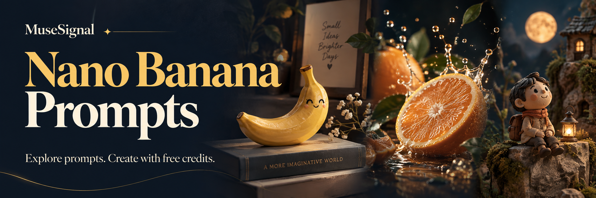

[](https://musesignal.com/zh?utm_source=github&utm_medium=repository&utm_campaign=awesome-nano-banana-prompts&utm_content=banner)

# Awesome Nano Banana Prompts

**by [MuseSignal](https://musesignal.com/zh?utm_source=github&utm_medium=repository&utm_campaign=awesome-nano-banana-prompts&utm_content=brand)**

[English](README.md) · [简体中文](README.zh-CN.md)

完整提示词、真实效果预览、原作者与原始来源。由 MuseSignal 持续整理，覆盖产品摄影、人像、海报等创作场景。

**Nano Banana · Nano Banana 2 · Nano Banana Pro**

> **无需先充值，领取免费积分即可开始体验主流生图模型。**
>
> 在 MuseSignal 注册并领取免费积分即可开始创作。生成消耗积分，具体用量随模型和参数变化。

**[领取免费积分开始创作](<https://musesignal.com/zh?utm_source=github&utm_medium=repository&utm_campaign=awesome-nano-banana-prompts&utm_content=hero>) · [浏览精选 Prompt ↓](<#selected-prompts>)**

| 本仓库公开 Prompt | 本页完整展示 | 数据更新 |
| ---: | ---: | --- |
| **204** | **60** | 2026-10-03 |

本仓库发布 MuseSignal 的部分内容。以上数字分别为 JSON 收录量和本页展示量，不代表网站全量；模型专题是总库子集。

## 按场景浏览

点击进入 MuseSignal 筛选图库。数量为本仓库 JSON 收录量；专题可按具体模型版本浏览。

| 按场景浏览 | JSON 收录 | MuseSignal |
| --- | ---: | --- |
| 人像摄影 | 94 | [Nano Banana](<https://musesignal.com/zh?category=portrait&model=nano-banana&utm_source=github&utm_medium=repository&utm_campaign=awesome-nano-banana-prompts&utm_content=category_portrait>) · [Nano Banana 2](<https://musesignal.com/zh?category=portrait&model=nano-banana-2&utm_source=github&utm_medium=repository&utm_campaign=awesome-nano-banana-prompts&utm_content=category_portrait>) · [Nano Banana Pro](<https://musesignal.com/zh?category=portrait&model=nano-banana-pro&utm_source=github&utm_medium=repository&utm_campaign=awesome-nano-banana-prompts&utm_content=category_portrait>) |
| 商业产品 | 38 | [Nano Banana](<https://musesignal.com/zh?category=commercial-product&model=nano-banana&utm_source=github&utm_medium=repository&utm_campaign=awesome-nano-banana-prompts&utm_content=category_commercial-product>) · [Nano Banana 2](<https://musesignal.com/zh?category=commercial-product&model=nano-banana-2&utm_source=github&utm_medium=repository&utm_campaign=awesome-nano-banana-prompts&utm_content=category_commercial-product>) · [Nano Banana Pro](<https://musesignal.com/zh?category=commercial-product&model=nano-banana-pro&utm_source=github&utm_medium=repository&utm_campaign=awesome-nano-banana-prompts&utm_content=category_commercial-product>) |
| 海报设计 | 17 | [Nano Banana](<https://musesignal.com/zh?category=poster-graphic&model=nano-banana&utm_source=github&utm_medium=repository&utm_campaign=awesome-nano-banana-prompts&utm_content=category_poster-graphic>) · [Nano Banana 2](<https://musesignal.com/zh?category=poster-graphic&model=nano-banana-2&utm_source=github&utm_medium=repository&utm_campaign=awesome-nano-banana-prompts&utm_content=category_poster-graphic>) · [Nano Banana Pro](<https://musesignal.com/zh?category=poster-graphic&model=nano-banana-pro&utm_source=github&utm_medium=repository&utm_campaign=awesome-nano-banana-prompts&utm_content=category_poster-graphic>) |
| 食物饮品 | 11 | [Nano Banana](<https://musesignal.com/zh?category=food-drink&model=nano-banana&utm_source=github&utm_medium=repository&utm_campaign=awesome-nano-banana-prompts&utm_content=category_food-drink>) · [Nano Banana 2](<https://musesignal.com/zh?category=food-drink&model=nano-banana-2&utm_source=github&utm_medium=repository&utm_campaign=awesome-nano-banana-prompts&utm_content=category_food-drink>) · [Nano Banana Pro](<https://musesignal.com/zh?category=food-drink&model=nano-banana-pro&utm_source=github&utm_medium=repository&utm_campaign=awesome-nano-banana-prompts&utm_content=category_food-drink>) |
| 角色艺术 | 29 | [Nano Banana](<https://musesignal.com/zh?category=character-art&model=nano-banana&utm_source=github&utm_medium=repository&utm_campaign=awesome-nano-banana-prompts&utm_content=category_character-art>) · [Nano Banana 2](<https://musesignal.com/zh?category=character-art&model=nano-banana-2&utm_source=github&utm_medium=repository&utm_campaign=awesome-nano-banana-prompts&utm_content=category_character-art>) · [Nano Banana Pro](<https://musesignal.com/zh?category=character-art&model=nano-banana-pro&utm_source=github&utm_medium=repository&utm_campaign=awesome-nano-banana-prompts&utm_content=category_character-art>) |
| 场景空间 | 15 | [Nano Banana](<https://musesignal.com/zh?category=scene-space&model=nano-banana&utm_source=github&utm_medium=repository&utm_campaign=awesome-nano-banana-prompts&utm_content=category_scene-space>) · [Nano Banana 2](<https://musesignal.com/zh?category=scene-space&model=nano-banana-2&utm_source=github&utm_medium=repository&utm_campaign=awesome-nano-banana-prompts&utm_content=category_scene-space>) · [Nano Banana Pro](<https://musesignal.com/zh?category=scene-space&model=nano-banana-pro&utm_source=github&utm_medium=repository&utm_campaign=awesome-nano-banana-prompts&utm_content=category_scene-space>) |

<a id="selected-prompts"></a>

## 精选提示词：效果图与完整 Prompt

[人像摄影](<#selected-portrait>) · [商业产品](<#selected-commercial-product>) · [海报设计](<#selected-poster-graphic>) · [食物饮品](<#selected-food-drink>) · [角色艺术](<#selected-character-art>) · [场景空间](<#selected-scene-space>)

展开「完整提示词」即可复制原文。点击「在 MuseSignal 尝试」进入该案例，再使用页面上的「使用提示词」按钮打开创作面板。效果图为原作者示例；模型版本按来源记录保留。

<a id="selected-portrait"></a>

### 人像摄影 · 13

[Nano Banana](<https://musesignal.com/zh?category=portrait&model=nano-banana&utm_source=github&utm_medium=repository&utm_campaign=awesome-nano-banana-prompts&utm_content=category_portrait>) · [Nano Banana 2](<https://musesignal.com/zh?category=portrait&model=nano-banana-2&utm_source=github&utm_medium=repository&utm_campaign=awesome-nano-banana-prompts&utm_content=category_portrait>) · [Nano Banana Pro](<https://musesignal.com/zh?category=portrait&model=nano-banana-pro&utm_source=github&utm_medium=repository&utm_campaign=awesome-nano-banana-prompts&utm_content=category_portrait>)

<a id="prompt-3336e049-b5ee-454c-9e52-15918181db5b"></a>

#### Sadie Sink with Disco Ball in Pink

<a href="https://musesignal.com/zh/prompt/3336e049-b5ee-454c-9e52-15918181db5b?utm_source=github&amp;utm_medium=repository&amp;utm_campaign=awesome-nano-banana-prompts&amp;utm_content=case_image"></a>

**Nano Banana Pro** · 原作者: manolya

创作场景: 人像摄影

<details>
<summary>完整提示词</summary>

```text
Disco Ball and Sadie Sink
Pink Aesthetic Nano Banana Pro:
{
"style_summary": "Retro-modern disco-pop aesthetic with high-saturation monochromatic tones.",
"pose": {
"orientation": "Over-the-shoulder look",
"description": "The subject is positioned with her back to the camera, twisting her torso to look back. She is holding a large silver disco ball at chest height, creating a focal point in the upper half of the frame.",
"stance": "High-cut silhouette emphasizing the hips and back."
},
"colors": {
"primary_palette": ["Bubblegum Pink", "Fuchsia", "Hot Pink"],
"accent_colors": ["Metallic Silver", "White"],
"skin_tones": "Warm, natural tan with highlights",
"vibe": "Monochromatic and high-energy."
},
"composition": {
"framing": "Vertical, medium-full shot",
"subject_placement": "Centered silhouette",
"background": "Minimalist, solid-colored flat wall",
"depth": "Shallow, with a sharp drop-off shadow on the background to create a 3D pop effect."
},
"outfits_and_props": {
"clothing": "High-leg pink spandex bodysuit with white piping/trim",
"accessories": "Rose-tinted transparent aviator-style sunglasses",
"key_prop": "A large, multi-faceted metallic silver disco ball",
"hair": "High ponytail, sleek and brunette."
},
"lighting": {
"type": "Hard studio lighting",
"direction": "Side-lit from the left",
"shadows": "Sharp, defined shadows on the wall and body contours",
"highlights": "Specular highlights on the bodysuit and disco ball facets",
"special_lighting": "Caustic light reflections (small squares of light) projected onto the subject's skin from the disco ball."
},
"effects_and_texture": {
"finish": "Glossy and high-contrast",
"texture": "Reflective surfaces (disco ball), matte background, and smooth spandex sheen",
"saturation": "High",
"grain": "Clean, digital finish with minimal noise."
```

</details>

**[在 MuseSignal 尝试 →](<https://musesignal.com/zh/prompt/3336e049-b5ee-454c-9e52-15918181db5b?utm_source=github&utm_medium=repository&utm_campaign=awesome-nano-banana-prompts&utm_content=readme_case_cta>)** · [原帖](<https://x.com/manolyaai/status/2020561374217126145>)

---

<a id="prompt-e9496853-ff93-4817-a020-032fe8285cb3"></a>

#### Sweet Costume, Powerful Aura

<a href="https://musesignal.com/zh/prompt/e9496853-ff93-4817-a020-032fe8285cb3?utm_source=github&amp;utm_medium=repository&amp;utm_campaign=awesome-nano-banana-prompts&amp;utm_content=case_image"></a>

**Nano Banana Pro** · 原作者: manolya

创作场景: 人像摄影

<details>
<summary>完整提示词</summary>

```text
{
"visual_style": {
"pose": {
"action": "Relaxed reclining on a textured surface",
"leg_position": "One leg gently raised and extended, the other comfortably bent",
"interaction": "Hands resting naturally on clothing or adjusting fabric casually",
"expression": "Soft, calm expression looking downward or sideways"
},
"colors": {
"palette": "Monochromatic Pink and White",
"primary": "#E18982 (Dusty Rose background)",
"secondary": "#F4A7B9 (Pastel Pink faux fur)",
"accents": [
"#FFFFFF (White clothing and accessories)",
"#F2DADA (Neutral skin tone balance)"
]
},
"composition": {
"framing": "Wide shot with significant negative space at the top",
"subject_placement": "Centered horizontally, weighted in the lower half of the frame",
"depth": "Layered textures with foreground and midground dominated by soft fur texture",
"angle": "Eye-level to slightly high-angle"
},
"outfits": {
"clothing": "White fashion bodysuit or fitted studio outfit (non-lingerie)",
"legwear": "Opaque or semi-opaque white tights or stockings",
"accessories": "Plush white bunny ear headband (playful fashion styling)",
"makeup": "Soft monochromatic pink tones on eyes and cheeks"
},
"lighting": {
"type": "High-key studio lighting",
"quality": "Soft and diffused with minimal harsh shadows",
"effect": "Even illumination emphasizing texture and color harmony"
},
"mood_and_style": {
"theme": "Playful Editorial, Whimsical Fashion",
"vibe": "Dreamy, lighthearted, soft, magazine-style",
"textures": "Contrast between smooth fabric and soft faux fur"
},
"environment": {
"setting": "Minimalist studio",
"props": "Large oversized pink faux-fur sofa or seating surface",
"background": "Solid seamless paper backdrop"
```

</details>

**[在 MuseSignal 尝试 →](<https://musesignal.com/zh/prompt/e9496853-ff93-4817-a020-032fe8285cb3?utm_source=github&utm_medium=repository&utm_campaign=awesome-nano-banana-prompts&utm_content=readme_case_cta>)** · [原帖](<https://x.com/manolyaai/status/2021333957594243367>)

---

<a id="prompt-cf27f8fd-9c22-4325-9185-6283d1bc76ea"></a>

#### Seated Portrait with Foreground Emphasis

<a href="https://musesignal.com/zh/prompt/cf27f8fd-9c22-4325-9185-6283d1bc76ea?utm_source=github&amp;utm_medium=repository&amp;utm_campaign=awesome-nano-banana-prompts&amp;utm_content=case_image"></a>

**Nano Banana 2** · 原作者: sammy

创作场景: 人像摄影

<details>
<summary>完整提示词</summary>

```text
{
"image_metadata": {
"style": "hyper-realistic smartphone photography",
"aspect_ratio": "4:5 vertical",
"resolution": "high resolution with subtle smartphone compression",
"camera": {
"device": "modern smartphone",
"lens": "wide-angle (~24mm equivalent)",
"angle": "slightly low, close perspective",
"framing": "full body seated portrait with strong foreground emphasis on legs and feet",
"focus": "sharp on face and foreground feet, mild background softness"
}
},
"subject": {
"use_reference_image": true,
"override": false,
"pose": {
"position": "seated deep into a cushioned armchair",
"torso": "slightly reclined into the backrest",
"legs": "both legs lifted and bent upward toward camera, creating strong foreshortening",
"arms": "wrapped casually around shins, holding legs in place",
"hips_and_glutes": {
"visibility": "partially visible",
"description": "subtle outline visible due to seated compression against chair cushion; fabric slightly stretched and creased around hip area",
"interaction_with_chair": "pressed into seat, creating natural flattening and fabric tension"
},
"feet": {
"position": "dominant foreground element, closest to lens",
"orientation": "soles facing camera at slight angles",
"detail": "natural skin texture, visible creases, relaxed toes"
}
},
"face": {
"expression": "neutral, slightly serious/pensive",
"gaze": "direct eye contact with camera"
}
},
"clothing": {
"type": "casual loungewear set",
"top": {
"item": "sweatshirt",
"color": "light grey",
"fit": "loose, slightly oversized",
"fabric_behavior": "soft folds around torso and arms"
},
"bottom": {
"item": "jogger sweatpants",
"color": "light grey",
"fit": "relaxed but slightly fitted around hips and thighs",
"details": "elastic ankle cuffs, visible creases from bent legs and seated compression"
}
},
"environment": {
"setting": "indoor, calm living space",
"chair": {
"type": "armchair",
"material": "brown leather",
"texture": "soft, slightly worn with natural creases",
"design": "rounded backrest with stitched geometric/sunburst pattern"
},
"background": {
"curtains": {
"color": "beige",
"material": "heavy fabric",
"style": "full-length, softly draped"
},
"floor": {
"type": "light patterned rug",
"visibility": "partially visible at bottom edge"
}
}
},
"lighting": {
"type": "natural daylight",
"source": "window from side/front",
"quality": "soft and diffused",
"shadow_behavior": "gentle shadows, no harsh contrast",
"tone": "warm-neutral"
},
"composition": {
"perspective": "strong foreshortening due to legs extending toward camera",
"focus_hierarchy": [
"feet in foreground",
"face and expression",
"body posture including seated compression"
],
"framing": "subject centered within chair",
"mood": "intimate, relaxed, candid"
},
"color_palette": {
"dominant": ["light grey", "warm brown", "beige"],
"secondary": ["neutral tones"],
"style": "muted, soft, warm"
},
"post_processing": {
"editing": "minimal, natural",
"contrast": "low to medium",
"saturation": "slightly muted",
"skin_retention": "realistic texture preserved"
```

</details>

**[在 MuseSignal 尝试 →](<https://musesignal.com/zh/prompt/cf27f8fd-9c22-4325-9185-6283d1bc76ea?utm_source=github&utm_medium=repository&utm_campaign=awesome-nano-banana-prompts&utm_content=readme_case_cta>)** · [原帖](<https://x.com/sumiturkude007/status/2045917845842776100>)

---

<a id="prompt-f5935f6b-d62f-4cb5-a133-8cc9087a1c24"></a>

#### Sabrina Carpenter in a Stunning Portrait

<a href="https://musesignal.com/zh/prompt/f5935f6b-d62f-4cb5-a133-8cc9087a1c24?utm_source=github&amp;utm_medium=repository&amp;utm_campaign=awesome-nano-banana-prompts&amp;utm_content=case_image"></a>

**Nano Banana 2** · 原作者: Pinodi

创作场景: 人像摄影

<details>
<summary>完整提示词</summary>

```text
An eye-level, medium-shot lifestyle portrait of [NAME] with an athletic hourglass physique, standing confidently and relaxed in a casual, sporty mood. She is facing the camera but slightly angled to the side, with her right hand resting on her hip and her left hand lightly holding the edge of her tied shirt. Her hair is styled in a high, wavy ponytail with loose strands framing her face, and she looks directly into the lens with a subtle, soft smile.
She wears a 2026 Portugal national football team short-sleeve jersey, with the front tied in a central knot to create a cropped look above her waist, paired with tight, maroon athletic spandex shorts and small gold hoop earrings. Her makeup is natural, featuring defined eyebrows, soft eyeshadow, and nude lipstick.
The setting is an off-white bedroom; a bed with a textured white quilt is visible to the right, next to a dark headboard with warm, built-in accent lighting glowing behind it.
The scene is captured with high-key flat beauty lighting, creating a bright, airy atmosphere with even illumination on her face and extremely soft, low-contrast shadows. Photographed with an 85mm f/1.4 lens, the image features tack-sharp focus on her eyes and a shallow depth of field that elegantly blurs the background into a soft bokeh. The photo maintains real skin texture with visible pores and no artificial smoothing, ensuring high sharpness in the fabric and hair textures, accurate white balance, and a professional high-resolution quality. Aspect Ratio 9:16.
```

</details>

**[在 MuseSignal 尝试 →](<https://musesignal.com/zh/prompt/f5935f6b-d62f-4cb5-a133-8cc9087a1c24?utm_source=github&utm_medium=repository&utm_campaign=awesome-nano-banana-prompts&utm_content=readme_case_cta>)** · [原帖](<https://x.com/PinodiArt/status/2067587675360506344>)

---

<a id="prompt-b0203a6a-e6b1-4a0e-881a-354a1cdf4ff6"></a>

#### Sabrina Carpenter in Radiant Portrait

<a href="https://musesignal.com/zh/prompt/b0203a6a-e6b1-4a0e-881a-354a1cdf4ff6?utm_source=github&amp;utm_medium=repository&amp;utm_campaign=awesome-nano-banana-prompts&amp;utm_content=case_image"></a>

**Nano Banana Pro** · 原作者: Sadia

创作场景: 人像摄影

<details>
<summary>完整提示词</summary>

```text
{
"nano_banana_pro_system_v6.0": {
"global_master_rendering_specifications": {
"resolution": "8K Ultra-HD / 7680x4320 native upscale",
"lighting_engine": "Unreal Engine 5.4 Lumen + Nanite, Path Traced global illumination",
"post_processing": "Subsurface scattering (SSS), chromatic aberration (0.02), film grain (0.1), ACES color grading",
"branding_overlay": "Digital watermark text '@emer_web3' in bottom right corner, 20% opacity"
},
"asset_profile_01_sabrina_yellow": {
"subject": "Sabrina Carpenter",
"physique_metadata": {
"hair": "Voluminous long blonde wavy hair, warm honey highlights, soft curtain bangs",
"complexion": "Radiant, sun-kissed skin texture with natural specular highlights"
},
"wardrobe_specifications": {
"material": "High-elasticity performance spandex, matte lemon yellow finish",
"top": "Cropped tank with intricate multi-strap criss-cross back design",
"bottom": "High-waisted matching leggings, ruched seam 'scrunch' detail on posterior"
},
"scene_coordinates": [
"Pose: Prone on mat, knees bent at 90 degrees, feet raised, looking over shoulder with soft smile",
"Pose: Kneeling lunge, hands clasped above head, torso twisted toward lens",
"Pose: Kneeling, rear-facing torso twist, hands resting on thighs",
"Environment: Seamless white photography cyclorama with a single black rectangular rubber yoga mat"
]
},
"asset_profile_02_sadie_sink_multiverse": {
"subject": "Sadie Sink",
"hair": "Vibrant wavy copper-red hair, textured finish",
"variant_01_lounge": {
"outfit": "Blue 'HAWAIIAN Tropic' strapless tube top with yellow floral logo, matching blue high-waisted shorts",
"environment": "Modern grey-walled interior, KAWS Companion pop-art red canvas, warm wall sconce lighting",
"jewelry": "Gold circular pendant, silver navel piercing"
},
"variant_02_cosplay": {
"outfit": "Red wide-brimmed cowboy hat, tricolor (blue/gold/white) strapless top with silver ring connector, denim shorts, white chaps",
"accessories": "Brown leather belt with gold buckle, yellow armbands with red ribbon ties",
"prop": "Elegant wine glass with dark red liquid"
},
"variant_03_fitness": {
"outfit": "Black 'HAWKINS ATHLETICS' spaghetti strap top, deep cobalt blue high-waisted compression leggings, white crew socks",
"environment": "Gym locker room, full-length mirror reflection, industrial lighting, visible fitness equipment in background"
}
},
"asset_profile_03_sweeney_blue": {
"subject": "Sydney Sweeney",
"outfit_specs": "Premium cobalt blue performance activewear set, high-neck racerback top, high-rise leggings",
"yoga_sequence": [
"Tabletop pose (all-fours) on black mat, focused neutral expression, concrete wall background",
"Seated resting pose, torso leaning back, weight supported by straight arms behind back",
"Prone sphinx variation, chest lifted by forearms, lower legs elevated vertically",
"Vertical leg extension stretch, grasping ankles, intense focus"
]
},
"asset_profile_04_editorial_red": {
"wardrobe": "Vibrant crimson red high-performance gym wear, multi-lattice strap bra, matching leggings",
"visual_highlights": [
"Back view showing intricate lattice strap pattern and tied bow detail",
"Prone pose on black mat against high-key white background, accentuating fabric tension",
"Kneeling pose showing rear scrunch-seam detail and bare feet on mat"
```

</details>

**[在 MuseSignal 尝试 →](<https://musesignal.com/zh/prompt/b0203a6a-e6b1-4a0e-881a-354a1cdf4ff6?utm_source=github&utm_medium=repository&utm_campaign=awesome-nano-banana-prompts&utm_content=readme_case_cta>)** · [原帖](<https://x.com/SadiaMalik182/status/2060595724510015717>)

---

<a id="prompt-5c204dcc-3207-4e00-a096-79921469bbdb"></a>

#### Sydney Sweeney in Ethereal Cupid Pose

<a href="https://musesignal.com/zh/prompt/5c204dcc-3207-4e00-a096-79921469bbdb?utm_source=github&amp;utm_medium=repository&amp;utm_campaign=awesome-nano-banana-prompts&amp;utm_content=case_image"></a>

**Nano Banana Pro** · 原作者: manolya

创作场景: 人像摄影

<details>
<summary>完整提示词</summary>

```text
{
"visual_style": {
"aesthetic_theme": "Modern Ethereal Cupid / Coquette Core",
"composition": {
"shot_type": "Full-body studio portrait",
"pose": "Crouched/squatting position, dynamic three-quarter view with head tilted",
"framing": "Centered subject, vertical orientation",
"background": "Minimalist, seamless off-white/light grey studio backdrop"
},
"color_palette": {
"primary": ["#FDFDFD (Clean White)", "#F4D0D9 (Soft Petal Pink)"],
"secondary": ["#F5F5DC (Cream/Ivory)"],
"accents": ["#D4AF37 (Glittering Gold)", "#FF4D4D (Soft Red heart)"],
"tonality": "High-key, pastel-saturated, and bright"
},
"outfit_and_styling": {
"clothing": "White satin mini slip dress with delicate lace scalloped trim",
"accessories": ["Large pale pink feathered wings", "Textured gold glitter bow", "Red heart-tipped arrow"],
"footwear": "Soft pink patent Mary Jane heels paired with white crew socks",
"hair_style": "Messy ash-blonde updo with soft, face-framing wispy curls",
"makeup": "Igari-style (hangover) heavy pink blush across cheeks and nose, dewy skin, and doll-like wispy lashes"
},
"lighting": {
"source": "Large, soft light source (likely a softbox)",
"quality": "Diffused, high-key, and even",
"shadows": "Extremely soft and minimal, creating a 'glowy' skin effect"
},
"effects_and_atmosphere": {
"textures": "Contrast between smooth satin, organic feathers, and gritty gold glitter",
"vibe": "Romantic, whimsical, dreamy, and youthful",
"finish": "Sharp focus on facial features with a slight soft-focus blooming effect on the highlights"
```

</details>

**[在 MuseSignal 尝试 →](<https://musesignal.com/zh/prompt/5c204dcc-3207-4e00-a096-79921469bbdb?utm_source=github&utm_medium=repository&utm_campaign=awesome-nano-banana-prompts&utm_content=readme_case_cta>)** · [原帖](<https://x.com/manolyaai/status/2020872345393447326>)

---

<a id="prompt-9f07ae34-5326-49c6-82ef-8e268a5f4407"></a>

#### Candid Gaze of Rosé in Soft Light

<a href="https://musesignal.com/zh/prompt/9f07ae34-5326-49c6-82ef-8e268a5f4407?utm_source=github&amp;utm_medium=repository&amp;utm_campaign=awesome-nano-banana-prompts&amp;utm_content=case_image"></a>

**Nano Banana 2** · 原作者: Alice

创作场景: 人像摄影

<details>
<summary>完整提示词</summary>

```text
{
"type": "image_prompt",
"meta": {
"aspect_ratio": "9:16",
"style": "casual lifestyle photography",
"quality": "ultra photorealistic, highly detailed, 8k resolution",
"focus": "sharp focus on subject, realistic skin texture and fabric draping"
},
"subject": {
"identity": "Rosé (Park Chaeyoung) from BLACKPINK",
"appearance": {
"hair": "messy long blonde hair",
"expression": "head watching the camera in three-quarter front view, gaze directed at the camera, mouth slightly open in a candid relaxed expression with natural lip color"
},
"body_type": "slim athletic build with visible collarbones and natural arm definition"
},
"clothing": {
"type": "bright yellow sleeveless tank top",
"details": "loose-fitting with thin straps and a deep side cutout prominently visible on her left side revealing skin, paired with light-colored bottoms partially visible"
},
"pose": {
"description": "exact amateur smartphone selfie mirror shot from a precise side angle",
"body_position": "body turned slightly to the side, left arm raised with hand behind her head tousling her messy blonde hair",
"arms": "left arm raised with hand behind her head, right hand holding a gray iPhone with triple camera array extended forward for the selfie",
"head": "turned toward the phone in three-quarter profile view"
},
"environment": {
"location": "bright bedroom with pink walls and unmade bed",
"details": "graffiti written 'youngcatwoman' on walls in the background, white dresser, messy white bedding"
},
"props": [
"gray iPhone with triple camera array"
],
"lighting": {
"type": "natural",
"quality": "bright natural daylight from a window on the left creating soft directional shadows along her side profile and even illumination with accurate auto white balance around 5500K",
"effects": "soft directional shadows, realistic smartphone lighting"
},
"mood": "candid relaxed",
"color_palette": [
"Bright red tank top",
"Pink walls",
"Messy blonde hair",
"White bedding"
],
"camera": {
"framing": "medium shot from waist up",
"perspective": "exact amateur smartphone selfie mirror shot from a precise side angle with mild wide-angle lens distortion",
"lens_suggestion": "smartphone lens with slight natural distortion (approximately 24mm equivalent focal length)"
},
"additional_details": [
"Photorealistic recreation preserving the exact original flat casual lighting, cluttered bedroom background, precise first-person selfie perspective with visible extended arm holding the device from the side angle, natural front-camera lens distortion on the face in profile, and authentic unfiltered amateur smartphone photography feel with high detail in hair strands, skin texture, and clothing fabric.",
"Kim Jisoo from BLACKPINK with the same outfit style as the main subject but wearing a bright orange sleeveless tank top and denim shorts is standing just behind Rosé, hugging her lovingly from the back with her arms wrapped gently and affectionately around her waist. Jisoo has long wavy dark hair, a warm friendly smile with her characteristic lip shape, and is embracing Rosé protectively while Rosé takes the selfie."
```

</details>

**[在 MuseSignal 尝试 →](<https://musesignal.com/zh/prompt/9f07ae34-5326-49c6-82ef-8e268a5f4407?utm_source=github&utm_medium=repository&utm_campaign=awesome-nano-banana-prompts&utm_content=readme_case_cta>)** · [原帖](<https://x.com/youngcatwoman/status/2048338798137004056>)

---

<a id="prompt-2e4b2e9c-bcbb-4938-8ac7-6f20cd8ccfeb"></a>

#### Deep Squat Pose in High Heels

<a href="https://musesignal.com/zh/prompt/2e4b2e9c-bcbb-4938-8ac7-6f20cd8ccfeb?utm_source=github&amp;utm_medium=repository&amp;utm_campaign=awesome-nano-banana-prompts&amp;utm_content=case_image"></a>

**Nano Banana 2** · 原作者: sammy

创作场景: 人像摄影

<details>
<summary>完整提示词</summary>

```text
{
"image_description": {
"subject": {
"use_reference_image": true,
"override": false,
"physique": "slim, toned"
},
"pose_and_composition": {
"body_position": "tight deep squat",
"lower_body": {
"stance": "knees fully bent and drawn close to chest",
"feet": {
"position": "close together, pointed forward",
"heels": "elevated due to high heels",
"weight_distribution": "balanced on balls of feet"
}
},
"upper_body": {
"posture": "leaning forward over knees",
"arms": {
"one_arm": "forearm resting across knees",
"other_arm": "elbow resting on knee with hand supporting head"
}
},
"head": {
"tilt": "slight tilt to side",
"direction": "angled upward",
"gaze": "direct eye contact with camera above",
"facial_features": "fully derived from reference image",
"expression": "fully derived from reference image"
},
"camera_angle": {
"position": "well above subject’s head",
"angle": "top-down high angle (approximately 30–45 degrees downward)",
"lens": "slight wide-angle smartphone perspective",
"distance": "close framing, compact composition",
"effect": "knees and feet appear slightly larger due to perspective"
},
"aspect_ratio": "4:5 vertical"
},
"attire": {
"outfit": {
"type": "long-sleeve fitted mini dress",
"color": "black",
"fabric": "velvet or soft matte",
"fit": "tight, body-contouring",
"neckline": "deep V-neck"
},
"footwear": {
"type": "high heels",
"color": "black patent",
"details": "pointed toe with ankle embellishments"
},
"accessories": {
"bag": "small metallic/rhinestone handbag held loosely",
"necklace": "thin silver necklace"
}
},
"environment_and_lighting": {
"setting": "modern indoor space (elevator or hallway)",
"background": "metallic wall panels",
"floor": "light gray tile floor",
"lighting": {
"type": "overhead indoor lighting",
"quality": "soft but directional from above",
"effect": "subtle highlights on face and reflective surfaces"
}
},
"technical_details": {
"style": "fashion/editorial photography",
"resolution": "high definition",
"depth_of_field": "moderate, subject sharp"
},
"rendering_notes": {
"identity_consistency": "all facial features must match reference image exactly",
"camera_priority": "strong top-down perspective must be preserved",
"pose_accuracy": "tight squat with forward lean",
"perspective_accuracy": "slight wide lens distortion (foreground emphasis)",
"anatomy": "natural proportions, no distortion artifacts",
"consistency": "alignment between camera height, gaze direction, and pose"
```

</details>

**[在 MuseSignal 尝试 →](<https://musesignal.com/zh/prompt/2e4b2e9c-bcbb-4938-8ac7-6f20cd8ccfeb?utm_source=github&utm_medium=repository&utm_campaign=awesome-nano-banana-prompts&utm_content=readme_case_cta>)** · [原帖](<https://x.com/sumiturkude007/status/2048469660010783160>)

---

<a id="prompt-ff0b57fd-16cf-40f4-b04a-b7a9f564c039"></a>

#### Atelier-Style Digital Oil Portrait

<a href="https://musesignal.com/zh/prompt/ff0b57fd-16cf-40f4-b04a-b7a9f564c039?utm_source=github&amp;utm_medium=repository&amp;utm_campaign=awesome-nano-banana-prompts&amp;utm_content=case_image"></a>

**Nano Banana Pro** · 原作者: Zayan

创作场景: 人像摄影

<details>
<summary>完整提示词</summary>

```text
Digital oil painting with a semi-realistic portrait approach, painterly brushwork with visible, loose strokes and textured edges. Soft blending on facial features combined with expressive, rough brush strokes around the hair and clothing. Use a warm, natural skin tone palette with subtle color variation (peach, beige, soft pink highlights) and gentle light diffusion.
Lighting is soft and directional, slightly from the front/side, creating smooth shadows without harsh contrast. Emphasize natural highlights on the nose, cheeks, and forehead with a slightly glossy, painterly finish.
Background is abstract and minimal, composed of broad, dry-brush strokes with muted colors (desaturated teal, gray, olive, and beige), creating a soft halo effect around the subject. Edges of the subject fade organically into the background using broken brush strokes.
Color treatment is vibrant but controlled, with warm tones (orange, red) contrasted against cool, muted background hues. Brush strokes should feel spontaneous and layered, with visible paint texture, as if done on canvas.
Overall finish should resemble a modern atelier-style portrait painting, slightly stylized but still grounded in realism, with an artistic, handcrafted feel rather than hyper-detailed realism. No sharp outlines—forms are defined by color and light transitions.
```

</details>

**[在 MuseSignal 尝试 →](<https://musesignal.com/zh/prompt/ff0b57fd-16cf-40f4-b04a-b7a9f564c039?utm_source=github&utm_medium=repository&utm_campaign=awesome-nano-banana-prompts&utm_content=readme_case_cta>)** · [原帖](<https://x.com/HustleXR/status/2100463992938643539>)

---

<a id="prompt-efe11ff2-16af-4656-a41c-37ad87b9973c"></a>

#### Expressive Oil Painting Portrait Style

<a href="https://musesignal.com/zh/prompt/efe11ff2-16af-4656-a41c-37ad87b9973c?utm_source=github&amp;utm_medium=repository&amp;utm_campaign=awesome-nano-banana-prompts&amp;utm_content=case_image"></a>

**Nano Banana Pro** · 原作者: Zayan

创作场景: 人像摄影

<details>
<summary>完整提示词</summary>

```text
Expressive oil painting, loose brushwork, painterly portrait style, visible brush strokes, impressionistic realism, textured canvas feel, warm earthy tones (ochre, sienna, umber), soft natural lighting, rough edges and unfinished background, focus on facial texture and character, rich skin tones with subtle highlights, gestural painting technique, traditional fine art style, slightly abstracted details, organic blending, handcrafted look, muted background, artistic spontaneity, museum-style portrait painting. Ar 9:16!
```

</details>

**[在 MuseSignal 尝试 →](<https://musesignal.com/zh/prompt/efe11ff2-16af-4656-a41c-37ad87b9973c?utm_source=github&utm_medium=repository&utm_campaign=awesome-nano-banana-prompts&utm_content=readme_case_cta>)** · [原帖](<https://x.com/HustleXR/status/2099445268634894339>)

---

<a id="prompt-2fb5e7db-dcd9-4bc1-a54e-35c94d0d9ab4"></a>

#### Hand-Drawn Editorial Portrait Illustration

<a href="https://musesignal.com/zh/prompt/2fb5e7db-dcd9-4bc1-a54e-35c94d0d9ab4?utm_source=github&amp;utm_medium=repository&amp;utm_campaign=awesome-nano-banana-prompts&amp;utm_content=case_image"></a>

**Nano Banana Pro** · 原作者: Zayan

创作场景: 人像摄影

<details>
<summary>完整提示词</summary>

```text
Hand-drawn editorial portrait illustration, semi-realistic sketch style, fine ink linework, cross-hatching shading, textured pencil strokes, subtle watercolor wash, muted earthy color palette, warm tones, soft paper grain texture, vintage magazine illustration aesthetic, clean centered composition, minimal background with bold geometric color block, rough brush edges, natural skin texture rendering, soft shadow gradients, high detail facial features, artistic sketch-paint hybrid, modern retro illustration style, matte finish, subtle grunge texture, professional editorial artwork.
```

</details>

**[在 MuseSignal 尝试 →](<https://musesignal.com/zh/prompt/2fb5e7db-dcd9-4bc1-a54e-35c94d0d9ab4?utm_source=github&utm_medium=repository&utm_campaign=awesome-nano-banana-prompts&utm_content=readme_case_cta>)** · [原帖](<https://x.com/HustleXR/status/2098637009191604686>)

---

<a id="prompt-e9915f4c-2619-4671-8701-858b5599d76c"></a>

#### Watercolor Portrait With Painter&#39;s Hand

<a href="https://musesignal.com/zh/prompt/e9915f4c-2619-4671-8701-858b5599d76c?utm_source=github&amp;utm_medium=repository&amp;utm_campaign=awesome-nano-banana-prompts&amp;utm_content=case_image"></a>

**Nano Banana Pro** · 原作者: Zayan

创作场景: 人像摄影

<details>
<summary>完整提示词</summary>

```text
Ar 9:16! Expressive loose watercolor illustration style, ultra-detailed watercolor portrait rendering, soft translucent paint layering, wet-on-wet watercolor diffusion, natural pigment bleeding effects, delicate brushstroke textures, airy hand-painted aesthetic, realistic anatomy blended with painterly abstraction, subtle ink-like edge definition, elegant unfinished watercolor splashes around the composition, soft feathered transitions between colors, luminous paper texture visible through transparent paint layers, warm natural skin tones with gentle blush highlights, cinematic soft lighting, flowing organic brush movement, refined watercolor realism with emotional fine art atmosphere, smooth facial rendering contrasted with loose expressive edges, handcrafted traditional painting aesthetic, watercolor bloom effects, fluid color gradients, lightly desaturated palette with earthy warm neutrals and muted blues, premium sketchbook illustration style, visible artistic spontaneity, delicate strand-like hair strokes, atmospheric white negative space, minimal background detail, soft focus depth, editorial fine art watercolor aesthetic, subtle accidental paint marks and organic imperfections, elegant composition balance, painter’s hand holding a thin paintbrush visible in foreground, immersive artist-at-work perspective, realistic brush and hand rendering, museum-quality watercolor artwork, timeless classical painting mood, sophisticated contemporary watercolor portrait style, ultra refined paper-and-pigment texture, dreamy and poetic visual tone, handcrafted artistic realism, master-level watercolor detailing.
```

</details>

**[在 MuseSignal 尝试 →](<https://musesignal.com/zh/prompt/e9915f4c-2619-4671-8701-858b5599d76c?utm_source=github&utm_medium=repository&utm_campaign=awesome-nano-banana-prompts&utm_content=readme_case_cta>)** · [原帖](<https://x.com/HustleXR/status/2096539446120530325>)

---

<a id="prompt-c709c036-8035-405d-aa92-ae77131c9c84"></a>

#### Cinematic Taj Mahal Model Portrait

<a href="https://musesignal.com/zh/prompt/c709c036-8035-405d-aa92-ae77131c9c84?utm_source=github&amp;utm_medium=repository&amp;utm_campaign=awesome-nano-banana-prompts&amp;utm_content=case_image"></a>

**Nano Banana Pro** · 原作者: Maddox

创作场景: 人像摄影

<details>
<summary>完整提示词</summary>

```text
a elegant long hair, black girl model wearing black summer dress, standing in front of the taj mahal with a big elephant touching her with its trunk, Whole body in frame shot from the side. Soft outdoor daylight, diffused lighting, warm highlights, gentle white tones, natural color grading. Natural skin texture, realistic facial proportions, confident yet friendly expression. High-end commercial photography, photorealistic, ultra-detailed, cinematic realism. Canon EOS R5, 85mm lens, f/1.2 aperture, shallow depth of field, creamy bokeh, sharp focus, 8K, the camera makes a close up, she is posing for the camera
```

</details>

**[在 MuseSignal 尝试 →](<https://musesignal.com/zh/prompt/c709c036-8035-405d-aa92-ae77131c9c84?utm_source=github&utm_medium=repository&utm_campaign=awesome-nano-banana-prompts&utm_content=readme_case_cta>)** · [原帖](<https://x.com/Maddox_Digital/status/2084094837012455860>)

---

<a id="selected-commercial-product"></a>

### 商业产品 · 9

[Nano Banana](<https://musesignal.com/zh?category=commercial-product&model=nano-banana&utm_source=github&utm_medium=repository&utm_campaign=awesome-nano-banana-prompts&utm_content=category_commercial-product>) · [Nano Banana 2](<https://musesignal.com/zh?category=commercial-product&model=nano-banana-2&utm_source=github&utm_medium=repository&utm_campaign=awesome-nano-banana-prompts&utm_content=category_commercial-product>) · [Nano Banana Pro](<https://musesignal.com/zh?category=commercial-product&model=nano-banana-pro&utm_source=github&utm_medium=repository&utm_campaign=awesome-nano-banana-prompts&utm_content=category_commercial-product>)

<a id="prompt-c6beb52d-34fd-45cb-9e49-229af4ce108c"></a>

#### Nano Banana 2 Enamel Pin on Desk

<a href="https://musesignal.com/zh/prompt/c6beb52d-34fd-45cb-9e49-229af4ce108c?utm_source=github&amp;utm_medium=repository&amp;utm_campaign=awesome-nano-banana-prompts&amp;utm_content=case_image"></a>

**Nano Banana 2** · 原作者: Nano Banana 2

创作场景: 商业产品

<details>
<summary>完整提示词</summary>

```text
You can use Nano Banana 2 to turn anything into an enamel pin. In @GeminiApp you can select the "Enamel pin" style, or you can use a prompt like this:
Turn just the subject into a gold enamel pin. It's a minimal photo of the pin on a desk, no other items.
```

</details>

**[在 MuseSignal 尝试 →](<https://musesignal.com/zh/prompt/c6beb52d-34fd-45cb-9e49-229af4ce108c?utm_source=github&utm_medium=repository&utm_campaign=awesome-nano-banana-prompts&utm_content=readme_case_cta>)** · [原帖](<https://x.com/NanoBanana/status/2027716950705521054>)

---

<a id="prompt-14d82000-1fd7-46ba-8140-79e10b46e271"></a>

#### Late-Night Selfie with Nano Banana Pro

<a href="https://musesignal.com/zh/prompt/14d82000-1fd7-46ba-8140-79e10b46e271?utm_source=github&amp;utm_medium=repository&amp;utm_campaign=awesome-nano-banana-prompts&amp;utm_content=case_image"></a>

**Nano Banana Pro** · 原作者: Aria

创作场景: 商业产品

<details>
<summary>完整提示词</summary>

```text
Ultra-realistic indoor selfie portrait of a breathtakingly beautiful young woman sitting casually on a bed in a minimalist modern bedroom, captured with an iPhone-style front camera angle. Soft direct flash photography creates luminous glowing skin, realistic highlights, and subtle shadows, giving the image a candid late-night selfie atmosphere. Clean neutral-toned background, cozy modern bedroom aesthetic, natural composition, effortless feminine beauty with subtle IG baddie influence.
Face & Expression:
Soft oval face shape with delicate feminine features, large almond-shaped eyes, naturally flushed cheeks, small defined nose, and glossy pink lips slightly parted. Joyful and playful expression with a soft smile, sparkling eyes, and carefree feminine energy. Dreamy yet fun vibe, realistic skin texture with visible pores and natural glow.
Makeup — Soft IG Baddie Meets Clean Girl: Flawless hydrated glass skin with a soft matte balance and luminous highlights on the cheeks and nose. Soft pink blush concentrated across the cheeks and nose bridge for youthful warmth. Defined fluffy brows with clean shaping. Eyes enhanced with soft brown-pink eyeshadow, subtle eyeliner, wispy doll-like lashes, and bright under-eye highlights creating large innocent eyes. Lips are naturally overlined with a glossy pink tint. Makeup feels feminine, modern, effortless, photogenic, and subtly glamorous.
Hair: Long voluminous chestnut-brown layered blowout hairstyle with soft feathered curtain bangs framing the face naturally. Smooth silky texture with luxurious shine, large rounded bouncy curls at the ends, face-framing layers, airy movement, and salon-quality 90s supermodel blowout styling. Hair appears thick, healthy, soft, and dimensional with subtle warm brunette highlights. Elegant fluffy volume around the crown and sides, softly curled inward and outward layers creating glamorous movement. Slightly messy effortless styling with a few loose strands framing the cheeks naturally. One hand gently touching and adjusting the messy hair, enhancing the candid playful selfie vibe.
Outfit & Styling: Tight fitted white baby tee with soft fabric contours, casual feminine styling, minimalist jewelry, oversized round eyeglasses with subtle flash reflection on the lenses adding realism and cozy aesthetic charm.
Lighting & Atmosphere: Direct camera flash mixed with soft ambient room lighting, creating glossy skin reflections, natural facial depth, and realistic bedroom selfie vibes. Soft warm neutral color grading, intimate candid mood, cozy clean-girl aesthetic with luxury influencer photography feel.
Camera & Composition: Close-up to medium framing, slight low-angle selfie perspective with extended arm visible, shallow depth of field, ultra-realistic DSLR/iPhone hybrid quality, cinematic skin rendering, natural imperfections preserved, cozy candid framing, 8k ultra-detailed realism.
```

</details>

**[在 MuseSignal 尝试 →](<https://musesignal.com/zh/prompt/14d82000-1fd7-46ba-8140-79e10b46e271?utm_source=github&utm_medium=repository&utm_campaign=awesome-nano-banana-prompts&utm_content=readme_case_cta>)** · [原帖](<https://x.com/ariaxawan/status/2061324766901088571>)

---

<a id="prompt-d1680c98-65ff-49df-84a9-10db1abf1568"></a>

#### Futuristic Sneakers Stepping Into Tomorrow

<a href="https://musesignal.com/zh/prompt/d1680c98-65ff-49df-84a9-10db1abf1568?utm_source=github&amp;utm_medium=repository&amp;utm_campaign=awesome-nano-banana-prompts&amp;utm_content=case_image"></a>

**Nano Banana 2** · 原作者: Gem Alpha

创作场景: 商业产品

<details>
<summary>完整提示词</summary>

```text
Futuristic Sneakers
Step into tomorrow. 👟⚡
Innovation begins with every stride.
Created with Nano Banana 2 on @Lart_AI
Check the Stey bye step Tutorial here 👇🏻
```

</details>

**[在 MuseSignal 尝试 →](<https://musesignal.com/zh/prompt/d1680c98-65ff-49df-84a9-10db1abf1568?utm_source=github&utm_medium=repository&utm_campaign=awesome-nano-banana-prompts&utm_content=readme_case_cta>)** · [原帖](<https://x.com/Gemalpha_88/status/2073221972432199693>)

---

<a id="prompt-e1e22381-87bd-4252-85f4-b17970f0a1f0"></a>

#### Dynamic 3D Product Ad with Dramatic Lighting

<a href="https://musesignal.com/zh/prompt/e1e22381-87bd-4252-85f4-b17970f0a1f0?utm_source=github&amp;utm_medium=repository&amp;utm_campaign=awesome-nano-banana-prompts&amp;utm_content=case_image"></a>

**Nano Banana Pro** · 原作者: Amira Zairi

创作场景: 商业产品

<details>
<summary>完整提示词</summary>

```text
Cinematic 3D action-packed advertisement for [INSERT PRODUCT/BRAND HERE], captured in an intense mid-motion moment with dramatic studio lighting, dynamic particle effects, and high-impact slow-motion energy. Ultra-hyperrealistic rendering, razor-sharp details, glossy commercial finish, atmospheric depth, and powerful contrast. Viral-ready composition with the brand logo seamlessly integrated into the scene and a sleek, modern slogan positioned cleanly beneath. High-end blockbuster commercial aesthetic
```

</details>

**[在 MuseSignal 尝试 →](<https://musesignal.com/zh/prompt/e1e22381-87bd-4252-85f4-b17970f0a1f0?utm_source=github&utm_medium=repository&utm_campaign=awesome-nano-banana-prompts&utm_content=readme_case_cta>)** · [原帖](<https://x.com/azed_ai/status/2069781855772233854>)

---

<a id="prompt-fe49ff6c-3605-4f38-8055-3503200b0a15"></a>

#### Specialty Coffee Packaging Design Concept

<a href="https://musesignal.com/zh/prompt/fe49ff6c-3605-4f38-8055-3503200b0a15?utm_source=github&amp;utm_medium=repository&amp;utm_campaign=awesome-nano-banana-prompts&amp;utm_content=case_image"></a>

**Nano Banana** · 原作者: Daria\_Surkova

创作场景: 商业产品

<details>
<summary>完整提示词</summary>

```text
Design Concept of the Day
Specialty Coffee Packaging Design
Midjourney + NanoBanana + Ps
```

</details>

**[在 MuseSignal 尝试 →](<https://musesignal.com/zh/prompt/fe49ff6c-3605-4f38-8055-3503200b0a15?utm_source=github&utm_medium=repository&utm_campaign=awesome-nano-banana-prompts&utm_content=readme_case_cta>)** · [原帖](<https://x.com/Dari_Designs/status/2043685636922806566>)

---

<a id="prompt-0376ed86-67b2-4d11-ae83-72cf61e30c20"></a>

#### Avant-Garde Typographic Portrait with Nano Banana Pro

<a href="https://musesignal.com/zh/prompt/0376ed86-67b2-4d11-ae83-72cf61e30c20?utm_source=github&amp;utm_medium=repository&amp;utm_campaign=awesome-nano-banana-prompts&amp;utm_content=case_image"></a>

**Nano Banana Pro** · 原作者: ΛRMIN \| AI

创作场景: 商业产品

<details>
<summary>完整提示词</summary>

```text
A premium editorial mixed-media avant-garde magazine poster.
SUBJECT & COMPOSITION: A central, shoulder-up portrait of [INSERT CHARACTER NAME], featuring a [INSERT FACIAL EXPRESSION / EMOTION, e.g., stern, intense, or smiling] serious facial expression, with [INSERT HAIR / FACIAL HAIR DESCRIPTION], staring directly into the lens. He/She is wearing a sleek, [INSERT BLACK CLOTHING DESCRIPTION, e.g., solid black t-shirt or turtleneck] that extends to the absolute bottom edge of the frame. The art style is a high-contrast figurative digital illustration with realistic ink shading, intricate manual cross-hatching, and crisp linework mixed with retro stippling.
TRANSLUCENT GRAPHIC HIGHLIGHT: A raw, slightly tilted diagonal vibrant [INSERT HIGHLIGHT COLOR] graphic bar is slashed strictly across the eyes. Crucially, this color block is a highly translucent, sheer vellum-like overlay with a multiply-blend effect; every single detail underneath—including the fine lines of the eyes, the facial features, the texture of the hair, and the background text—remains perfectly visible and crisp through the [INSERT SAME COLOR] tint. The highlight features an authentic vintage halftone dot screen-print texture with subtle, raw ink-bleeds along its imperfect edges.
DESIGNER TEXT BACKGROUND: The background is an off-white newsprint paper texture layout, structured into clean justified columns with distinct gutters, completely filled with dense, tiny black Lorem Ipsum text. Crucially, a sharp, empty negative space buffer closely contours his/her hair and face; this buffer matches the exact off-white canvas color, ensuring a seamless break in the text grid without any sticker outline. Faint, technical printer registration marks and tiny color-bar test strips are subtly visible on the extreme bottom edges, while a minimalist horizontal barcode and a technical serial number are placed on the extreme top edges.
TYPOGRAPHY: At the absolute bottom, overlaid on his/her black garment, the title "[INSERT CHARACTER NAME IN CAPS]" is typeset in an ultra-bold, heavy geometric sans-serif font (like Neue Haas Grotesk Display or Futura Bold) in crisp solid white. Underneath, a smaller, widely-spaced white subtitle reads "[INSERT CUSTOM SUBTITLE / EPITHET]" with generous letter-spacing.
MATERIAL & VINTAGE PRINTING: The overall poster exhibits tangible paper grain, a slightly weathered archive condition, minor corner ink-wear, and organic, gentle paper creases across the entire canvas.
```

</details>

**[在 MuseSignal 尝试 →](<https://musesignal.com/zh/prompt/0376ed86-67b2-4d11-ae83-72cf61e30c20?utm_source=github&utm_medium=repository&utm_campaign=awesome-nano-banana-prompts&utm_content=readme_case_cta>)** · [原帖](<https://x.com/Arminn_Ai/status/2064039812861186497>)

---

<a id="prompt-295774ea-0236-40a3-9947-fe74a4710a2d"></a>

#### Luxury FIFA Trophy Built from Brand Products

<a href="https://musesignal.com/zh/prompt/295774ea-0236-40a3-9947-fe74a4710a2d?utm_source=github&amp;utm_medium=repository&amp;utm_campaign=awesome-nano-banana-prompts&amp;utm_content=case_image"></a>

**Nano Banana Pro** · 原作者: Saul Goodman

创作场景: 商业产品

<details>
<summary>完整提示词</summary>

```text
Brand_Name: {Type brand name}
Create a clean premium poster in 4:5 vertical format. Place the brand logo at the top center. In the middle, build a FIFA World Cup trophy shape using only the brand’s products and packaging, arranged to match the exact iconic trophy silhouette as closely as possible. Keep the trophy centered, tall, elegant, and instantly recognizable, with realistic 3D product rendering, crisp details, and soft studio shadows. Use a flat solid background in the brand’s signature color. Add floating golden confetti, ribbon curls, and subtle spark bursts around the trophy. At the bottom, add a short bold all-caps slogan in modern heavy typography. Keep the design minimal, highly polished, and identical in composition style to a luxury brand campaign poster.
```

</details>

**[在 MuseSignal 尝试 →](<https://musesignal.com/zh/prompt/295774ea-0236-40a3-9947-fe74a4710a2d?utm_source=github&utm_medium=repository&utm_campaign=awesome-nano-banana-prompts&utm_content=readme_case_cta>)** · [原帖](<https://x.com/Goodmanprotocol/status/2069647345374077253>)

---

<a id="prompt-20aceaa8-1624-4bd7-b7c7-5a463da7512e"></a>

#### Minimalist Fashion Campaign with Maroon Knit Top

<a href="https://musesignal.com/zh/prompt/20aceaa8-1624-4bd7-b7c7-5a463da7512e?utm_source=github&amp;utm_medium=repository&amp;utm_campaign=awesome-nano-banana-prompts&amp;utm_content=case_image"></a>

**Nano Banana Pro** · 原作者: Calira

创作场景: 商业产品

<details>
<summary>完整提示词</summary>

```text
A high-end UGC fashion campaign featuring a young East Asian woman with long, sleek straight black hair, showcasing a product. She is wearing a deep maroon knit cowl-neck short-sleeve top with elegant draped pleats on the shoulder and ruching on the sides, paired with white drawstring cargo shorts.
A multi-angle cinematic sequence style, showcasing both full-body lifestyle shots and close-up fabric textures. The setting is a minimalist, modern aesthetic apartment with a cream-colored curved sofa, a large gold-rimmed standing mirror, and bright windows. Soft, diffused natural morning sunlight illuminating the scene, casting gentle shadows.
Photorealistic, high-end commercial quality, shot on an 85mm lens, f/1.8 aperture, sharp focus on the fine texture of the burgundy fabric, clean color grading, 8K resolution.
```

</details>

**[在 MuseSignal 尝试 →](<https://musesignal.com/zh/prompt/20aceaa8-1624-4bd7-b7c7-5a463da7512e?utm_source=github&utm_medium=repository&utm_campaign=awesome-nano-banana-prompts&utm_content=readme_case_cta>)** · [原帖](<https://x.com/CaliraVal/status/2062391667567767855>)

---

<a id="prompt-bf809ccc-3b6b-433b-9946-dfd2d93169a5"></a>

#### Black-and-White High Fashion Jewelry Editorial

<a href="https://musesignal.com/zh/prompt/bf809ccc-3b6b-433b-9946-dfd2d93169a5?utm_source=github&amp;utm_medium=repository&amp;utm_campaign=awesome-nano-banana-prompts&amp;utm_content=case_image"></a>

**Nano Banana Pro** · 原作者: Maddox

创作场景: 商业产品

<details>
<summary>完整提示词</summary>

```text
Black-and-white high fashion jewelry editorial photograph featuring two models — a woman in the foreground and a man in the background. The woman has sleek hair pulled back tightly, wearing a black turtleneck top, a small geometric diamond stud earring, and a delicate diamond eternity ring on her finger. Her hand rests gently on the man's chest/shoulder. The man is positioned behind her in side profile, head slightly tilted upward, wearing a dark structured jacket, his face partially in deep shadow creating a dramatic silhouette. Pure white overexposed background. Dramatic high contrast studio lighting with deep shadows sculpting the faces. Intimate yet distant mood, luxury jewelry campaign aesthetic, sharp focus on the ring and earring, cinematic composition, shot from a slight low angle looking up, editorial Vogue or Tiffany & Co. campaign style, 8K, hyper-realistic.
```

</details>

**[在 MuseSignal 尝试 →](<https://musesignal.com/zh/prompt/bf809ccc-3b6b-433b-9946-dfd2d93169a5?utm_source=github&utm_medium=repository&utm_campaign=awesome-nano-banana-prompts&utm_content=readme_case_cta>)** · [原帖](<https://x.com/Maddox_Digital/status/2075576614973530314>)

---

<a id="selected-poster-graphic"></a>

### 海报设计 · 8

[Nano Banana](<https://musesignal.com/zh?category=poster-graphic&model=nano-banana&utm_source=github&utm_medium=repository&utm_campaign=awesome-nano-banana-prompts&utm_content=category_poster-graphic>) · [Nano Banana 2](<https://musesignal.com/zh?category=poster-graphic&model=nano-banana-2&utm_source=github&utm_medium=repository&utm_campaign=awesome-nano-banana-prompts&utm_content=category_poster-graphic>) · [Nano Banana Pro](<https://musesignal.com/zh?category=poster-graphic&model=nano-banana-pro&utm_source=github&utm_medium=repository&utm_campaign=awesome-nano-banana-prompts&utm_content=category_poster-graphic>)

<a id="prompt-e10af005-1a73-44b7-9430-a53c29d07d47"></a>

#### Duotone Typographic Portrait Poster

<a href="https://musesignal.com/zh/prompt/e10af005-1a73-44b7-9430-a53c29d07d47?utm_source=github&amp;utm_medium=repository&amp;utm_campaign=awesome-nano-banana-prompts&amp;utm_content=case_image"></a>

**Nano Banana Pro** · 原作者: ΛRMIN \| AI

创作场景: 海报设计

<details>
<summary>完整提示词</summary>

```text
A professional duotone graphic design poster of [Subject], rendered from the neck up in a detailed three-quarter profile view looking slightly right. [description of facial expression and gaze].
Composition & Typography Integration: The visual style is a seamless double-exposure blend of typography and portraiture, exactly as if the text is carving out the face. The bold, heavy, solid sans-serif word "[Word]" is positioned vertically on the left. Crucially, the typography is not a flat layer on top of or behind the face; instead, the left side of Subject's face—including the left eye, eyebrow, temple, and cheek—is visibly contained and fully detailed inside the body of the letters themselves. The facial features and shading transition smoothly into the text without any sharp dividing lines, gaps, or cuts, allowing the complete structure of the face to remain recognizable through the typography.
Texture & Halftone Technique: The entire face and the vertical text are rendered in a uniform, deep [Dark Color Name] color. The details and gradients of the portrait are created using a fine, sharp screen-print halftone stippling dot pattern.
Background & Framing (Strict Rule): The background is a flat, solid [Light Color Name] color, overlaid completely with a subtle, tactile organic paper fiber texture. The colored background matrix must absolutely fill the 100% full frame from edge to edge. Do not include any white borders, paper margins, external frames, mockups, vignettes, or realistic backgrounds. The canvas itself is the textured colored paper.
Signature: At the bottom center, a minimalist, elegant cursive signature of [Subject's Name] is cleanly drawn in the matching [Dark Color Name] color. High contrast, clean vector-like execution with fine stipple textures.
```

</details>

**[在 MuseSignal 尝试 →](<https://musesignal.com/zh/prompt/e10af005-1a73-44b7-9430-a53c29d07d47?utm_source=github&utm_medium=repository&utm_campaign=awesome-nano-banana-prompts&utm_content=readme_case_cta>)** · [原帖](<https://x.com/Arminn_Ai/status/2062579500727288202>)

---

<a id="prompt-d093b499-4d07-4f73-8b73-fa7e1c9c096c"></a>

#### 400 Advanced Prompts for Business Automation

<a href="https://musesignal.com/zh/prompt/d093b499-4d07-4f73-8b73-fa7e1c9c096c?utm_source=github&amp;utm_medium=repository&amp;utm_campaign=awesome-nano-banana-prompts&amp;utm_content=case_image"></a>

**Nano Banana** · 原作者: Santi Torres

创作场景: 海报设计

<details>
<summary>完整提示词</summary>

```text
El resultado: Una biblioteca en Notion con los 400 mejores prompts avanzados para clonar tu cerebro y automatizar tu negocio.
Te ahorra semanas de trabajo en:
• Creación de contenido masivo
• Automatización de sistemas
• Copywriting que vende solo
... Y mucho más en 20 categorías.
GRATIS solo hoy.
Like + RT
Sígueme (para abrir DM)
Comenta "400"
```

</details>

**[在 MuseSignal 尝试 →](<https://musesignal.com/zh/prompt/d093b499-4d07-4f73-8b73-fa7e1c9c096c?utm_source=github&utm_medium=repository&utm_campaign=awesome-nano-banana-prompts&utm_content=readme_case_cta>)** · [原帖](<https://x.com/SantiTorAI/status/2081332988294607233>)

---

<a id="prompt-141c6987-7790-4f13-96d9-43ce8bd7822b"></a>

#### AI-Powered Cybersecurity Poster with Gemini 3.5 Flash

<a href="https://musesignal.com/zh/prompt/141c6987-7790-4f13-96d9-43ce8bd7822b?utm_source=github&amp;utm_medium=repository&amp;utm_campaign=awesome-nano-banana-prompts&amp;utm_content=case_image"></a>

**Nano Banana** · 原作者: Google AI

创作场景: 海报设计

<details>
<summary>完整提示词</summary>

```text
As AI models are now finding vulnerabilities faster than we can fix them, our approach to securing software must be built on highly efficient and capable models.
Which brings us to our third (!) model launch of the day: Gemini 3.5 Flash Cyber ⚡🛡️
Built on top of 3.5 Flash, in CodeMender (our AI agent for code security) it delivers competitive performance at the frontier. on benchmarks like CyberGym and is optimized
for finding and fixing cybersecurity vulnerabilities at scale at a lower cost.
Given the dual-use nature of this technology, we have taken an intentional approach to its deployment. The model will be available exclusively to governments and trusted partners via CodeMender soon as part of a limited-access pilot program.
```

</details>

**[在 MuseSignal 尝试 →](<https://musesignal.com/zh/prompt/141c6987-7790-4f13-96d9-43ce8bd7822b?utm_source=github&utm_medium=repository&utm_campaign=awesome-nano-banana-prompts&utm_content=readme_case_cta>)** · [原帖](<https://x.com/GoogleAI/status/2079617029473182132>)

---

<a id="prompt-a611af01-8615-453a-99d4-3cccf69822bd"></a>

#### Designer Mood with NotebookLM YAML

<a href="https://musesignal.com/zh/prompt/a611af01-8615-453a-99d4-3cccf69822bd?utm_source=github&amp;utm_medium=repository&amp;utm_campaign=awesome-nano-banana-prompts&amp;utm_content=case_image"></a>

**Nano Banana** · 原作者: しらき@パワポ図解

创作场景: 海报设计

<details>
<summary>完整提示词</summary>

```text
Concept: >
プロダクトポスター、
スイス・タイポグラフィ、
現代デザインミュージアム、
実験的エディトリアルから着想を得た
ミニマルグラフィックスタイル。

身近な日用品や工業製品を
展示品のように扱い、
単色で大胆に着色したオブジェクトと、
円形に配置されたタイポグラフィによって、
「ありふれたものの新しい見方」を提示する。

Canvas:
Ratio: "16:9"

Mood:
- Minimal
- Contemporary
- Analytical
- Playful
- Experimental
- Graphic
- Curated
- Intelligent

Color Palette:
Background:
LightGray: "#F1F1F1"

Accent:
Coral: "#FF6B8A"
Tangerine: "#FF9A42"
Lemon: "#F5D63D"
Lime: "#6BE05B"
Mint: "#35D3A6"
Aqua: "#45DCE8"
Cobalt: "#3F6BFF"
Violet: "#6E45FF"

Text:
Black: "#111111"
Gray: "#666666"

Typography:
Headlines:
Style: "Neo-grotesque sans serif"
Weight: 700
Case: Uppercase

CircularText:
Style: "Geometric sans serif"
Weight: 400
Arrangement: Circular

Body:
Style: "Neutral sans serif"
Weight: 400
Size: Small

Illustration:
Style:
Product poster illustration

Subjects:
- Everyday objects
- Household tools
- Consumer products
- Utility items
- Mechanical devices
- Functional equipment

Rendering:
- Monochrome recoloring
- Flat silhouettes
- Posterized objects
- Clean cut-out edges
- Minimal internal details
- No realism

Object Treatment:
Rules:
- One slide focuses on one object
- Each object uses one vivid color
- Preserve recognizability
- Remove material textures
- Treat products as exhibits

Typography Composition:
Elements:
- Circular headlines
- Radial text paths
- Rotated captions
- Small annotation blocks
- Minimal metadata labels
- Date-like identifiers

Layout:
Overall:
- Poster exhibition format
- Centered compositions
- Strong object emphasis
- Museum catalog simplicity

Composition:
- One dominant object
- Circular typography around object
- Wide margins
- Large empty areas
- Asymmetrical balance

Information Design:
Hierarchy:
- Object first
- Typography second
- Supporting details third

Graphic Elements:
- Thin circular guides
- Outline labels
- Small stamps
- Minimal dividers
- Technical annotations

Print Effects:
Style:
- Smooth flat color
- No gradients
- No halftones
- Crisp edges
- Digital poster finish

Composition Rules:
- Celebrate ordinary objects
- Use color to create surprise
- Maintain visual restraint
- Allow whitespace to dominate
- Avoid decorative excess

Design Rules:
- Curate instead of decorate
- Simplify aggressively
- Elevate the everyday
- Prioritize clarity
- Treat each slide as an exhibition poster

Avoid:
- Photorealistic rendering
- Material textures
- Complex backgrounds
- Drop shadows
- Skeuomorphic effects
- Busy infographics
- Decorative illustrations
- Multi-object clutter

Suitable For:
- Product introductions
- Design thinking workshops
- Innovation presentations
- Manufacturing case studies
- Process explanations
- Museum education
- Trend reports
- Brand storytelling

Keywords:
- Swiss Poster
- Product Exhibition
- Contemporary Editorial
- Chromatic Objects
- Museum Graphics
- Design Minimalism
- Curated Everyday
- Object Storytelling
```

</details>

**[在 MuseSignal 尝试 →](<https://musesignal.com/zh/prompt/a611af01-8615-453a-99d4-3cccf69822bd?utm_source=github&utm_medium=repository&utm_campaign=awesome-nano-banana-prompts&utm_content=readme_case_cta>)** · [原帖](<https://x.com/kumiko_shiraki/status/2066083229438713880>)

---

<a id="prompt-3ccfc42b-bf4b-46a3-b4f0-c8966c05c264"></a>

#### Argentina&#39;s Dream on the Pitch

<a href="https://musesignal.com/zh/prompt/3ccfc42b-bf4b-46a3-b4f0-c8966c05c264?utm_source=github&amp;utm_medium=repository&amp;utm_campaign=awesome-nano-banana-prompts&amp;utm_content=case_image"></a>

**Nano Banana Pro** · 原作者: Zyrella

创作场景: 海报设计

<details>
<summary>完整提示词</summary>

```text
A premium, ultra-realistic sports poster for the FIFA World Cup 2026.
Subject: A full-body shot of a beautiful young woman with long, wavy dark hair, smiling gently as she walks forward on a professional football pitch. She is wearing the official Argentina national football kit: a light blue and white striped jersey with the number 10 on the chest, matching black shorts, white socks with light blue stripes, and white football boots.
Composition & Layout: The image uses a dynamic angular split-screen design.
- Left side: A vast, blurry, crowded football stadium at night under bright, dramatic floodlights, with hints of blue and white Argentina flags waving in the stands. A thin layer of cinematic smoke or fog rolls across the grass at her feet, where a modern football sits in the foreground.
- Right side: A sleek, solid metallic blue-grey geometric background separated by a sharp diagonal line.
Graphic Elements & Text:
- In the top left corner, the official "FIFA WORLD CUP 2026" logo is cleanly integrated.
- On the right side, a large, premium 3D-textured gold and blue AFA (Argentine Football Association) crest with three gold stars is embossed onto the metallic background.
- In the bottom right corner, bold, clean, white typography reads "ARGENTINA", with subtler text underneath reading "LA ALBICELESTE" and "UNITED STATES | CANADA | MEXICO".
Lighting & Aesthetic: Cinematic editorial style, sharp focus on the woman, high-resolution production details, 8K, commercial sports photography lighting, vibrant team colors contrasting with a moody stadium atmosphere.
```

</details>

**[在 MuseSignal 尝试 →](<https://musesignal.com/zh/prompt/3ccfc42b-bf4b-46a3-b4f0-c8966c05c264?utm_source=github&utm_medium=repository&utm_campaign=awesome-nano-banana-prompts&utm_content=readme_case_cta>)** · [原帖](<https://x.com/Zyrellix/status/2074847528831602689>)

---

<a id="prompt-8f01548d-9173-4506-a6a1-b79a37645c5d"></a>

#### Argentina vs Spain Final Prediction Graphic

<a href="https://musesignal.com/zh/prompt/8f01548d-9173-4506-a6a1-b79a37645c5d?utm_source=github&amp;utm_medium=repository&amp;utm_campaign=awesome-nano-banana-prompts&amp;utm_content=case_image"></a>

**Nano Banana** · 原作者: Mira Sterling

创作场景: 海报设计

<details>
<summary>完整提示词</summary>

```text
SportEval - 7.19 - Argentina win
Finals are often decided by moments of individual brilliance.
For Spain 🇪🇸 vs Argentina 🇦🇷, some AI models believe those moments could belong to Argentina.
According to @SportEvalAI:
🇦🇷 Gemini predicts Argentina 1-0 Spain.
Its reasoning is that while Spain have been defensively impressive, Argentina's attack has remained dangerous throughout the knockout stage, scoring six goals in their last three matches.
In a final where both teams are closely matched, one counterattack, set piece, or clinical finish could completely change the game.
Kimi K2.6 also leans toward Argentina, predicting Argentina 2-1 Spain.
But the models are far from unanimous. GPT and DeepSeek believe Spain's defensive organization could be the deciding factor, while Claude and MiMo see a more balanced game.
📊Compare all model predictions:
Pitch Monopoly reveals the confidence behind those picks:
Kimi puts its strongest allocation on 1-2, while Gemini assigns 40 Points to 1-0.
Is this where Pitch Monopoly becomes the most interesting part?
```

</details>

**[在 MuseSignal 尝试 →](<https://musesignal.com/zh/prompt/8f01548d-9173-4506-a6a1-b79a37645c5d?utm_source=github&utm_medium=repository&utm_campaign=awesome-nano-banana-prompts&utm_content=readme_case_cta>)** · [原帖](<https://x.com/Chaemate_/status/2078788910348722479>)

---

<a id="prompt-bd35ff88-1392-43ca-be7b-33c46bf7ea36"></a>

#### Blue Ballpoint Ink Zine Poster Illustration

<a href="https://musesignal.com/zh/prompt/bd35ff88-1392-43ca-be7b-33c46bf7ea36?utm_source=github&amp;utm_medium=repository&amp;utm_campaign=awesome-nano-banana-prompts&amp;utm_content=case_image"></a>

**Nano Banana Pro** · 原作者: Zayan

创作场景: 海报设计

<details>
<summary>完整提示词</summary>

```text
"Ultra-detailed blue ballpoint pen illustration translated into monochrome black ink, dense cross-hatching and fine hatch shading, intricate biro sketch texture, obsessive linework, engraved contour rendering, hand-drawn pen illustration aesthetic, expressive organic strokes, editorial surreal composition, high-detail facial rendering, layered sketchbook construction lines, vintage technical scribbles and handwritten notes in pure white only over bold red background, white typographic annotations integrated into backdrop, underground zine poster aesthetic, raw imperfect ink marks, high-contrast black ink subject against vivid red field, experimental graphic design, avant-garde magazine cover style --ar 9:16 --stylize 750."
```

</details>

**[在 MuseSignal 尝试 →](<https://musesignal.com/zh/prompt/bd35ff88-1392-43ca-be7b-33c46bf7ea36?utm_source=github&utm_medium=repository&utm_campaign=awesome-nano-banana-prompts&utm_content=readme_case_cta>)** · [原帖](<https://x.com/HustleXR/status/2098087685348892674>)

---

<a id="prompt-ab0d09b4-ab41-4252-b4b3-417590962fea"></a>

#### Minimal Yellow, Maximum Confidence

<a href="https://musesignal.com/zh/prompt/ab0d09b4-ab41-4252-b4b3-417590962fea?utm_source=github&amp;utm_medium=repository&amp;utm_campaign=awesome-nano-banana-prompts&amp;utm_content=case_image"></a>

**Nano Banana Pro** · 原作者: Sadia

创作场景: 海报设计

<details>
<summary>完整提示词</summary>

```text
Minimal yellow Maximum confidence.
Created with Gemini Nano Banana Pro on @Lart_AI.
Full step-by-step tutorial below 👇
```

</details>

**[在 MuseSignal 尝试 →](<https://musesignal.com/zh/prompt/ab0d09b4-ab41-4252-b4b3-417590962fea?utm_source=github&utm_medium=repository&utm_campaign=awesome-nano-banana-prompts&utm_content=readme_case_cta>)** · [原帖](<https://x.com/SadiaMalik182/status/2073984278963335636>)

---

<a id="selected-food-drink"></a>

### 食物饮品 · 8

[Nano Banana](<https://musesignal.com/zh?category=food-drink&model=nano-banana&utm_source=github&utm_medium=repository&utm_campaign=awesome-nano-banana-prompts&utm_content=category_food-drink>) · [Nano Banana 2](<https://musesignal.com/zh?category=food-drink&model=nano-banana-2&utm_source=github&utm_medium=repository&utm_campaign=awesome-nano-banana-prompts&utm_content=category_food-drink>) · [Nano Banana Pro](<https://musesignal.com/zh?category=food-drink&model=nano-banana-pro&utm_source=github&utm_medium=repository&utm_campaign=awesome-nano-banana-prompts&utm_content=category_food-drink>)

<a id="prompt-f3dee244-3ccb-4e43-884f-69c0da07a5aa"></a>

#### Watermelon Universe: A Slice of Imagination

<a href="https://musesignal.com/zh/prompt/f3dee244-3ccb-4e43-884f-69c0da07a5aa?utm_source=github&amp;utm_medium=repository&amp;utm_campaign=awesome-nano-banana-prompts&amp;utm_content=case_image"></a>

**Nano Banana 2** · 原作者: Gem Alpha

创作场景: 食物饮品

<details>
<summary>完整提示词</summary>

```text
Watermelon isn't just a fruit—it's a whole universe. 🍉✨
Every slice holds a world of imagination.
Created with Nano Banana 2 on @Lart_AI
Check the Stey bye step Tutorial here 👇🏻
```

</details>

**[在 MuseSignal 尝试 →](<https://musesignal.com/zh/prompt/f3dee244-3ccb-4e43-884f-69c0da07a5aa?utm_source=github&utm_medium=repository&utm_campaign=awesome-nano-banana-prompts&utm_content=readme_case_cta>)** · [原帖](<https://x.com/Gemalpha_88/status/2073974704139104447>)

---

<a id="prompt-2fc52523-a38c-44a2-be43-958544ec1010"></a>

#### Strawberry Fashion Bloom

<a href="https://musesignal.com/zh/prompt/2fc52523-a38c-44a2-be43-958544ec1010?utm_source=github&amp;utm_medium=repository&amp;utm_campaign=awesome-nano-banana-prompts&amp;utm_content=case_image"></a>

**Nano Banana 2** · 原作者: Gem Alpha

创作场景: 食物饮品

<details>
<summary>完整提示词</summary>

```text
Nature never looked this delicious. 🍓✨
Where fashion blooms with the sweetness of strawberries.
Created with Nano Banana 2 on @Lart_AI
Check the Stey bye step Tutorial here 👇🏻
```

</details>

**[在 MuseSignal 尝试 →](<https://musesignal.com/zh/prompt/2fc52523-a38c-44a2-be43-958544ec1010?utm_source=github&utm_medium=repository&utm_campaign=awesome-nano-banana-prompts&utm_content=readme_case_cta>)** · [原帖](<https://x.com/Gemalpha_88/status/2072485588486545680>)

---

<a id="prompt-3728cad7-dde0-4be0-b251-0f67c9094af5"></a>

#### Luxurious Chocolate Indulgence in Bold Elegance

<a href="https://musesignal.com/zh/prompt/3728cad7-dde0-4be0-b251-0f67c9094af5?utm_source=github&amp;utm_medium=repository&amp;utm_campaign=awesome-nano-banana-prompts&amp;utm_content=case_image"></a>

**Nano Banana 2** · 原作者: Gem Alpha

创作场景: 食物饮品

<details>
<summary>完整提示词</summary>

```text
Elegance never tasted this bold. 🍫✨
Where luxury meets pure indulgence.
Created with Nano Banana 2 on @Lart_AI
Check the Stey bye step Tutorial here 👇🏻
```

</details>

**[在 MuseSignal 尝试 →](<https://musesignal.com/zh/prompt/3728cad7-dde0-4be0-b251-0f67c9094af5?utm_source=github&utm_medium=repository&utm_campaign=awesome-nano-banana-prompts&utm_content=readme_case_cta>)** · [原帖](<https://x.com/Gemalpha_88/status/2072983437854801990>)

---

<a id="prompt-2dca3684-bdc2-427b-9e69-117ff319b389"></a>

#### Nano Banana on Open Art AI

<a href="https://musesignal.com/zh/prompt/2dca3684-bdc2-427b-9e69-117ff319b389?utm_source=github&amp;utm_medium=repository&amp;utm_campaign=awesome-nano-banana-prompts&amp;utm_content=case_image"></a>

**Nano Banana 2** · 原作者: Simply Ray

创作场景: 食物饮品

<details>
<summary>完整提示词</summary>

```text
low quality, worst quality (1.4), bad anatomy, deformed, ugly appearance, crossed eyes, extra limbs, missing limbs, fused fingers, extra fingers, watermark, text, signature, illustration, painting, cartoon.
```

</details>

**[在 MuseSignal 尝试 →](<https://musesignal.com/zh/prompt/2dca3684-bdc2-427b-9e69-117ff319b389?utm_source=github&utm_medium=repository&utm_campaign=awesome-nano-banana-prompts&utm_content=readme_case_cta>)** · [原帖](<https://x.com/kingofdairyque/status/2080989326557487445>)

---

<a id="prompt-de59aa87-9e21-44ed-b7bc-5cd3e6b325a3"></a>

#### Experience Coffee Like Never Before

<a href="https://musesignal.com/zh/prompt/de59aa87-9e21-44ed-b7bc-5cd3e6b325a3?utm_source=github&amp;utm_medium=repository&amp;utm_campaign=awesome-nano-banana-prompts&amp;utm_content=case_image"></a>

**Nano Banana Pro** · 原作者: AqibAi

创作场景: 食物饮品

<details>
<summary>完整提示词</summary>

```text
From prompht to Experience Coffee Like Never Before.
Created with Nano banana pro on
@Lart_AI
Full step by step tutorial below 👇
```

</details>

**[在 MuseSignal 尝试 →](<https://musesignal.com/zh/prompt/de59aa87-9e21-44ed-b7bc-5cd3e6b325a3?utm_source=github&utm_medium=repository&utm_campaign=awesome-nano-banana-prompts&utm_content=readme_case_cta>)** · [原帖](<https://x.com/Aqib__786Ai/status/2075787147169140997>)

---

<a id="prompt-31697c0e-0536-4a3c-8e01-9aa707bf0338"></a>

#### Lemonade Visual Masterpiece

<a href="https://musesignal.com/zh/prompt/31697c0e-0536-4a3c-8e01-9aa707bf0338?utm_source=github&amp;utm_medium=repository&amp;utm_campaign=awesome-nano-banana-prompts&amp;utm_content=case_image"></a>

**Nano Banana Pro** · 原作者: AqibAi

创作场景: 食物饮品

<details>
<summary>完整提示词</summary>

```text
Turning Lemonade Into a Visual Masterpiece. Made with nano banana pro on @lart_AI
Full step by step tutorial 👇
```

</details>

**[在 MuseSignal 尝试 →](<https://musesignal.com/zh/prompt/31697c0e-0536-4a3c-8e01-9aa707bf0338?utm_source=github&utm_medium=repository&utm_campaign=awesome-nano-banana-prompts&utm_content=readme_case_cta>)** · [原帖](<https://x.com/Aqib__786Ai/status/2076630915271282932>)

---

<a id="prompt-fdb76bfd-0c8d-4c68-9cb1-360acfa5df8e"></a>

#### Roasted Coffee Bean Pyramid in Orange Light

<a href="https://musesignal.com/zh/prompt/fdb76bfd-0c8d-4c68-9cb1-360acfa5df8e?utm_source=github&amp;utm_medium=repository&amp;utm_campaign=awesome-nano-banana-prompts&amp;utm_content=case_image"></a>

**Nano Banana Pro** · 原作者: Emma

创作场景: 食物饮品

<details>
<summary>完整提示词</summary>

```text
Ultra-detailed macro product photography of glossy roasted coffee beans stacked in a small pyramid formation against a vibrant solid orange background. Dramatic studio lighting highlighting the rich dark brown textures and natural oil sheen on the beans. Extreme close-up shot with sharp focus on surface details, visible cracks and creases, shallow depth of field with smooth background blur. High contrast, bold color separation (dark brown vs bright orange), commercial advertising style, minimal composition, 100mm macro lens, f/2.8, ultra-realistic, 8K resolution.
```

</details>

**[在 MuseSignal 尝试 →](<https://musesignal.com/zh/prompt/fdb76bfd-0c8d-4c68-9cb1-360acfa5df8e?utm_source=github&utm_medium=repository&utm_campaign=awesome-nano-banana-prompts&utm_content=readme_case_cta>)** · [原帖](<https://x.com/Emmma__0/status/2021940449200508966>)

---

<a id="prompt-556f975f-8dc5-48d1-9390-6135df363e22"></a>

#### Golden Toffee Caramel Explosion in Slow Motion

<a href="https://musesignal.com/zh/prompt/556f975f-8dc5-48d1-9390-6135df363e22?utm_source=github&amp;utm_medium=repository&amp;utm_campaign=awesome-nano-banana-prompts&amp;utm_content=case_image"></a>

**Nano Banana Pro** · 原作者: Snow

创作场景: 食物饮品

<details>
<summary>完整提示词</summary>

```text
A premium golden toffee suspended in mid air above a mirror polished black surface, the moment of impact creating an enormous explosion of molten caramel, liquid gold splashing outward in slow motion, thousands of sparkling sugar crystals floating through the air like diamonds, dramatic studio lighting, ultra realistic textures, luxury confectionery advertisement, cinematic depth of field, macro photography, hyper detailed reflections, 16K masterpiece, food photography award winner.
```

</details>

**[在 MuseSignal 尝试 →](<https://musesignal.com/zh/prompt/556f975f-8dc5-48d1-9390-6135df363e22?utm_source=github&utm_medium=repository&utm_campaign=awesome-nano-banana-prompts&utm_content=readme_case_cta>)** · [原帖](<https://x.com/iamrealsnow/status/2066462510103056548>)

---

<a id="selected-character-art"></a>

### 角色艺术 · 11

[Nano Banana](<https://musesignal.com/zh?category=character-art&model=nano-banana&utm_source=github&utm_medium=repository&utm_campaign=awesome-nano-banana-prompts&utm_content=category_character-art>) · [Nano Banana 2](<https://musesignal.com/zh?category=character-art&model=nano-banana-2&utm_source=github&utm_medium=repository&utm_campaign=awesome-nano-banana-prompts&utm_content=category_character-art>) · [Nano Banana Pro](<https://musesignal.com/zh?category=character-art&model=nano-banana-pro&utm_source=github&utm_medium=repository&utm_campaign=awesome-nano-banana-prompts&utm_content=category_character-art>)

<a id="prompt-9b11816c-f26f-4423-911f-e8ab0fafc424"></a>

#### Half-Peeled Banana Sauropod Plushie

<a href="https://musesignal.com/zh/prompt/9b11816c-f26f-4423-911f-e8ab0fafc424?utm_source=github&amp;utm_medium=repository&amp;utm_campaign=awesome-nano-banana-prompts&amp;utm_content=case_image"></a>

**Nano Banana 2** · 原作者: Nano Banana 2

创作场景: 角色艺术

<details>
<summary>完整提示词</summary>

```text
Make a photo of a half peeled banana plushie, the plushie is also a sauropod
```

</details>

**[在 MuseSignal 尝试 →](<https://musesignal.com/zh/prompt/9b11816c-f26f-4423-911f-e8ab0fafc424?utm_source=github&utm_medium=repository&utm_campaign=awesome-nano-banana-prompts&utm_content=readme_case_cta>)** · [原帖](<https://x.com/NanoBanana/status/2026736186509709367>)

---

<a id="prompt-3d3c9dae-7b3c-4ee9-aed1-1115958febc6"></a>

#### Cosplay Character at Convention

<a href="https://musesignal.com/zh/prompt/3d3c9dae-7b3c-4ee9-aed1-1115958febc6?utm_source=github&amp;utm_medium=repository&amp;utm_campaign=awesome-nano-banana-prompts&amp;utm_content=case_image"></a>

**Nano Banana** · 原作者: Bethany

创作场景: 角色艺术

<details>
<summary>完整提示词</summary>

```text
Want to try this prompt yourself?
Just open the gemini app, upload your photo, paste the prompt, and hit Generate.
That's it. 📷
Prompt Below
```

</details>

**[在 MuseSignal 尝试 →](<https://musesignal.com/zh/prompt/3d3c9dae-7b3c-4ee9-aed1-1115958febc6?utm_source=github&utm_medium=repository&utm_campaign=awesome-nano-banana-prompts&utm_content=readme_case_cta>)** · [原帖](<https://x.com/JustBethanyai/status/2067344385470087399>)

---

<a id="prompt-1c3dfc47-1cda-45e2-9da7-23fa314558e4"></a>

#### Impossible Dreams Take Flight

<a href="https://musesignal.com/zh/prompt/1c3dfc47-1cda-45e2-9da7-23fa314558e4?utm_source=github&amp;utm_medium=repository&amp;utm_campaign=awesome-nano-banana-prompts&amp;utm_content=case_image"></a>

**Nano Banana 2** · 原作者: Gem Alpha

创作场景: 角色艺术

<details>
<summary>完整提示词</summary>

```text
Even the impossible can rise. 🎈🐘
Where imagination learns to fly.
Created with Nano Banana 2 on @Lart_AI
Check the Stey bye step Tutorial here 👇🏻
```

</details>

**[在 MuseSignal 尝试 →](<https://musesignal.com/zh/prompt/1c3dfc47-1cda-45e2-9da7-23fa314558e4?utm_source=github&utm_medium=repository&utm_campaign=awesome-nano-banana-prompts&utm_content=readme_case_cta>)** · [原帖](<https://x.com/Gemalpha_88/status/2074329209691054373>)

---

<a id="prompt-d7f69e79-eb4d-454d-90bb-bdab7acc586a"></a>

#### Morning Light and Feline Curiosity

<a href="https://musesignal.com/zh/prompt/d7f69e79-eb4d-454d-90bb-bdab7acc586a?utm_source=github&amp;utm_medium=repository&amp;utm_campaign=awesome-nano-banana-prompts&amp;utm_content=case_image"></a>

**Nano Banana Pro** · 原作者: Aria

创作场景: 角色艺术

<details>
<summary>完整提示词</summary>

```text
A realistic, worm’s-eye view photograph of a cheerful young woman with a messy bun, wearing a crop top and loose-fitting jeans. She is pointing at a curious, questioning orange tabby cat whose expressive face is extremely close to the camera lens, as if gazing inside it. The backdrop is a dilapidated old building bathed in soft morning sunlight, creating a cinematic atmosphere with delicate textures, playful energy, and highly detailed urban realism.Use uploaded image as ONLY identity reference. Keep exact same face, skin tone, hairline, body structure, jawline, lips, nose, eyes, shoulders, and natural proportions. Do not beautify or change identity. Ignore pose, face angle, head tilt, and camera angle from uploaded image completely.
```

</details>

**[在 MuseSignal 尝试 →](<https://musesignal.com/zh/prompt/d7f69e79-eb4d-454d-90bb-bdab7acc586a?utm_source=github&utm_medium=repository&utm_campaign=awesome-nano-banana-prompts&utm_content=readme_case_cta>)** · [原帖](<https://x.com/ariaxawan/status/2055175783141011912>)

---

<a id="prompt-008fb426-78f9-49ab-bb0e-602902991121"></a>

#### Fire and Ice: Forged Power

<a href="https://musesignal.com/zh/prompt/008fb426-78f9-49ab-bb0e-602902991121?utm_source=github&amp;utm_medium=repository&amp;utm_campaign=awesome-nano-banana-prompts&amp;utm_content=case_image"></a>

**Nano Banana 2** · 原作者: Gem Alpha

创作场景: 角色艺术

<details>
<summary>完整提示词</summary>

```text
Two elements. One soul. 🐅🔥❄️
Power isn't chosen—it is forged through fire and ice.
Created with Nano Banana 2 on @Lart_AI
Check the Stey bye step Tutorial here 👇🏻
```

</details>

**[在 MuseSignal 尝试 →](<https://musesignal.com/zh/prompt/008fb426-78f9-49ab-bb0e-602902991121?utm_source=github&utm_medium=repository&utm_campaign=awesome-nano-banana-prompts&utm_content=readme_case_cta>)** · [原帖](<https://x.com/Gemalpha_88/status/2073246120927785255>)

---

<a id="prompt-d7d2c099-b633-4e76-af98-6bddba55ceed"></a>

#### Born King: Strength and Legacy

<a href="https://musesignal.com/zh/prompt/d7d2c099-b633-4e76-af98-6bddba55ceed?utm_source=github&amp;utm_medium=repository&amp;utm_campaign=awesome-nano-banana-prompts&amp;utm_content=case_image"></a>

**Nano Banana 2** · 原作者: Gem Alpha

创作场景: 角色艺术

<details>
<summary>完整提示词</summary>

```text
A king isn't crowned. He is born. 🦁⚡
Strength. Honor. Legacy.
Created with Nano Banana 2 on @Lart_AI
Check the Stey bye step Tutorial here 👇🏻
```

</details>

**[在 MuseSignal 尝试 →](<https://musesignal.com/zh/prompt/d7d2c099-b633-4e76-af98-6bddba55ceed?utm_source=github&utm_medium=repository&utm_campaign=awesome-nano-banana-prompts&utm_content=readme_case_cta>)** · [原帖](<https://x.com/Gemalpha_88/status/2072682261657628749>)

---

<a id="prompt-bfafecae-53ee-43d2-bd1a-852ae6648748"></a>

#### Comic-Book Illustration Style Prompt

<a href="https://musesignal.com/zh/prompt/bfafecae-53ee-43d2-bd1a-852ae6648748?utm_source=github&amp;utm_medium=repository&amp;utm_campaign=awesome-nano-banana-prompts&amp;utm_content=case_image"></a>

**Nano Banana Pro** · 原作者: Zayan

创作场景: 角色艺术

<details>
<summary>完整提示词</summary>

```text
Modern comic-book illustration style with a semi-realistic approach, bold inked linework combined with clean sharp edges, dynamic cel-shading with high contrast between light and shadow, subtle painterly blending on skin while maintaining graphic comic aesthetics, vibrant yet slightly gritty color grading, strong rim lighting and dramatic highlights, stylized anatomy with heroic proportions, detailed hair rendered with flowing strands and sharp highlights, textured brush splashes and ink splatter accents for a dynamic effect, minimalistic light background to emphasize the subject, cinematic composition, ultra-detailed, high resolution, graphic novel quality.
ar 9:16!
```

</details>

**[在 MuseSignal 尝试 →](<https://musesignal.com/zh/prompt/bfafecae-53ee-43d2-bd1a-852ae6648748?utm_source=github&utm_medium=repository&utm_campaign=awesome-nano-banana-prompts&utm_content=readme_case_cta>)** · [原帖](<https://x.com/HustleXR/status/2100100831945408531>)

---

<a id="prompt-cd24a259-12f5-4997-aca3-801eaff33460"></a>

#### Engraving-Style Semi-Realistic Digital Painting

<a href="https://musesignal.com/zh/prompt/cd24a259-12f5-4997-aca3-801eaff33460?utm_source=github&amp;utm_medium=repository&amp;utm_campaign=awesome-nano-banana-prompts&amp;utm_content=case_image"></a>

**Nano Banana Pro** · 原作者: Zayan

创作场景: 角色艺术

<details>
<summary>完整提示词</summary>

```text
Soft semi-realistic digital painting blended with highly detailed engraving illustration style, combining painterly softness with ultra-fine crosshatching and dotting techniques. Cinematic warm lighting with a strong golden-orange glow illuminating one side of the subject, contrasted by soft cool shadows, enhanced by dramatic chiaroscuro. Skin and textures are rendered through a fusion of smooth luminous digital shading and dense layered engraving lines, creating a balance between soft gradients and intricate linework. Subtle glossy highlights and reflective surfaces are preserved, especially in the eyes, giving a luminous and lifelike appearance.
Delicate painterly blending remains visible through soft brush strokes, seamlessly integrated with precise contour lines and micro-detail etching, forming rich textures built from thousands of fine strokes. Edges transition naturally—sharp and clean in focal areas while dissolving into loose sketch-like strokes in unfinished regions. The top of the head and lower body fade into an incomplete sketch effect with soft, disappearing lines and partially dissolved forms blending into the background.
Background uses a textured brown cardboard surface with visible matte grain and slightly rough tactile quality, subtly merged with a dark, studio-like atmospheric depth. The composition is minimalistic and elegant, with a calm yet dramatic mood. Color grading leans toward warm, natural tones with a slightly muted and faded palette, maintaining harmony between digital painting warmth and classic engraving aesthetics.
High contrast lighting with deep blacks and controlled highlights enhances depth, while maintaining soft transitions in key areas. Ultra-high detail, macro texture emphasis, cinematic shadow depth, museum-quality finish, handcrafted engraving feel, 8K resolution. Ar 9:16!
```

</details>

**[在 MuseSignal 尝试 →](<https://musesignal.com/zh/prompt/cd24a259-12f5-4997-aca3-801eaff33460?utm_source=github&utm_medium=repository&utm_campaign=awesome-nano-banana-prompts&utm_content=readme_case_cta>)** · [原帖](<https://x.com/HustleXR/status/2097910747980255291>)

---

<a id="prompt-792126f5-29b1-4371-92d6-84a1316a23af"></a>

#### Cinematic Graphic Realism Engraved Portrait

<a href="https://musesignal.com/zh/prompt/792126f5-29b1-4371-92d6-84a1316a23af?utm_source=github&amp;utm_medium=repository&amp;utm_campaign=awesome-nano-banana-prompts&amp;utm_content=case_image"></a>

**Nano Banana Pro** · 原作者: Zayan

创作场景: 角色艺术

<details>
<summary>完整提示词</summary>

```text
CINEMATIC GRAPHIC REALISM
Created with google gemini nano banana pro 

Ultra-detailed cinematic graphic realism fused with traditional engraved illustration, dark fantasy comic art, and expressive hand-inked portraiture. The visual style combines highly dimensional semi-realistic anatomy with dense, controlled ink linework and dramatic chiaroscuro.

Use a predominantly near-black environment/background, allowing the subject to emerge from darkness through carefully controlled warm highlights and deep shadow masses. The overall image should feel mysterious, dramatic, powerful, tactile, and intensely atmospheric.

Color palette

Use a restrained, dark cinematic palette dominated by:

- deep black / near-black — background and deepest shadows
- burnt umber and dark brown
- rich copper / warm bronze
- deep rust-orange
- warm ochre
- natural warm sienna skin tones
- muted ivory / silver-gray for hair and highlights
- extremely restrained desaturated blue-gray accents

Colors should appear rich, earthy, dark, and slightly muted, with luminous warm highlights emerging against black. Avoid neon or overly saturated digital colors.

Rendering technique

Construct the image using dense fine ink strokes, engraving-style hatching, cross-hatching, contour hatching, stippling, and layered painterly brushwork.

Every major anatomical plane should contain visible directional strokes following the form. Skin, hands, wrinkles, beard, hair, fabric, and accessories should be rendered with hundreds of controlled micro-strokes rather than smooth digital surfaces.

Combine sharp ink contours with painterly color masses, creating a hybrid appearance between an old master engraving and a modern cinematic graphic-novel painting.

Lighting

Use intense low-key chiaroscuro lighting.

Most of the surrounding environment disappears into almost pure black, while selected planes of the subject receive warm copper-orange illumination. Highlights should be concentrated on facial planes, hands, hair strands, and important structural details.

Use strong directional lighting with:
deep black shadow → rich burnt-orange midtone → narrow warm highlight.

Highlights should remain controlled and relatively hard-edged, emphasizing wrinkles, bone structure, muscles, fingers, hair strands, and textured surfaces.

Linework and texture

Use extremely fine black/brown engraved lines combined with stronger graphic contours.

Include:
cross-hatching, parallel hatching, contour lines, stippled texture, scratch-like ink marks, fine hair strokes, irregular brush edges, and tiny engraved details.

Line density should increase naturally inside shadow areas and decrease toward illuminated planes.

Surface treatment

Avoid perfectly smooth digital rendering. Preserve a hand-crafted tactile texture throughout the image.

Skin should show subtle pores, wrinkles, folds, fine facial hair, and directional brush/ink strokes. Hair should be constructed from numerous individual strands mixed with larger graphic masses. Fabric should contain visible woven/brush textures and deep folds.

Overall aesthetic

Dark cinematic portrait + engraved realism + graphic novel realism + Renaissance-inspired chiaroscuro + hand-inked illustration + painterly color blocking + dark fantasy editorial art.

The final appearance should be extremely detailed, dramatic, mature, rugged, cinematic, tactile, and powerful, with the realism coming from anatomical modeling and microscopic linework rather than photographic rendering.

No flat vector style, no clean cartoon appearance, no soft airbrush, no plastic skin, no 3D-rendered look, no glossy CGI, no neon colors, no typography, no logo, no watermark.

Aspect ratio: 9:16 — vertical composition.
```

</details>

**[在 MuseSignal 尝试 →](<https://musesignal.com/zh/prompt/792126f5-29b1-4371-92d6-84a1316a23af?utm_source=github&utm_medium=repository&utm_campaign=awesome-nano-banana-prompts&utm_content=readme_case_cta>)** · [原帖](<https://x.com/HustleXR/status/2105529544945832340>)

---

<a id="prompt-2daed836-8113-4f45-adc1-1a25c80736d8"></a>

#### Monochrome Ink Fashion Portrait Illustration

<a href="https://musesignal.com/zh/prompt/2daed836-8113-4f45-adc1-1a25c80736d8?utm_source=github&amp;utm_medium=repository&amp;utm_campaign=awesome-nano-banana-prompts&amp;utm_content=case_image"></a>

**Nano Banana Pro** · 原作者: Zayan

创作场景: 角色艺术

<details>
<summary>完整提示词</summary>

```text
"Highly stylized monochrome fashion illustration, expressive black-and-white ink portrait style, ultra-clean grayscale palette with soft tonal shading and sharp dark accents, elegant feminine facial construction, elongated proportions, minimalistic luxury editorial aesthetic. Use flowing organic contour lines mixed with geometric construction lines crossing the face naturally. Combine loose gestural strokes with precise ink detailing around the eyes, eyebrows, lips, and hair strands.
Hair rendered with sweeping fluid brush lines and layered ink curves, creating dynamic movement and asymmetrical framing. Skin shading uses smooth cel-shaded grayscale planes with subtle gradient transitions, while maintaining a hand-drawn ink illustration appearance. Thin sketch lines remain visible as part of the composition.
Eyes highly detailed and luminous with crisp eyelashes and reflective highlights. Lips softly sculpted with semi-realistic shading and delicate line texture. Use selective contrast: bold black strokes around facial features balanced against large clean white negative spaces.
Overall composition resembles a fusion of modern fashion sketch, manga-inspired editorial art, and minimalist ink wash illustration. Background kept plain light gray or off-white with uncluttered negative space. High contrast, elegant, refined, cinematic, expressive line-art aesthetic."
```

</details>

**[在 MuseSignal 尝试 →](<https://musesignal.com/zh/prompt/2daed836-8113-4f45-adc1-1a25c80736d8?utm_source=github&utm_medium=repository&utm_campaign=awesome-nano-banana-prompts&utm_content=readme_case_cta>)** · [原帖](<https://x.com/HustleXR/status/2097509829753651228>)

---

<a id="prompt-50f58b96-7d6f-4644-9e50-fce5c0cf24bd"></a>

#### Cinematic 2D Anime Character Art Style

<a href="https://musesignal.com/zh/prompt/50f58b96-7d6f-4644-9e50-fce5c0cf24bd?utm_source=github&amp;utm_medium=repository&amp;utm_campaign=awesome-nano-banana-prompts&amp;utm_content=case_image"></a>

**Nano Banana Pro** · 原作者: Zayan

创作场景: 角色艺术

<details>
<summary>完整提示词</summary>

```text
Cinematic 2D digital illustration, polished semi-realistic anime aesthetic, clean bold linework, smooth cel shading blended with soft painterly gradients, expressive detailed facial rendering, subtly exaggerated proportions, glossy eyes, natural skin texture, dimensional hair with individual flowing strands, warm rim lighting, moody teal-and-amber color grading, muted vintage tones, soft ambient shadows, slightly grainy texture, nostalgic 1990s/2000s editorial-poster vibe, atmospheric indoor lighting, highly polished character art, crisp details, depth and cinematic composition, vertical 9:16.
```

</details>

**[在 MuseSignal 尝试 →](<https://musesignal.com/zh/prompt/50f58b96-7d6f-4644-9e50-fce5c0cf24bd?utm_source=github&utm_medium=repository&utm_campaign=awesome-nano-banana-prompts&utm_content=readme_case_cta>)** · [原帖](<https://x.com/HustleXR/status/2096437155606196729>)

---

<a id="selected-scene-space"></a>

### 场景空间 · 11

[Nano Banana](<https://musesignal.com/zh?category=scene-space&model=nano-banana&utm_source=github&utm_medium=repository&utm_campaign=awesome-nano-banana-prompts&utm_content=category_scene-space>) · [Nano Banana 2](<https://musesignal.com/zh?category=scene-space&model=nano-banana-2&utm_source=github&utm_medium=repository&utm_campaign=awesome-nano-banana-prompts&utm_content=category_scene-space>) · [Nano Banana Pro](<https://musesignal.com/zh?category=scene-space&model=nano-banana-pro&utm_source=github&utm_medium=repository&utm_campaign=awesome-nano-banana-prompts&utm_content=category_scene-space>)

<a id="prompt-8564d590-2e5a-4930-8cb6-57ab223eebfb"></a>

#### Morning Cafe with Foggy San Francisco View

<a href="https://musesignal.com/zh/prompt/8564d590-2e5a-4930-8cb6-57ab223eebfb?utm_source=github&amp;utm_medium=repository&amp;utm_campaign=awesome-nano-banana-prompts&amp;utm_content=case_image"></a>

**Nano Banana** · 原作者: Nano Banana 2

创作场景: 场景空间

<details>
<summary>完整提示词</summary>

```text
- a photo of a man and woman at a cafe in San Francisco, they are sat by the window
- the view behind them is like the view from Dolores park, it is sunny, in the morning, blue sky, with warm remnants of fog
- the cafe is a bit cramped and it's a busy morning
- the man is wearing a pink polo t-shirt and white shorts, the shorts have an NBP motto
- the woman is in a green and yellow summer dress with a banana motif, she has yellow-rimmed sunglasses, her shoes are blue
- beneath their table is a curled up sleeping dog, it's a black and white french bulldog with a blue collar
- the table is round and metallic
- on the table lies an old 80s book with the title "How to prompt AI", a pink post-it note acts like a bookmark
- on the window of the cafe a beautiful design says
"Nano's Cafe" in gold etched lettering in a circle (it's mirrored),
- on the table is an iced latte and a capuccino, the capuccino has swan latte art
- there's also a Nano's Cafe menu on the table
- they are both pulling awkward poses for the photo
```

</details>

**[在 MuseSignal 尝试 →](<https://musesignal.com/zh/prompt/8564d590-2e5a-4930-8cb6-57ab223eebfb?utm_source=github&utm_medium=repository&utm_campaign=awesome-nano-banana-prompts&utm_content=readme_case_cta>)** · [原帖](<https://x.com/NanoBanana/status/2023519483885748336>)

---

<a id="prompt-ff5b3f0a-a3bc-4db9-8104-5c14140381af"></a>

#### Subtle Gradient Wallpaper with Natural Negative Space

<a href="https://musesignal.com/zh/prompt/ff5b3f0a-a3bc-4db9-8104-5c14140381af?utm_source=github&amp;utm_medium=repository&amp;utm_campaign=awesome-nano-banana-prompts&amp;utm_content=case_image"></a>

**Nano Banana 2** · 原作者: Nano Banana 2

创作场景: 场景空间

<details>
<summary>完整提示词</summary>

```text
Make a beautiful 9:16 wallpaper. Leave natural negative space near the top and bottom. Give the wallpaper a subtle top to bottom gradient. No blur effects or cropping. Keep the scene simple.
```

</details>

**[在 MuseSignal 尝试 →](<https://musesignal.com/zh/prompt/ff5b3f0a-a3bc-4db9-8104-5c14140381af?utm_source=github&utm_medium=repository&utm_campaign=awesome-nano-banana-prompts&utm_content=readme_case_cta>)** · [原帖](<https://x.com/NanoBanana/status/2024228848221491246>)

---

<a id="prompt-1c022a06-4107-4d17-b5d9-eff0f8040008"></a>

#### Snow Leopard in Melting Spring Landscape

<a href="https://musesignal.com/zh/prompt/1c022a06-4107-4d17-b5d9-eff0f8040008?utm_source=github&amp;utm_medium=repository&amp;utm_campaign=awesome-nano-banana-prompts&amp;utm_content=case_image"></a>

**Nano Banana 2** · 原作者: Nano Banana 2

创作场景: 场景空间

<details>
<summary>完整提示词</summary>

```text
1. A full body portrait photo of a snow leopard
2. A full body portrait photo of a snow leopard. It has one paw raised as it is walking towards us. The snow on the ground is melting, and small purple and yellow flowers are showing with some grass. In the sky there is a sun dog. Behind, a sharp rock protrudes high into the sky. The warm light is catching the rock edge. The snow leopard's eyes are a radiant blue. Direct eye contact.
```

</details>

**[在 MuseSignal 尝试 →](<https://musesignal.com/zh/prompt/1c022a06-4107-4d17-b5d9-eff0f8040008?utm_source=github&utm_medium=repository&utm_campaign=awesome-nano-banana-prompts&utm_content=readme_case_cta>)** · [原帖](<https://x.com/NanoBanana/status/2028576407157080112>)

---

<a id="prompt-30d5cf29-3238-4afc-8a62-9bf93766e12c"></a>

#### 3D Newspaper Diorama with Nano Banana Pro

<a href="https://musesignal.com/zh/prompt/30d5cf29-3238-4afc-8a62-9bf93766e12c?utm_source=github&amp;utm_medium=repository&amp;utm_campaign=awesome-nano-banana-prompts&amp;utm_content=case_image"></a>

**Nano Banana Pro** · 原作者: ΛRMIN \| AI

创作场景: 场景空间

<details>
<summary>完整提示词</summary>

```text
A high-resolution conceptual studio render of a 3D rectangular diorama block where a flat newspaper acts as the front-facing panel. Camera Angle: A fixed 3/4 perspective from the front-left, looking into the depth of the structure.
1. THE FRONT PANEL (2D): The front face is a perfectly flat, vertical, aged/modern newspaper page. Masthead: At the top, the title "DAILY CHRONICLE" is printed in a classic, bold serif font. Main Headline: Directly below the title, a massive, bold, all-caps headline reads: "[INSERT MAIN HEADLINE HERE]".
Articles & Text: The rest of the page is filled with a professional multi-column layout of realistic, small-print news articles, sub-headlines, and date stamps. The Photo: In the center, there is a flat, printed monochrome black-and-white photograph. Crucial: This photo is a 2D ink print on the paper surface with NO physical depth, NO cutout, and NO window frame. It depicts [DESCRIBE THE 2D B&W PHOTO] from a direct, flat perspective.
2. THE 3D EXTENSION (DEPTH): Starting exactly and flush from the back of the newspaper page, a long rectangular 3D volume extends straight backward into the distance. This 3D block brings the printed photo to life as a miniaturized slice of reality. Details: Inside, the scene features [DESCRIBE THE 3D SUBJECT IN FULL COLOR AND DETAIL]. Atmosphere: Includes [DESCRIBE ATMOSPHERIC EFFECTS: e.g., fog, rain, God-rays, or smoke]. This is NOT a toy; it is a photorealistic, high-detail environment scaled down.
3. GEOMETRY & ALIGNMENT: The 3D environment and its ground base DO NOT protrude in front of the newspaper; they start strictly from the back side of the paper and extend away from the camera. The side view of the block is visible, showing a sharp, clean cross-section of the [INSERT ENVIRONMENT TYPE, e.g., ocean, road, or forest floor].
4. THE BASE (MACRO DETAIL): The entire 3D extension sits on a thick, realistic cross-section slab of [INSERT GROUND MATERIAL]. The slab reveals [DESCRIBE LAYERS: e.g., soil sediment, roots, pipes, or bedrock]. This slab is perfectly aligned with the bottom of the 3D block.
5. VISUAL STYLE & RENDERING: Bright, minimalist grey studio background with soft global illumination. Lighting: Cinematic, focusing on [DESCRIBE LIGHTING CONTRAST]. Technical: 8k resolution, macro-photography lens style, sharp focus on the transition between the flat paper and the high-detail 3D depth, photorealistic and non-plastic textures.
```

</details>

**[在 MuseSignal 尝试 →](<https://musesignal.com/zh/prompt/30d5cf29-3238-4afc-8a62-9bf93766e12c?utm_source=github&utm_medium=repository&utm_campaign=awesome-nano-banana-prompts&utm_content=readme_case_cta>)** · [原帖](<https://x.com/Arminn_Ai/status/2026005537968558304>)

---

<a id="prompt-f013cad3-544b-4fb7-a990-2551e45f84b7"></a>

#### Supercar on the Moon

<a href="https://musesignal.com/zh/prompt/f013cad3-544b-4fb7-a990-2551e45f84b7?utm_source=github&amp;utm_medium=repository&amp;utm_campaign=awesome-nano-banana-prompts&amp;utm_content=case_image"></a>

**Nano Banana 2** · 原作者: Gem Alpha

创作场景: 场景空间

<details>
<summary>完整提示词</summary>

```text
Supercar on the Moon 🔥
Beyond roads. Beyond limits. 🌕🏎️
Some dreams are built for another world.
Created with Nano Banana 2 on @Lart_AI
Check the Stey bye step Tutorial here 👇🏻
```

</details>

**[在 MuseSignal 尝试 →](<https://musesignal.com/zh/prompt/f013cad3-544b-4fb7-a990-2551e45f84b7?utm_source=github&utm_medium=repository&utm_campaign=awesome-nano-banana-prompts&utm_content=readme_case_cta>)** · [原帖](<https://x.com/Gemalpha_88/status/2072856943757308203>)

---

<a id="prompt-0528b4b0-070c-4baa-add9-9097d7c9e15c"></a>

#### Rooftop Sunset with Tom and Jerry

<a href="https://musesignal.com/zh/prompt/0528b4b0-070c-4baa-add9-9097d7c9e15c?utm_source=github&amp;utm_medium=repository&amp;utm_campaign=awesome-nano-banana-prompts&amp;utm_content=case_image"></a>

**Nano Banana Pro** · 原作者: Zara

创作场景: 场景空间

<details>
<summary>完整提示词</summary>

```text
Create a heartwarming, photorealistic cinematic scene of me sitting comfortably on a rooftop beside Tom and Jerry during a beautiful pink-orange sunset. I appear as a real person with natural skin texture, realistic facial details, authentic lighting, and lifelike proportions. I am sitting close to Tom and Jerry like good friends, smiling and enjoying the peaceful evening together.
Keep Tom and Jerry faithful to their iconic and recognizable character designs, naturally integrated into the realistic environment while retaining their classic animated appearance and personalities. My outfit is casual and stylish in soft pastel colors. The background features warm golden-hour sunlight, detailed rooftops, a peaceful neighborhood skyline, soft atmospheric haze, and a dreamy cinematic depth of field. Realistic photography, natural shadows and reflections, warm sunset lighting, highly detailed environment, cinematic composition, shallow depth of field, wholesome and nostalgic mood. My face must remain clearly recognizable and closely match the uploaded reference photo.
```

</details>

**[在 MuseSignal 尝试 →](<https://musesignal.com/zh/prompt/0528b4b0-070c-4baa-add9-9097d7c9e15c?utm_source=github&utm_medium=repository&utm_campaign=awesome-nano-banana-prompts&utm_content=readme_case_cta>)** · [原帖](<https://x.com/ZaraIrahh/status/2080879220771958910>)

---

<a id="prompt-5059b775-5e11-4aa4-b6ae-2a39a5deec5f"></a>

#### Glowing Tree Over Serene Sunset Lake

<a href="https://musesignal.com/zh/prompt/5059b775-5e11-4aa4-b6ae-2a39a5deec5f?utm_source=github&amp;utm_medium=repository&amp;utm_campaign=awesome-nano-banana-prompts&amp;utm_content=case_image"></a>

**Nano Banana 2** · 原作者: Viki

创作场景: 场景空间

<details>
<summary>完整提示词</summary>

```text
A tranquil digital landscape featuring a vibrant, glowing sunset over distant mountains, with the sun casting pastel reflections of pink, purple, and turquoise across a calm lake. Two small, forested islands with tall pine trees frame the foreground, and the overall mood is serene and dreamlike, with soft gradients and minimalistic composition set against a muted, hazy background.
Prompt:
A surreal landscape featuring a lone figure standing beneath a large tree with glowing purple leaves on a cliff edge, overlooking a distant mountain at sunset. A stream of luminous turquoise water flows down the cliff, emitting magical sparkles. The scene is bathed in soft pastel colors, creating a tranquil and mystical atmosphere.
```

</details>

**[在 MuseSignal 尝试 →](<https://musesignal.com/zh/prompt/5059b775-5e11-4aa4-b6ae-2a39a5deec5f?utm_source=github&utm_medium=repository&utm_campaign=awesome-nano-banana-prompts&utm_content=readme_case_cta>)** · [原帖](<https://x.com/churvikv/status/2090858753583169966>)

---

<a id="prompt-d76b0b32-cb91-470e-93f8-64dc812389c0"></a>

#### Stranded on a Desert Highway

<a href="https://musesignal.com/zh/prompt/d76b0b32-cb91-470e-93f8-64dc812389c0?utm_source=github&amp;utm_medium=repository&amp;utm_campaign=awesome-nano-banana-prompts&amp;utm_content=case_image"></a>

**Nano Banana 2** · 原作者: Sadie 🥀

创作场景: 场景空间

<details>
<summary>完整提示词</summary>

```text
{
"project_config": {
"aesthetic": "Raw UGC / Candid Smartphone Photography",
"aspect_ratio": "9:16",
"render_target": "4K_look"
},
"subject": {
"description": "Candid full-body shot of a busty top-heavy mid-30s American woman with neutral skin tone stranded by a broken-down pink vintage car on a desert highway.",
"demographics": "Mid 30s, American, neutral skin tone with warm undertones, voluptuous curvy build",
"body": {
"physique": "Pronounced hourglass with large heavy breasts, deep cleavage, strong gravitational displacement, wide hips and soft curves",
"details": "Realistic skin with visible pores, peach fuzz, micro-texture, and natural biological details. No airbrushing or smoothing."
},
"face": {
"structure": " Reference Image face ",
"expression": "Sultry half-lidded gaze with slightly parted lips, confident and alluring",
"eyes": " Reference Image Eyes",
"lips": " Reference Image lips",
"brows": "Naturally arched thick dark eyebrows"
},
"hair": {
"style": "Voluminous retro 60s blowout with white thick headband",
"color": "Dark brown with subtle dimension"
},
"wardrobe": {
"outfit": "Tight pink short-sleeve romper stretched extremely tight across chest showing deep cleavage and strong tension lines",
"accessories": "White headband, white Mary Jane shoes"
}
},
"pose_and_action": {
"pose": "Standing by the car with arms crossed under chest, slight forward lean",
"framing": "Full body to medium portrait",
"gaze": "Smoldering direct gaze into the lens"
},
"scene": {
"location": "Arid desert highway",
"background_details": "Pink vintage muscle car with hood open, cracked asphalt, distant desert mountains",
"atmosphere": "Confident, sultry, stranded but unbothered"
},
"lighting": {
"type": "Midday bright sun",
"details": "Strong natural shadows under breasts and chin, natural specular highlights on skin"
},
"camera": {
"device": "iPhone 16 Pro, 24mm equivalent f/1.8",
"style": "Raw candid smartphone photo with natural grain, realistic skin texture and bright daylight look"
},
"constraints": {
"negative_prompts": [
"cartoon", "3d render", "anime", "smooth skin", "airbrushed", "beauty filter", "CGI",
"text", "watermark", "extra limbs", "deformed", "perfect skin", "oversaturated", "blurry"
],
"rules": [
"Natural skin with visible pores and micro-details",
"Realistic anatomy, fabric tension and gravity physics",
"No retouching or smoothing"
]
},
"output": {
"count": 1,
"size": "1080x1920"
```

</details>

**[在 MuseSignal 尝试 →](<https://musesignal.com/zh/prompt/d76b0b32-cb91-470e-93f8-64dc812389c0?utm_source=github&utm_medium=repository&utm_campaign=awesome-nano-banana-prompts&utm_content=readme_case_cta>)** · [原帖](<https://x.com/NameIsSudee/status/2060539696539955679>)

---

<a id="prompt-8e50358f-22b5-4498-b53b-82f76e582eae"></a>

#### Mid-Air Soccer Kick Action Shot

<a href="https://musesignal.com/zh/prompt/8e50358f-22b5-4498-b53b-82f76e582eae?utm_source=github&amp;utm_medium=repository&amp;utm_campaign=awesome-nano-banana-prompts&amp;utm_content=case_image"></a>

**Nano Banana** · 原作者: Minahil

创作场景: 场景空间

<details>
<summary>完整提示词</summary>

```text
An action shot capturing a dynamic mid-air soccer kick in an open, grassy field under a bright, partly cloudy sky. The subject is frozen in a powerful, airborne leap, body twisted horizontally to the ground, with one leg extended high to strike a weathered, airborne soccer ball. Clods of dirt and grass fly off the boots, emphasizing the raw energy of the movement. The setting is a rustic, unmanicured field of dry winter grass, with soft-focus hills visible in the distant background, shot with a shallow depth of field that sharply isolates the athlete against the landscape.
```

</details>

**[在 MuseSignal 尝试 →](<https://musesignal.com/zh/prompt/8e50358f-22b5-4498-b53b-82f76e582eae?utm_source=github&utm_medium=repository&utm_campaign=awesome-nano-banana-prompts&utm_content=readme_case_cta>)** · [原帖](<https://x.com/Minahil42298354/status/2066060276776993001>)

---

<a id="prompt-fcdc1324-3613-457b-934d-7c538267bbe6"></a>

#### Architectural Watercolor Painting

<a href="https://musesignal.com/zh/prompt/fcdc1324-3613-457b-934d-7c538267bbe6?utm_source=github&amp;utm_medium=repository&amp;utm_campaign=awesome-nano-banana-prompts&amp;utm_content=case_image"></a>

**Nano Banana Pro** · 原作者: Zayan

创作场景: 场景空间

<details>
<summary>完整提示词</summary>

```text
Expressive architectural watercolor painting, fluid confident brushwork, delicate structural ink/sketch lines, bright textured white paper background. Exact palette: deep charcoal gray, cool slate blue, warm golden-amber, beige, crisp white, subtle black accents. Glistening wet reflections, luminous atmospheric mist, controlled washes & paint splatters, translucent layered depth, balanced warm/cool contrast, elegant semi-simplified details, airy metropolitan mood, premium handcrafted fine-art quality. Ar 9:16!
```

</details>

**[在 MuseSignal 尝试 →](<https://musesignal.com/zh/prompt/fcdc1324-3613-457b-934d-7c538267bbe6?utm_source=github&utm_medium=repository&utm_campaign=awesome-nano-banana-prompts&utm_content=readme_case_cta>)** · [原帖](<https://x.com/HustleXR/status/2099721717853860339>)

---

<a id="prompt-92bc9097-fdaa-4d01-85d4-30e955de0ac5"></a>

#### Architectural Watercolor-and-Ink Hybrid Style

<a href="https://musesignal.com/zh/prompt/92bc9097-fdaa-4d01-85d4-30e955de0ac5?utm_source=github&amp;utm_medium=repository&amp;utm_campaign=awesome-nano-banana-prompts&amp;utm_content=case_image"></a>

**Nano Banana Pro** · 原作者: Zayan

创作场景: 场景空间

<details>
<summary>完整提示词</summary>

```text
Create a completely new visual style by synthesizing two contrasting visual languages:

STYLE FOUNDATION:
A cinematic architectural illustration with the clean composition, strong perspective, elegant architectural forms, crisp selective linework, luminous tropical colors, dramatic blue sky, and polished environmental storytelling of a high-end anime-inspired background painting.

PAINT HANDLING:
Fuse this with expressive traditional watercolor and ink techniques: loose gestural brush strokes, dry-brush texture, translucent watercolor washes, pigment blooms, irregular ink contours, spontaneous splatters, visible paper grain, partially unfinished edges, atmospheric paint bleeding, and subtle abstract fragmentation.

NEW HYBRID STYLE:
Do NOT simply imitate either reference. Develop an original visual language that sits between polished digital illustration and expressive architectural watercolor sketching.

Keep the major architectural structures highly readable and beautifully designed, but allow secondary details, vegetation, reflections, clouds, distant objects, and peripheral elements to dissolve into loose watercolor marks and ink gestures.

Use selective precision:
sharp, deliberate linework around important architectural silhouettes, windows, domes, roofs, bridges, lamps, boats, and foreground structures;
looser broken lines and painterly abstraction toward the edges and background.

Combine luminous cinematic lighting with watercolor transparency.
Use layered washes of turquoise, cyan, deep blue, warm ochre, coral, terracotta, muted green, and soft cream.
Let colors subtly bleed into one another rather than appearing as perfectly flat digital fills.

Atmosphere should feel tropical, poetic, nostalgic, peaceful, slightly dreamlike, and cinematic.

Include strong foreground / middle-ground / background depth.
Use reflections on water as loose, broken watercolor reflections rather than perfectly mirrored digital reflections.
Clouds should be volumetric and luminous but painted with soft watercolor masses and irregular edges.
Vegetation should alternate between identifiable tropical foliage and expressive abstract brushwork.

SURFACE:
fine cold-pressed watercolor paper texture,
subtle grain,
transparent pigment layers,
ink-and-wash marks,
dry brush,
soft granulation,
occasional paint splashes,
slightly imperfect handmade edges.

COMPOSITION:
vertical cinematic composition,
strong leading lines,
architectural focal point,
deep perspective,
generous atmospheric space,
balanced negative space,
beautiful visual hierarchy,
high-end editorial travel illustration.

IMPORTANT:
The final result must look like a coherent NEW ART STYLE, not a collage and not a literal combination of the two references.
Avoid photorealism.
Avoid generic watercolor clip-art.
Avoid overly clean vector art.
Avoid excessive anime facial features.
Avoid uniform line thickness.
Avoid making every object equally detailed.
Preserve architectural clarity while allowing painterly abstraction to emerge naturally.

highly sophisticated, cinematic, expressive, elegant, atmospheric, hand-painted, architectural watercolor-and-ink illustration, contemporary visual development art, original style. Ar 9:16!
```

</details>

**[在 MuseSignal 尝试 →](<https://musesignal.com/zh/prompt/92bc9097-fdaa-4d01-85d4-30e955de0ac5?utm_source=github&utm_medium=repository&utm_campaign=awesome-nano-banana-prompts&utm_content=readme_case_cta>)** · [原帖](<https://x.com/HustleXR/status/2099133932122096054>)

---

## 继续探索

[在 MuseSignal 浏览](<https://musesignal.com/zh?utm_source=github&utm_medium=repository&utm_campaign=awesome-nano-banana-prompts&utm_content=after_examples>) · [领取免费积分开始创作](<https://musesignal.com/zh?utm_source=github&utm_medium=repository&utm_campaign=awesome-nano-banana-prompts&utm_content=after_examples_create>)

更多创作场景、搜索与筛选，前往 MuseSignal。

## 本库案例模型

| 模型 | 提示词 | MuseSignal |
| --- | ---: | --- |
| Nano Banana | 28 | [在 MuseSignal 浏览](<https://musesignal.com/zh?model=nano-banana&utm_source=github&utm_medium=repository&utm_campaign=awesome-nano-banana-prompts&utm_content=model_nano-banana>) |
| Nano Banana 2 | 79 | [在 MuseSignal 浏览](<https://musesignal.com/zh?model=nano-banana-2&utm_source=github&utm_medium=repository&utm_campaign=awesome-nano-banana-prompts&utm_content=model_nano-banana-2>) |
| Nano Banana Pro | 97 | [在 MuseSignal 浏览](<https://musesignal.com/zh?model=nano-banana-pro&utm_source=github&utm_medium=repository&utm_campaign=awesome-nano-banana-prompts&utm_content=model_nano-banana-pro>) |

## 最近发布

- [Black-and-White High Fashion Jewelry Editorial](<https://musesignal.com/zh/prompt/bf809ccc-3b6b-433b-9946-dfd2d93169a5?utm_source=github&utm_medium=repository&utm_campaign=awesome-nano-banana-prompts&utm_content=latest>) — Nano Banana Pro
- [Mid-Air Soccer Kick Action Shot](<https://musesignal.com/zh/prompt/8e50358f-22b5-4498-b53b-82f76e582eae?utm_source=github&utm_medium=repository&utm_campaign=awesome-nano-banana-prompts&utm_content=latest>) — Nano Banana
- [Cinematic Graphic Realism Engraved Portrait](<https://musesignal.com/zh/prompt/792126f5-29b1-4371-92d6-84a1316a23af?utm_source=github&utm_medium=repository&utm_campaign=awesome-nano-banana-prompts&utm_content=latest>) — Nano Banana Pro
- [Atelier-Style Digital Oil Portrait](<https://musesignal.com/zh/prompt/ff0b57fd-16cf-40f4-b04a-b7a9f564c039?utm_source=github&utm_medium=repository&utm_campaign=awesome-nano-banana-prompts&utm_content=latest>) — Nano Banana Pro
- [Comic-Book Illustration Style Prompt](<https://musesignal.com/zh/prompt/bfafecae-53ee-43d2-bd1a-852ae6648748?utm_source=github&utm_medium=repository&utm_campaign=awesome-nano-banana-prompts&utm_content=latest>) — Nano Banana Pro
- [Architectural Watercolor Painting](<https://musesignal.com/zh/prompt/fcdc1324-3613-457b-934d-7c538267bbe6?utm_source=github&utm_medium=repository&utm_campaign=awesome-nano-banana-prompts&utm_content=latest>) — Nano Banana Pro
- [Expressive Oil Painting Portrait Style](<https://musesignal.com/zh/prompt/efe11ff2-16af-4656-a41c-37ad87b9973c?utm_source=github&utm_medium=repository&utm_campaign=awesome-nano-banana-prompts&utm_content=latest>) — Nano Banana Pro
- [Architectural Watercolor-and-Ink Hybrid Style](<https://musesignal.com/zh/prompt/92bc9097-fdaa-4d01-85d4-30e955de0ac5?utm_source=github&utm_medium=repository&utm_campaign=awesome-nano-banana-prompts&utm_content=latest>) — Nano Banana Pro

## 在 MuseSignal 生成

用自己的主题、产品和参考图，在 MuseSignal 体验这些生图模型：

- GPT Image 2
- GPT Image 2.5 Flare
- GPT Image 2.5 Sunburst
- Grok Imagine Image Quality
- Nano Banana 2 (Google Gemini 3.1 Flash Image)
- Nano Banana Pro (Google Gemini 3 Pro Image)
- Qwen Image 3 Pro
- Seedream 4.5
- Seedream 5.0 Lite
- Seedream 5.0 Pro

[领取免费积分开始创作](<https://musesignal.com/zh?utm_source=github&utm_medium=repository&utm_campaign=awesome-nano-banana-prompts&utm_content=generation_models>)

## 开发者：下载公开数据

[下载完整 JSON · 204](data/prompts.json) · [Data format / 数据格式](DATA_FORMAT.md)

```python
import json
from pathlib import Path

prompts = json.loads(Path('data/prompts.json').read_text(encoding='utf-8'))
by_id = {p['id']: p for p in prompts}
print(len(by_id))
if prompts:
    print(prompts[0]['prompt'])
```

本专题是 MuseSignal 总库的子集，各仓库共用案例 ID。合并多个仓库的数据时，请按 id 去重。

仓库内分类归档: [人像摄影](<browse/zh/portrait/index.md>) · [商业产品](<browse/zh/commercial-product/index.md>) · [海报设计](<browse/zh/poster-graphic/index.md>) · [食物饮品](<browse/zh/food-drink/index.md>) · [角色艺术](<browse/zh/character-art/index.md>) · [场景空间](<browse/zh/scene-space/index.md>)

## 关于这个提示词库

本库由统一导出流程从 MuseSignal 已发布内容生成。修订、模型归属变更及下架会在下一次发布导出时同步。

案例标题和提示词正文保留原文。

封面由 MuseSignal 使用 AI 制作，是品牌示意图，不代表某条案例或某个模型的实测输出。

## 更多提示词专题

- [Awesome AI Image Prompts · by MuseSignal](<https://github.com/ych-chen/awesome-ai-image-prompts/blob/main/README.zh-CN.md>)
- [Awesome GPT Image Prompts · by MuseSignal](<https://github.com/ych-chen/awesome-gpt-image-2-prompts/blob/main/README.zh-CN.md>)

## 来源与署名

每条记录保留原作者和原帖。MuseSignal 整理不改变第三方提示词及图片的权利归属；个别内容的许可见来源。

[Attribution / 来源](ATTRIBUTION.md) · [License scope / 许可范围](LICENSE) · [Contribute / 贡献](CONTRIBUTING.md)
